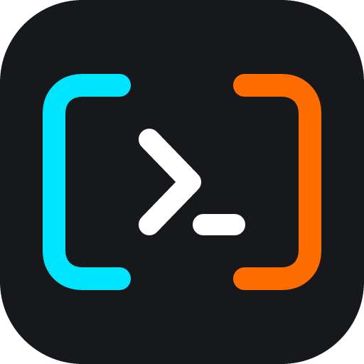
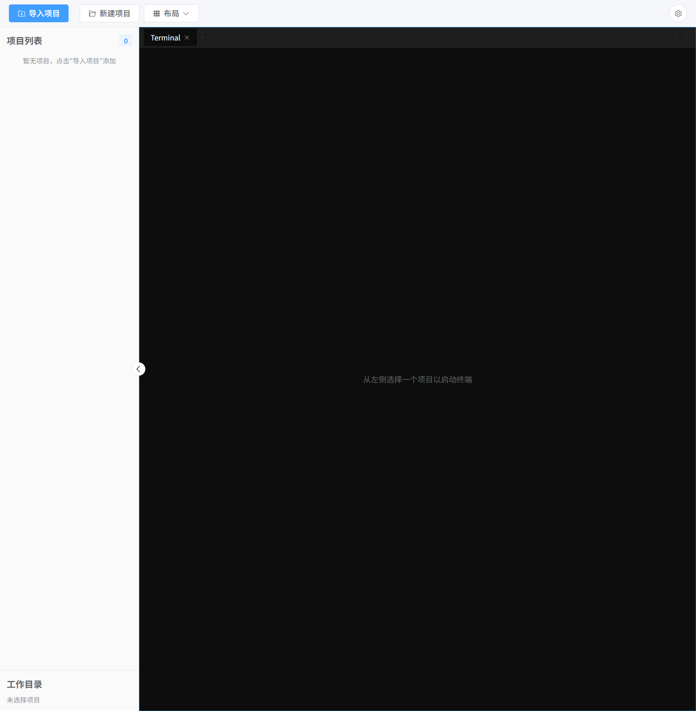

<div align="center">



# CC-Panes

**A Claude Code–first, multi-agent workspace — run parallel coding sessions side by side.**

[](https://github.com/wuxiran/cc-pane/releases/latest)
[](https://github.com/wuxiran/cc-pane/releases)
[](https://github.com/wuxiran/cc-pane/stargazers)
[](https://github.com/wuxiran/cc-pane/releases/latest)
[](LICENSE)
[](https://github.com/wuxiran/cc-pane/actions/workflows/ci.yml)
[](https://tauri.app/)
[](https://react.dev/)
[](https://www.rust-lang.org/)

**English** · [中文](README.zh-CN.md) · [📖 User Guide](docs/guide/README.md)

[**⬇ Download**](https://github.com/wuxiran/cc-pane/releases/latest) · [Report an Issue](https://github.com/wuxiran/cc-pane/issues) · [Discussions](https://github.com/wuxiran/cc-pane/discussions)


</div>

CC-Panes is a desktop control center for AI coding work. It keeps projects, terminals, launch profiles, providers, todos, file browsing, Git status, local history, and session resume in one place so you can drive several coding agents without losing the thread. It is built around Claude Code, with adapters for Codex, Gemini, Kimi, GLM, OpenCode, and Cursor, and provider profiles that can be selected at launch time.

## ✨ Why CC-Panes

- 🖥️ **Parallel sessions** — run multiple AI coding agents in a flexible split-pane terminal layout.
- 🧠 **Built-in MCP orchestration** — a `ccpanes` MCP server (`launch_task`, memory, workspace, plan tools) lets one agent spawn and coordinate others.
- 🔗 **Multi-device session sharing** — a standalone daemon hosts your PTYs so desktop, web, and the mobile mirror attach to the same live sessions.
- 📱 **Mobile mirror** — a Flutter Android client mirrors your desktop layout and lets you take over sessions from the phone.
- 🗂️ **Everything in one place** — workspaces, projects, tasks, todos, launch history, provider profiles, Git, local history, and file editing.
- 🔌 **Per-launch control** — pick provider, config profile, runtime (local / WSL / SSH), and skill policy for each session.

## Screenshots

| Multi-pane workspace | Focused terminal workspace |
| --- | --- |
|  |  |

| Todo and task planning | Light workspace view |
| --- | --- |
|  |  |

## Highlights

**Parallel Terminals**

- Flexible split panes and tabbed terminals backed by xterm.js and portable-pty.
- Launch Claude Code, Codex, Gemini, Kimi, GLM, OpenCode, and Cursor sessions.
- Resume historical sessions and keep launch history attached to projects.
- Built-in terminal input tools, paste handling, clipboard support, and terminal diagnostics.

**Workspaces And Projects**

- Workspace and project sidebar with pin, hide, reorder, scan, import, and create flows.
- Per-project metadata, launch history, tasks, todos, and MCP configuration.
- Project file browser with create, rename, delete, copy, move, search, and editor open.
- Monaco editor with Markdown preview and image preview.

**Launch Profiles And Providers**

- Launch profiles for repeatable CLI, runtime, provider, skill, and environment choices.
- Provider support for Anthropic, Bedrock, Vertex, OpenAI-compatible proxies, Gemini, Kimi, GLM, OpenCode, Cursor, and local config profiles.
- Launch-time provider selection modes for inheriting, selecting explicitly, or running without provider injection.
- Bundled Claude Code commands, agents, hooks, and CC-Panes skills for orchestrated workflows.

**Git, History, And Review**

- Git branch status, fetch, pull, push, stash, clone, and worktree helpers.
- Branch-aware local history snapshots with labels and diff view.
- File version recovery tools for comparing and restoring local edits.

**Desktop Workflow**

- Dev and release build isolation for data directories, identifiers, shortcuts, and window titles.
- Global screenshot shortcut with region capture and multi-monitor support.
- Tray behavior, notifications, voice input, mini view, fullscreen focus, and configurable shortcuts.
- Cross-platform packages for Windows, macOS, and Linux.

## ⬇ Download

Prebuilt installers are on the [latest release page](https://github.com/wuxiran/cc-pane/releases/latest).

| Platform | Files |
| --- | --- |
| **Windows** | `*_x64-setup.exe` · `*_arm64-setup.exe` |
| **macOS** | `*_aarch64.dmg` · `*_x64.dmg` |
| **Linux** | `*_amd64.AppImage` · `*_amd64.deb` |

Stable releases auto-update in-app; beta builds are published as pre-releases and can be installed manually.

## ❤️ Sponsors

CC-Panes is built independently. Its sole sponsor:

<div align="center">

### <a href="https://hub.nocannobb.com">nocannobb</a>

**Sponsor relay hub** — a Claude Code / Codex API relay station.

<sub><a href="https://hub.nocannobb.com">hub.nocannobb.com</a></sub>

</div>

Want to support CC-Panes? Open an issue or reach out via [WeChat](#-community).

## Co-creators

Thanks to the people building CC-Panes together:

<table>
  <tr>
    <td align="center">
      <a href="https://github.com/zhengjunkj">
        <br />
        <sub><b>zhengjunkj</b></sub>
      </a>
    </td>
  </tr>
</table>

## 💬 Community

- **GitHub Issues** — <https://github.com/wuxiran/cc-pane/issues>
- **GitHub Discussions** — <https://github.com/wuxiran/cc-pane/discussions>
- **WeChat chat group** — add `yemaofeng66`, mention `CC-Panes chat`.

**Bug feedback group** — add `yemaofeng66`, mention `CC-Panes bug feedback`:

<p>
  
</p>

## ⭐ Star History

<a href="https://star-history.com/#wuxiran/cc-pane&Date">
  
</a>

## License

CC-Panes is licensed under [GPL-3.0](LICENSE).

## Acknowledgments

- [Sponsor relay hub](https://hub.nocannobb.com)
- [Linux.do](https://linux.do)
- [Claude Code](https://docs.anthropic.com/en/docs/claude-code)
- [Tauri](https://tauri.app/)
- [xterm.js](https://xtermjs.org/)
- [portable-pty](https://github.com/wez/wezterm/tree/main/pty)
- [Allotment](https://github.com/johnwalley/allotment)
- [shadcn/ui](https://ui.shadcn.com/)

---

<details>
<summary>🛠️ <b>For Developers</b> — build from source, checks, architecture, repository layout</summary>

### Quick Start From Source

**Prerequisites**

- Node.js 22+
- Rust 1.83+
- Platform-specific [Tauri 2 prerequisites](https://tauri.app/start/prerequisites/)
- Claude Code, Codex, Gemini, or other CLI tools you want to launch from CC-Panes

**Install And Run**

```bash
git clone https://github.com/wuxiran/cc-pane.git
cd cc-pane
npm install
npm run tauri:dev
```

The development build uses `src-tauri/tauri.dev.conf.json` and stores data under `~/.cc-panes-dev/`.

### Build

```bash
npm run build          # frontend only
npm run tauri build    # production desktop app (runs frontend + helper binaries + resource copy)
```

### Checks

```bash
# Frontend
npx tsc --noEmit
npm run test:run

# Rust
cargo fmt --all -- --check
cargo check --workspace
cargo clippy --workspace -- -D warnings
cargo test --workspace
```

### Architecture

```text
React component
  -> Zustand store
  -> frontend service
  -> Tauri IPC command
  -> Rust service
  -> repository
  -> SQLite / file system / PTY
```

| Layer | Technology | Purpose |
| --- | --- | --- |
| Desktop | Tauri 2 | Rust backend with system WebView |
| Frontend | React 19, TypeScript 5.6, Vite 6 | Application UI |
| State | Zustand 5, Immer | Predictable state updates |
| UI | shadcn/ui, Radix UI, Tailwind CSS 4 | Components and styling |
| Terminal | xterm.js, portable-pty | Terminal rendering and PTY management |
| Storage | SQLite, rusqlite | Local persistence |
| Testing | Vitest, jsdom, Rust tests | Frontend and backend verification |

### Repository Layout

```text
cc-pane/
├── web/                  # React frontend (components, stores, services, hooks, types, i18n)
├── src-tauri/            # Tauri app entry, commands, services, repositories
├── cc-panes-core/        # Framework-independent core logic
├── cc-panes-api/         # HTTP/WebSocket API adapter
├── cc-panes-web/         # Web terminal server
├── cc-panes-daemon/      # Standalone PTY host (multi-device session sharing)
├── cc-cli-adapters/      # Claude/Codex/Gemini/etc adapter layer
├── cc-panes-mobile/      # Flutter Android mirror client
├── docs/                 # Documentation and screenshots
└── scripts/              # Build and utility scripts
```

Frontend imports use the `@/` alias, which resolves to `web/`.

### Development Notes

Dev and release builds are intentionally isolated:

| | Dev | Release |
| --- | --- | --- |
| Command | `npm run tauri:dev` | `npm run tauri build` |
| Data directory | `~/.cc-panes-dev/` | `~/.cc-panes/` |
| Identifier | `com.ccpanes.dev` | `com.ccpanes.app` |
| Window title | `CC-Panes [DEV]` | `CC-Panes` |
| Screenshot shortcut | `Ctrl+Alt+Shift+S` | `Ctrl+Shift+S` |

When behavior depends on the Windows desktop host, validate on Windows. WSL or Linux checks are useful for code and preflight verification, but they do not prove WebView2, tray, global shortcut, screenshot, updater, installer, or Windows PTY behavior.

### Contributing

Contributions are welcome. Please open an issue before large changes so the scope and design can be discussed. Commit messages follow [Conventional Commits](https://www.conventionalcommits.org/):

```text
feat: add launch profile import
fix: repair Windows PTY resize handling
docs: update README screenshots
```

</details>
