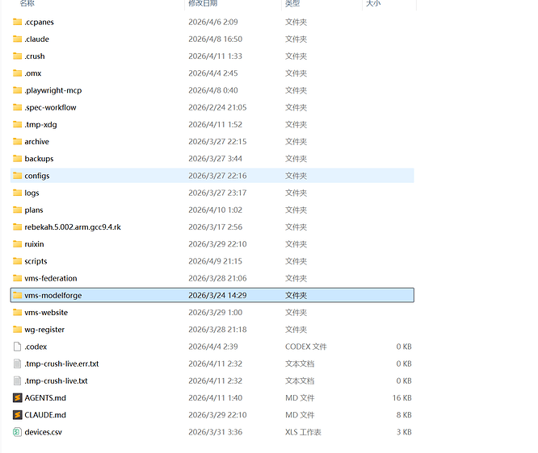
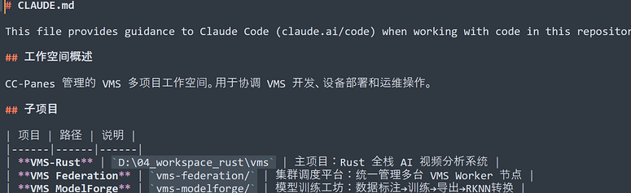
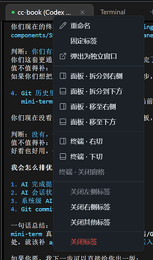
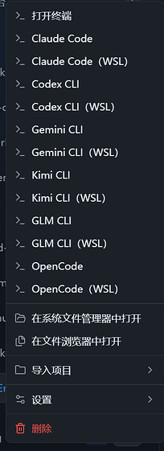
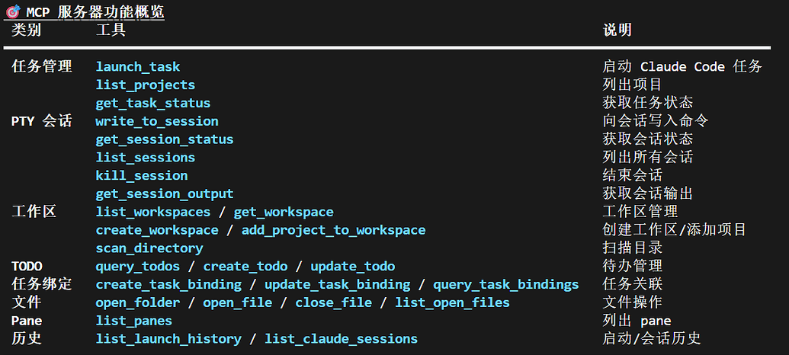
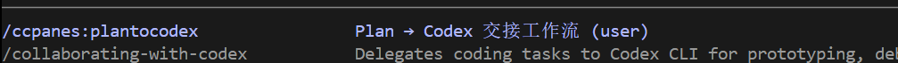
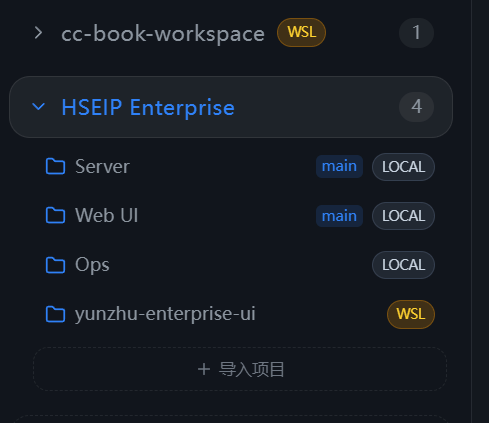
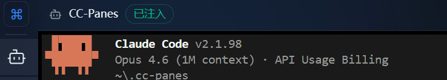
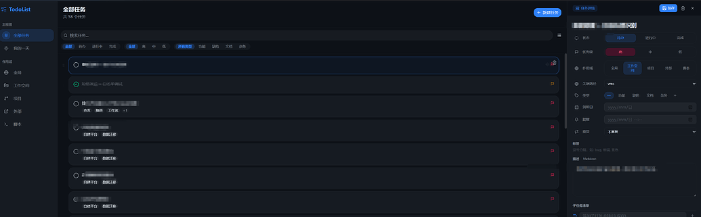

# CC-Panes

> A local-first terminal workspace for Windows and multi-AI CLI workflows.
>
> Instead of treating terminals as isolated windows, CC-Panes turns multi-project, multi-terminal, multi-model work into a visual, collaborative desktop workflow.
>
> It brings together AI coding sessions, project organization, workspace metadata, local history, MCP automation, and cross-terminal collaboration in one place.

[](LICENSE)
[](https://v2.tauri.app/)
[](https://react.dev/)
[](https://www.typescriptlang.org/)

[简体中文](README.zh-CN.md)

## Download

Prebuilt Windows installers are available on the [GitHub Releases](https://github.com/wuxiran/cc-pane/releases) page.

> On other platforms, you can build from source.

## What Is CC-Panes?

CC-Panes is a desktop application built with **Tauri 2 + React 19 + Rust**, designed around the most common workflows in the AI coding era:

- multi-project AI CLI session management
- workspace-level project organization
- multi-tab split terminals with pin support
- MCP-powered cross-terminal collaboration
- WSL and Windows dual-environment workflows
- Todo / Plans / Skills / Memory / Spec style workflow tools
- developer utilities such as screenshots, file browsing, Git integration, and session restore

In short:

> **CC-Panes is a workspace-oriented terminal workflow platform for AI-assisted development.**

## Why CC-Panes?

### Common pain points in Windows-based AI coding

- too many terminal windows, and no clear view of what is running where
- accidentally closing important tabs
- constantly repeating `cd` + launch steps for Claude Code, Codex, and other tools
- switching back and forth between frontend and backend projects
- polluting project directories with `.idea`, `.cursor`, `.claude`, `.codex`, and other tool metadata
- broken paths and fractured sessions across Windows + WSL hybrid workflows

CC-Panes is built to gather those scattered problems into one organized workspace.

### How it differs from a normal terminal tool

| Capability | Traditional terminal | CC-Panes |
| --- | --- | --- |
| Organization model | window-centric | **workspace-centric**, with code and metadata separated |
| Tab management | easy to lose context | **pinnable and splittable** with more stable layouts |
| CLI launching | manual commands | **unified entry points** |
| AI collaboration | usually single-session | **MCP-based**, cross-terminal coordination |
| Environment support | often fragmented | **Windows + WSL dual-path aware** |

## Architecture

```text
┌─────────────────────────────────────────────────────────────┐
│  React Frontend                                            │
│  ┌──────────┐ ┌──────────┐ ┌──────────┐ ┌───────────────┐  │
│  │ Sidebar  │ │ Panes    │ │ Panels   │ │ UI Components │  │
│  └────┬─────┘ └────┬─────┘ └────┬─────┘ └───────────────┘  │
│       │             │            │                           │
│  ┌────┴─────────────┴────────────┴────┐                     │
│  │  Services (invoke) + Stores        │                     │
│  └────────────────┬───────────────────┘                     │
├───────────────────┼─────────────────────────────────────────┤
│  Tauri IPC        │                                         │
├───────────────────┼─────────────────────────────────────────┤
│  Rust Backend     │                                         │
│  ┌────────────────┴───────────────────┐                     │
│  │  Commands → Services → Repository  │                     │
│  └────────────────┬───────────────────┘                     │
│  ┌────────────────┴───────────────────┐                     │
│  │  SQLite / File System / PTY        │                     │
│  └────────────────────────────────────┘                     │
└─────────────────────────────────────────────────────────────┘
```

## Tech Stack

| Layer | Technology | Purpose |
| --- | --- | --- |
| Desktop framework | Tauri 2 | Rust backend + system WebView |
| Frontend | React 19 + TypeScript | UI and interaction layer |
| State management | Zustand 5 + Immer | Immutable state updates |
| UI library | shadcn/ui + Radix UI | Component system |
| Styling | Tailwind CSS 4 | Utility-first styling |
| Terminal | xterm.js + portable-pty | Frontend rendering + backend PTY |
| Split panes | Allotment | Resizable terminal layout |
| Storage | SQLite (`rusqlite`) | Local persistence |
| Icons | Lucide React | SVG icon set |
| Build tool | Vite 6 | Frontend build pipeline |

## Prerequisites

- [Node.js](https://nodejs.org/) 22+
- [Rust](https://rustup.rs/) 1.83+
- Platform-specific dependencies required by [Tauri](https://v2.tauri.app/start/prerequisites/)

## Getting Started

```bash
# Clone the repository
git clone https://github.com/wuxiran/cc-pane.git
cd cc-pane

# Install frontend dependencies
npm install

# Run in development mode (frontend + Rust backend)
npm run tauri:dev
```

### Native WSL Development

If you want to develop as a native Linux app inside WSL, instead of working under a mounted Windows path like `/mnt/d/...`, the recommended flow is:

```bash
# 1) Clone the repo into the WSL Linux filesystem
mkdir -p ~/workspace
cd ~/workspace
git clone https://github.com/wuxiran/cc-pane.git cc-book
cd cc-book

# 2) Install Tauri/Linux dependencies
./scripts/setup-wsl-dev.sh

# 3) Install frontend dependencies
npm install

# 4) Verify the Rust workspace
cargo check --workspace

# 5) Start the dev environment (requires WSLg / Linux GUI support)
npm run tauri:dev
```

Notes:

- Do not keep your main WSL-native dev checkout under `/mnt/c/...` or `/mnt/d/...`; file watching and build performance are both worse there.
- If `cargo` or `npm` downloads fail, first verify that `HTTP_PROXY` / `HTTPS_PROXY` still point to a valid proxy.
- This repository keeps Cargo build output inside the local `target/` directory to avoid binding to Windows-specific paths.

## Build

```bash
# Build the production desktop app
npm run tauri build
```

The build output will be placed in `src-tauri/target/release/bundle/`.

## Development

```bash
# Frontend type check
npx tsc --noEmit

# Run frontend tests
npm run test:run

# Rust checks
cargo check --workspace
cargo clippy --workspace -- -D warnings
cargo fmt --all -- --check
cargo test --workspace
```

### Dev / Release Isolation

Dev and release builds are fully isolated through `cfg!(debug_assertions)` and can run side by side without conflicting:

| | Dev (`npm run tauri:dev`) | Release (`npm run tauri build`) |
| --- | --- | --- |
| Data directory | `~/.cc-panes-dev/` | `~/.cc-panes/` |
| Identifier | `com.ccpanes.dev` | `com.ccpanes.app` |
| Window title | `CC-Panes [DEV]` | `CC-Panes` |

## Project Structure

```text
cc-panes/
├── web/                    # React frontend source
│   ├── components/         # React components
│   │   ├── panes/          # Split terminal components
│   │   ├── sidebar/        # Sidebar components
│   │   ├── providers/      # Provider management UI
│   │   └── ui/             # shadcn/ui base components
│   ├── stores/             # Zustand state management
│   ├── services/           # Frontend service layer (invoke wrappers)
│   ├── hooks/              # Custom React hooks
│   ├── types/              # TypeScript type definitions
│   ├── i18n/               # Internationalization
│   ├── lib/                # Shared frontend helpers
│   └── utils/              # Utility functions
│
├── src-tauri/              # Tauri Rust backend
│   └── src/
│       ├── commands/       # Tauri IPC command handlers
│       ├── services/       # Business logic layer
│       ├── repository/     # Data access layer (SQLite)
│       ├── models/         # Data models
│       └── utils/          # Utilities (AppPaths, AppError)
│
├── cc-panes-*/             # Shared Rust workspace crates
└── docs/                   # Design docs, examples, and assets
```

## Interface Highlights

### Workspace-first organization

The real code stays where it already lives, while AI workflow metadata, prompts, documentation, and runtime context can be collected inside a workspace. The workspace can also hold AI-readable files such as `CLAUDE.md`, which helps keep repositories cleaner and project context more centralized.

<p align="center">
  
</p>

<p align="center">
  
</p>

### Pinnable tabs and split terminals

Terminal tabs can be pinned, renamed, moved left or right, and split into stable layouts. That makes it much harder to lose important sessions by accident.

<p align="center">
  
</p>

### Unified project launch entry points

The left-side project menu is more than a folder browser. It can also serve as a launcher surface for common AI coding CLIs, which greatly reduces repetitive path switching and command entry.

<p align="center">
  
</p>

### MCP: giving terminal and workspace power directly to AI

One of the most distinctive parts of CC-Panes is that many terminal and workspace operations are exposed through **MCP (Model Context Protocol)**. That means AI can inspect session state, write commands to other sessions, create workspaces, import projects, dispatch tasks, and operate on todos, files, and panes.

<p align="center">
  
</p>

Current MCP-exposed capability groups include:

- task management
- PTY sessions
- workspace management
- todo
- task binding
- file operations
- pane management
- history

### Plan -> Codex team-programming workflow

CC-Panes fits a collaboration model where one model plans and another implements. A typical pattern is:

- let Claude produce the plan
- use `launch_task` to hand implementation work to Codex
- monitor and continue the execution from another session

That is more than “opening two terminals”; it is a workflow where planning and implementation are deliberately separated and can be scaled into multi-window parallel work.

<p align="center">
  
</p>

### WSL is a core scenario, not an afterthought

Many Windows AI workflows eventually end up in WSL. CC-Panes supports that by keeping Windows paths and WSL path mappings for the same workspace, and by making local vs. WSL projects visible directly in the UI.

<p align="center">
  
</p>

<p align="center">
  
</p>

This makes hybrid workflows much more realistic:

- edit and inspect code inside WSL
- build, run, or debug from Windows
- keep all sessions under one visual workbench

### Todo as part of the workflow

The todo panel is not just a checklist. It supports state, priority, filtering, and side-panel editing, and can be connected to projects, labels, and sessions. Combined with MCP and planning flows, it starts to behave like a task dispatch layer for AI-assisted work.

<p align="center">
  
</p>

## Who Is It For?

- developers doing AI coding on Windows
- people who need to manage many terminals and projects at once
- users who rely on tools like Claude Code and Codex CLI
- teams or individuals who want reusable, collaborative AI workflows
- anyone who wants to keep repositories clean from tool-specific metadata

**Key strengths:** workspace-based organization, unified multi-CLI launch flows, pin + split layouts, MCP-backed cross-terminal collaboration, Plan -> Codex task dispatching, and a fuller workflow layer built around Todo / Specs / Skills / Memory.

## Future Directions

- SSH-based remote project support
- stronger session restore and persistence
- more powerful MCP automation
- more complete team-programming workflows
- more unified multi-model collaboration

## Supported CLI Tools

The repository already includes a unified adapter layer in [`cc-cli-adapters/`](./cc-cli-adapters/), with currently confirmed support for:

- `Claude Code`
- `Codex CLI`
- `Gemini CLI`
- `OpenCode`

Among these, Claude Code and Codex currently have the deepest integration.

## Docs

Design and implementation notes live under [`docs/`](./docs/), including:

- workspace and project models
- provider and platform adaptation
- local history
- skill system
- memory system
- GUI evolution and packaging

## Feedback

Found a bug or have a suggestion? Join the WeChat group:


## Contributing

Contributions are welcome. Please read [CONTRIBUTING.md](./CONTRIBUTING.md) first.

## License

This project is licensed under the [GNU General Public License v3.0](./LICENSE).

## Acknowledgments

- [Tauri](https://tauri.app/) — desktop application framework
- [Claude Code](https://docs.anthropic.com/en/docs/claude-code) — AI coding assistant by Anthropic
- [xterm.js](https://xtermjs.org/) — terminal emulator for the web
- [shadcn/ui](https://ui.shadcn.com/) — UI component library
