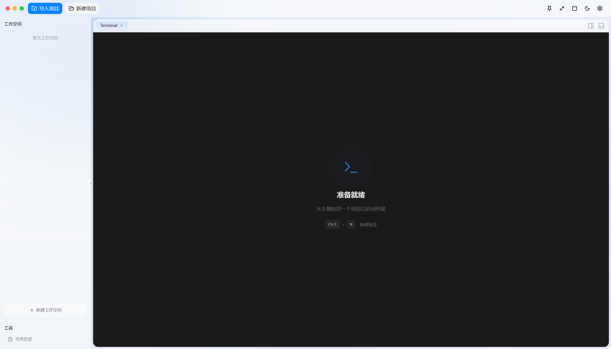
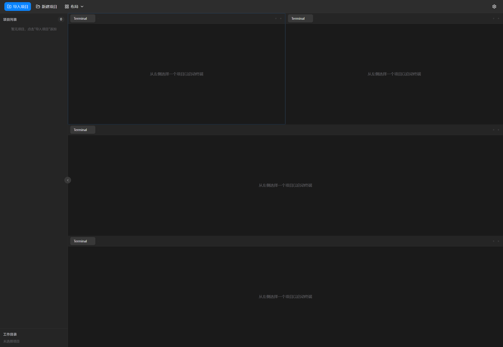
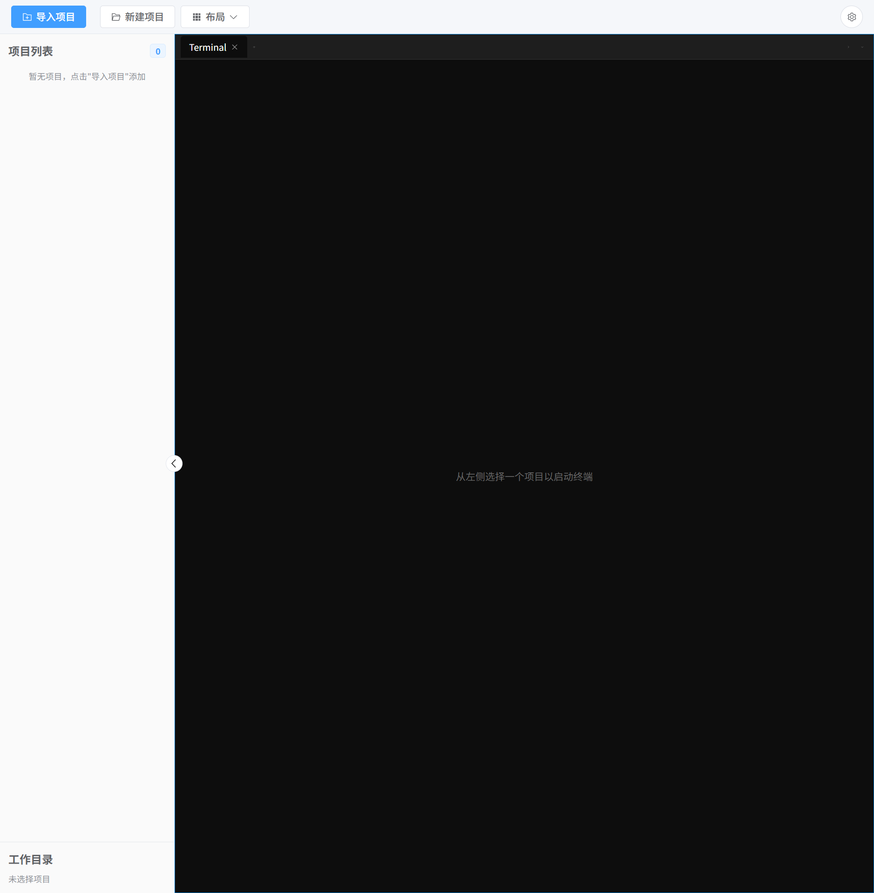
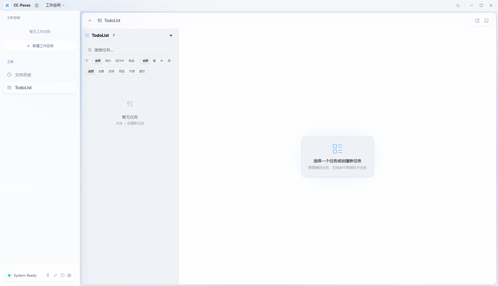
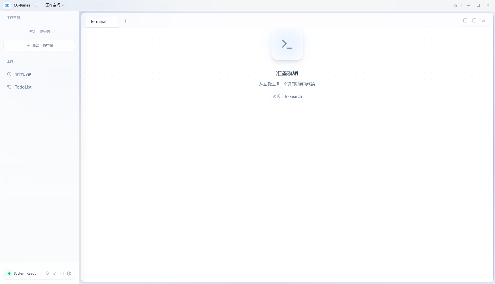

# CC-Panes

**以 Claude Code 为核心的多实例分屏工作台 —— 并排跑多个 AI Coding 会话。**

[English](README.md) · **中文** · [📖 使用手册](docs/guide/README.md)

[**⬇ 下载最新版**](https://github.com/wuxiran/cc-pane/releases/latest) · [反馈问题](https://github.com/wuxiran/cc-pane/issues) · [讨论区](https://github.com/wuxiran/cc-pane/discussions)

跑一个 AI Coding agent 很容易，跑五个就开始失控 —— 哪个终端在干什么、在哪个项目里、用的哪个 Provider、一小时前做了什么，全都记不住。

CC-Panes 就是为此而生的桌面控制台。它把项目、终端、启动配置、Provider、Todo、文件浏览、Git 状态、本地历史、会话恢复放到同一个工作台里，方便你同时推进多个 AI Coding 任务。它不是单纯的终端壳子，而是给 Claude Code、Codex、Gemini 等 CLI 工作流补上项目组织、并行编排、上下文恢复和桌面工具链 —— 同时适配 Kimi、GLM、OpenCode、Cursor，并支持在启动时选择 Provider 配置档。

<!-- TODO(media): 功能墙 6 组，见 docs/67-storyboards.md §3
     A 派工编排 / B 分屏并行 / D worktree 隔离 / C 移动端接管 / E AI 面板 / F skill 体系
     每组用 <picture> + <source srcset type="image/gif"> + JPG fallback，外包 <a> 链到对应 guide 篇 -->

## 截图

| 多 Pane 工作区 | 终端主工作区 |
| --- | --- |
|  |  |

| Todo 与任务管理 | 浅色工作区 |
| --- | --- |
|  |  |

## ⬇ 下载

预编译安装包在 [最新版 Release](https://github.com/wuxiran/cc-pane/releases/latest) 页面发布。

| 平台 | 文件 |
| --- | --- |
| **Windows** | `*_x64-setup.exe` · `*_arm64-setup.exe` |
| **macOS** | `*_aarch64.dmg` · `*_x64.dmg` |
| **Linux** | `*_amd64.AppImage` · `*_amd64.deb` |

稳定版支持应用内自动更新；beta 版以预发布形式发布，可手动安装。

## 能力矩阵

工作区、项目、任务、Todo、启动历史、Provider、Git、本地历史、文件编辑 —— 一处管全部：

| 能力 | 具体内容 |
| --- | --- |
| **AI 编排** | 内置 `ccpanes` MCP（`launch_task`、memory、workspace、plan 工具），一个 agent 能拉起并协调其它 agent；Leader / Worker 派工与回执；内置 Claude Code commands、agents、hooks 和 CC-Panes skills，适合编排式任务流。 |
| **多实例终端** | 基于 xterm.js 和 portable-pty 的真实 PTY 终端；支持分屏、Tab、多 Pane 布局和终端尺寸同步；可启动 Claude Code、Codex、Gemini、Kimi、GLM、OpenCode、Cursor；记录启动历史，支持按项目恢复历史会话。 |
| **多端会话共享** | 独立 daemon 托管 PTY，桌面、Web、手机镜像附着**同一批活会话**；Flutter Android 客户端镜像电脑布局，可在手机上接管会话。 |
| **工作区和项目** | 工作区、项目树、置顶、隐藏、排序、扫描、导入、新建项目；每个项目拥有独立的启动历史、任务、Todo、MCP 配置和元数据；内置文件浏览器，支持搜索、新建、重命名、删除、复制、移动和打开编辑器；Monaco 编辑器、Markdown 预览、图片预览。 |
| **启动配置和 Provider** | Launch Profile 管理 CLI、运行环境（本地 / WSL / SSH）、Provider、Skill 和环境变量组合；Provider 支持 Anthropic、Bedrock、Vertex、OpenAI 兼容代理、Gemini、Kimi、GLM、OpenCode、Cursor 和本地配置档；启动时可以选择继承 Provider、显式指定 Provider，或不注入 Provider。 |
| **Git、本地历史和审查** | Git 分支状态、fetch、pull、push、stash、clone、worktree 辅助能力；分支感知的本地历史快照、标签和 diff 视图；可对比并恢复本地文件版本。 |
| **桌面工作流** | 开发版和发布版的数据目录、应用标识、快捷键和窗口标题相互隔离；全局截图快捷键、区域截图、多显示器支持；托盘、通知、语音输入、小窗模式、全屏聚焦、快捷键配置；已发布 Windows、macOS、Linux 安装包。 |

## 📖 使用手册

[使用手册](docs/guide/README.md)共 20 篇，分四层：

- [**一 · 入门**](docs/guide/README.md#一入门) —— CC-Panes 是什么、安装与第一次启动、核心概念、上手五步、终端与分屏。
- [**二 · 日常使用**](docs/guide/README.md#二日常使用) —— 文件浏览与编辑、Git 与 Worktree、Local History、Todo / 会话日志 / Memory、设置详解。
- [**三 · 高级玩法**](docs/guide/README.md#三高级玩法cc-panes-的核心卖点) —— MCP 编排、多实例并行、Leader / Worker、Plan 交接与同行评审、Resume、WSL / SSH、Web 与手机端、AI 面板、Skill 体系、右侧坞、应用内浏览器。
- [**四 · 参考**](docs/guide/README.md#四参考) —— 数据存在哪 / 备份与排障、快捷键速查、常见问题。

## ❤️ 赞助

CC-Panes 独立开发，唯一赞助：

### <a href="https://hub.nocannobb.com">nocannobb</a>

**赞助中转站** —— Claude Code / Codex API 中转。

<a href="https://hub.nocannobb.com">hub.nocannobb.com</a>

想赞助 CC-Panes？欢迎开 Issue 或通过[微信](#-社群)联系。

## 共创者

感谢一起共建 CC-Panes 的伙伴：

<table>
  <tr>
    <td align="center">
      <a href="https://github.com/zhengjunkj">
         
        <b>zhengjunkj</b>
      </a>
    </td>
  </tr>
</table>

## 💬 社群

- **GitHub Issues** —— <https://github.com/wuxiran/cc-pane/issues>
- **GitHub Discussions** —— <https://github.com/wuxiran/cc-pane/discussions>
- **微信交流群** —— 添加微信 `yemaofeng66`，备注 `CC-Panes 交流群`。

**Bug 反馈群** —— 添加微信 `yemaofeng66`，备注 `CC-Panes Bug 反馈`：

  

## License

本项目使用 [GPL-3.0](LICENSE) 协议。

## 致谢

- [赞助中转站](https://hub.nocannobb.com)
- [Linux.do](https://linux.do)
- [Claude Code](https://docs.anthropic.com/en/docs/claude-code)
- [Tauri](https://tauri.app/)
- [xterm.js](https://xtermjs.org/)
- [portable-pty](https://github.com/wez/wezterm/tree/main/pty)
- [Allotment](https://github.com/johnwalley/allotment)
- [shadcn/ui](https://ui.shadcn.com/)

---

想从源码构建？见 [CONTRIBUTING.md](CONTRIBUTING.md)。
