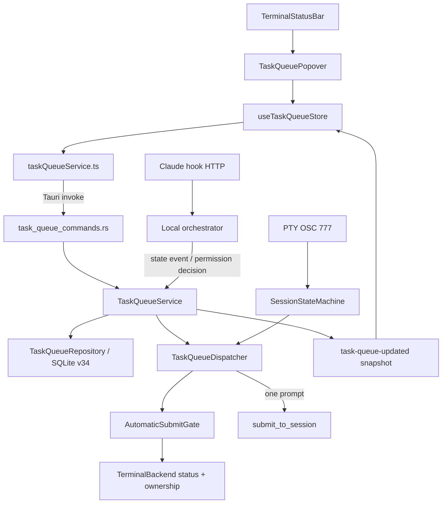
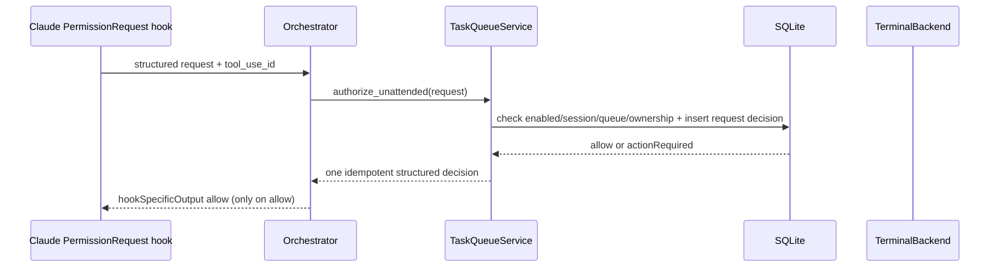
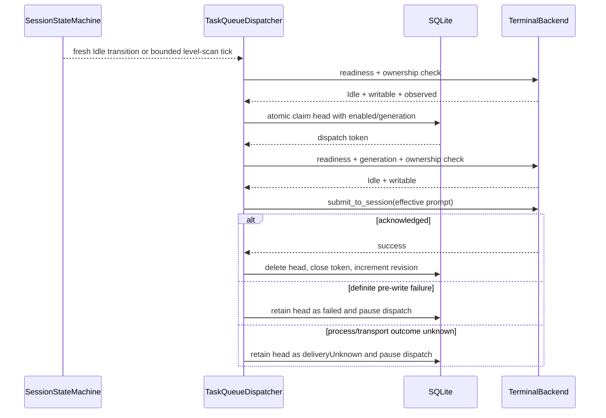

# Design · Terminal task queue

## Architecture diagram







## Key decisions

- Decision 1: backend-owned queues, not React timers. The Tauri Rust process owns the worker; the frontend only issues commands and renders snapshots. Hidden tabs and WebView reconnects therefore cannot decide whether a command is sent.
- Decision 2: persist per exact `pty_session_id` in SQLite. Only the PTY identity names the actual write target. An exited queue stays stopped and is never rebound to a new process.
- Decision 3: reuse the existing automatic-submit gate, state transition listener and periodic level scan. No rendered terminal text or frontend xterm chunk is used as completion evidence.
- Decision 4: normal queued tasks accept only `Idle`; `WaitingInput` is a blocker. A new task is not an answer to the current prompt.
- Decision 5: unattended uses Claude's synchronous `PermissionRequest` hook, not `Notification` or raw CR. The native `tool_use_id` is the idempotency key, and the backend returns an explicit structured `allow` only after the user has opted in. This is deterministic and auditable, while unknown prompts fail closed.
- Decision 6: keep HTTP and OSC state deduplication limited to state transitions. OSC does not carry permission payloads and is never allowed to authorize unattended decisions; no two-second time-window correlation can make two real prompts distinguishable.
- Decision 7: persist claim before PTY write and acknowledge before delete. A stale in-flight claim after restart is `deliveryUnknown`, never an automatic retry.
- Decision 8: store staged clipboard images under an app-owned per-session directory and persist opaque refs. The queue layer never opens a caller-supplied path.
- Decision 9: use a global feature switch plus per-session pause and unattended switches. The SQLite runtime generation is the dispatch authority; settings TOML is a user-facing configuration mirror.
- Decision 10: require explicit automatic-write authority. In-process terminal backends are exclusive to the Tauri process; daemon backends must report `claims_supported == true` and an owned lease. Older daemons fail closed rather than inheriting the compatibility behavior of `claim_session`.
- Decision 11: desktop-only transport in this change. `cc-panes-web`/Docker has no queue worker or routes, so it cannot create rows that appear executable but have no state-machine and PTY ownership path.
- Decision 12: do not add work to terminal rendering. `TerminalView` remains an output consumer; queue scheduling listens to backend state transitions and bounded timestamps only.

## State and race model

### Post-restart observation

`SessionStateMachine` gains an explicit registration/observation-generation API. Registration stores the backend status and current time but is not an idle edge. `status_for_automatic_submit_at` returns `Initializing` for an unobserved session until either:

1. a fresh `TurnEnd`/equivalent idle transition is observed; or
2. the registered hook observation and PTY output are both older than the existing stale threshold while the backend still reports a live session.

The old behavior of returning a raw backend `Idle` when no entry exists is removed for this call path. This makes backend restart fail closed instead of bypassing the dual-stale gate.

### Queue dispatch claim

The repository transaction enforces all of the following:

1. runtime `enabled = 1` and the caller's `dispatch_generation` equals the current generation;
2. session queue `paused = 0`;
3. no active dispatch token exists for the session;
4. the lowest-position item is `queued`;
5. set item `dispatching`, assign a UUID token, record `dispatch_started_at`, and increment revision.

Completion/failure updates require the same token. A stale callback cannot delete a newer item. Startup recovery converts every remaining `dispatching` row to `deliveryUnknown` in one transaction.

The global-setting update increments `dispatch_generation` and changes `enabled` in the same SQLite transaction. A claim already acknowledged before disable may finish; a later claim cannot pass the generation predicate.

### Automatic-write authority

The `TerminalBackend` boundary exposes:

```rust
enum AutomaticWriteAuthority {
    ExclusiveInProcess,
    EnforcedLease { owner_instance_id: String },
    Unavailable,
}
```

`Unavailable` is returned for old/unsupported daemons, missing ownership, session exit, or failed lease renewal. Both the ordinary dispatcher and the PermissionRequest handler require a non-`Unavailable` authority immediately before their side effect.

### Permission request idempotency

The hook request must include `tool_use_id`. The repository stores `(session_id, tool_use_id, request_fingerprint, decision, created_at)` with a unique key on `(session_id, tool_use_id)`. The first authorized request inserts `allow` before returning it; a duplicate with the same fingerprint returns `allow` without another transition. A duplicate with a different fingerprint is treated as `actionRequired` and logged only by identity/error class. Requests without a stable tool ID are unsupported.

## Data model changes

Database migration v34 adds:

```sql
CREATE TABLE task_queue_runtime (
  id INTEGER PRIMARY KEY CHECK (id = 1),
  enabled INTEGER NOT NULL DEFAULT 1 CHECK (enabled IN (0, 1)),
  dispatch_generation INTEGER NOT NULL DEFAULT 0,
  updated_at INTEGER NOT NULL
);

CREATE TABLE terminal_task_queues (
  session_id TEXT PRIMARY KEY NOT NULL,
  paused INTEGER NOT NULL DEFAULT 0 CHECK (paused IN (0, 1)),
  unattended INTEGER NOT NULL DEFAULT 0 CHECK (unattended IN (0, 1)),
  runtime_state TEXT NOT NULL DEFAULT 'running',
  reason TEXT,
  revision INTEGER NOT NULL DEFAULT 0,
  active_dispatch_token TEXT,
  dispatch_started_at INTEGER,
  created_at INTEGER NOT NULL,
  updated_at INTEGER NOT NULL
);

CREATE TABLE terminal_task_queue_items (
  id TEXT PRIMARY KEY NOT NULL,
  session_id TEXT NOT NULL,
  position INTEGER NOT NULL CHECK (position >= 0),
  text TEXT NOT NULL,
  image_refs_json TEXT NOT NULL DEFAULT '[]',
  state TEXT NOT NULL DEFAULT 'queued',
  dispatch_token TEXT,
  last_error_code TEXT,
  last_error_message TEXT,
  created_at INTEGER NOT NULL,
  updated_at INTEGER NOT NULL,
  FOREIGN KEY (session_id) REFERENCES terminal_task_queues(session_id) ON DELETE CASCADE,
  UNIQUE (session_id, position)
);

CREATE TABLE terminal_task_queue_permission_decisions (
  session_id TEXT NOT NULL,
  tool_use_id TEXT NOT NULL,
  request_fingerprint TEXT NOT NULL,
  decision TEXT NOT NULL CHECK (decision IN ('allow')),
  created_at INTEGER NOT NULL,
  PRIMARY KEY (session_id, tool_use_id)
);

INSERT INTO task_queue_runtime(id, enabled, dispatch_generation, updated_at)
VALUES (1, 1, 0, strftime('%s','now'));
CREATE INDEX idx_terminal_task_queue_items_session_state_position
  ON terminal_task_queue_items(session_id, state, position);
```

Rust models live in `cc-panes-core/src/models/task_queue.rs`; TypeScript mirrors live in `web/types/taskQueue.ts`. Repository methods use SQLite transactions and parameterized queries. `image_refs_json` is decoded with `serde_json`, validated on write and treated as a row error rather than silently falling back if corrupted.

`TerminalSettings` gains `task_queue_enabled` / `taskQueueEnabled`, default `true`, with a field-level tolerant deserializer. `merge_missing_defaults` and invalid-field preservation tests cover absence, wrong type and unrelated custom settings.

## API surface changes

### Tauri commands

- `get_terminal_task_queue(session_id) -> TaskQueueSnapshot`
- `stage_terminal_task_queue_clipboard_image(session_id) -> StagedTaskQueueImage`
- `add_terminal_task_queue_item(session_id, draft) -> TaskQueueSnapshot`
- `delete_terminal_task_queue_item(session_id, item_id) -> TaskQueueSnapshot`
- `clear_terminal_task_queue(session_id) -> TaskQueueSnapshot`
- `update_terminal_task_queue(session_id, patch) -> TaskQueueSnapshot`
- `retry_terminal_task_queue_item(session_id, item_id) -> TaskQueueSnapshot`

Commands inject `State<'_, Arc<TaskQueueService>>`; components never invoke Tauri directly. The global settings command calls `TaskQueueService::set_global_enabled` before returning from `saveSettings`.

### Internal hook route

The existing authenticated local orchestrator adds `POST /api/task-queue/permission-request`. It accepts the Claude hook envelope, validates the session and `tool_use_id`, and returns either:

- `200` with the exact structured `allow` response; or
- `204` for unsupported/action-required (the hook runner then emits no decision and exits successfully so Claude keeps its prompt).

The route never accepts browser cookies, task text or image paths and does not expose a public Web REST equivalent.

### Frontend service and store

`web/services/taskQueueService.ts` uses the existing Tauri invoke wrapper for all commands. In non-Tauri runtime it returns `UNAVAILABLE` and the status-bar entry is not rendered. `web/stores/useTaskQueueStore.ts` keeps snapshots keyed by session ID and ignores snapshots whose `revision` is older than the current one.

`task-queue-updated` is a Tauri app event carrying a snapshot. A reload performs `get_terminal_task_queue` before listening; mutation responses are authoritative, so a missed event cannot duplicate a dispatch.

## File / module impact

- Add:
  - `changes/add-terminal-task-queue/*`
  - `cc-panes-core/src/models/task_queue.rs`
  - `cc-panes-core/src/repository/task_queue_repository.rs`
  - `cc-panes-core/src/services/task_queue_service.rs`
  - `cc-panes-core/src/services/task_queue_dispatcher.rs`
  - `src-tauri/src/commands/task_queue_commands.rs`
  - `web/types/taskQueue.ts`
  - `web/services/taskQueueService.ts`
  - `web/stores/useTaskQueueStore.ts`
  - `web/components/panes/TaskQueuePopover.tsx`
  - co-located Rust/TypeScript/component tests.
- Modify:
  - `cc-panes-core/src/repository/db.rs`, model/repository/service exports, `TerminalSettings`, `SessionStateMachine`, `TerminalBackend`, and adapter capability definitions;
  - `cc-panes-core/src/services/terminal_service.rs` for clipboard staging, ownership and worker hooks;
  - `cc-panes-cli-hook/src/events/dispatch.rs` and hook registration for `permission-request` response handling;
  - `src-tauri/src/services/orchestrator_service.rs`, `src-tauri/src/lib.rs`, command/service exports and transition/level-scan wiring;
  - `web/components/panes/TerminalStatusBar.tsx`, its tests, and the parent rendering condition so every eligible terminal leaf receives a status bar;
  - `web/components/settings/TerminalSection.tsx`, settings registry/defaults/tests and `web/i18n/locales/{zh-CN,en}`.
- Delete: none.
- Explicitly unchanged: `cc-panes-web` and `cc-panes-daemon` queue routes/workers in this change; daemon compatibility is handled by the `AutomaticWriteAuthority` fail-closed boundary.

## Failure visibility and logging

- Stable error codes include `QUEUE_FULL`, `QUEUE_ITEM_INVALID`, `IMAGE_REF_INVALID`, `IMAGE_STAGE_FAILED`, `SESSION_NOT_FOUND`, `SESSION_NOT_WRITABLE`, `UNATTENDED_UNSUPPORTED`, `SUBMIT_FAILED`, and `DELIVERY_UNKNOWN`.
- Structured logs include session/item/token IDs, queue length, source (`transition`, `level_scan`, `resume`, `manual_retry`, `permission_request`), readiness state, and error code. They exclude task text, terminal output, image bytes and normal image paths.
- `Error`, `Exited`, lease loss, unknown prompts and delivery uncertainty publish a visible queue snapshot and may use the existing notification system for “Action required”; they never silently clear the queue.

## Security review

- Spoofing/elevation: every IPC mutation resolves the target through the existing Tauri state and verifies the current backend owns the PTY. The hook route requires the existing local bearer token, exact session ID and native `tool_use_id`.
- Tampering/replay: item IDs, image refs and dispatch tokens are backend-generated; state changes use compare-and-swap inside SQLite transactions; runtime generation blocks claims after disable; permission decisions are unique by `(session_id, tool_use_id)` and fingerprint mismatches fail closed.
- Repudiation: logs record session/item/token/request IDs, source and outcome code without prompt content. Explicit retry and unattended allow are distinguishable from automatic dispatch.
- Information disclosure: task text and image refs never enter telemetry or notification bodies; image bytes stay in the app-owned `task-queue-images/{session_id}` directory and are never uploaded by this feature.
- Denial of service: limits cap each queue at 100 items, each prompt at 65,536 UTF-8 bytes, images at 10 refs and 20 MiB each; the level scan visits only non-empty active queues and dispatches at most one item per session.
- Unsafe input/injection: queued text is user-authored terminal input and is passed only to the selected PTY via bracketed paste. Image refs resolve beneath the canonical app-owned directory and never enter SQL, shell commands or OS process arguments.
- Fail-closed unattended policy: unsupported/missing tool ID, Notification events, errors, session exit, lease loss, corrupt rows and ambiguous delivery all stop automatic input/approval. There is no fallback from structured classification to terminal text matching.

## Verification strategy

- Pure unit tests cover validation, state precedence, tolerant settings deserialization, prompt composition, capability classification, permission identity/fingerprint, dispatch-token compare-and-swap and post-restart observation.
- In-memory SQLite tests cover migration v34, runtime-generation disable race, FIFO ordering, 100-item limit, rollback, failure retention, concurrent claim attempts, idempotent permission decisions and recovery.
- Fake terminal gateway tests drive transition edge, periodic level scan, two readiness checks, busy race, `WaitingInput`, error/exit, unavailable claims and ambiguous delivery without a real PTY.
- Hook tests cover malformed/duplicate PermissionRequest payloads, exact `allow` response, no-decision `204`, Notification non-authorization and token/session checks.
- Component/store tests cover keyboard input, native image staging, previews, copy, badges, status labels, global setting, risk confirmation, unsupported unattended state and stale revision rejection.
- Contract tests cover Tauri registration and the `task-queue-updated` snapshot schema. Web is explicitly out of scope and has no queue route or worker in this change.
- Windows-host manual checks cover WebView Popover layout, ConPTY submit, Claude permission decision and Codex stale fallback. WSL/Linux checks do not count as Windows PTY verification.
