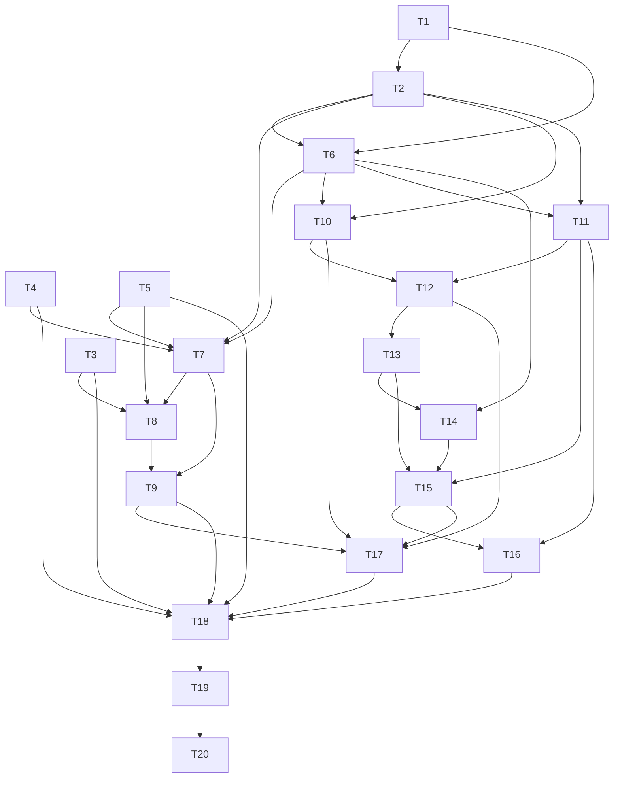

# 任务树 · 终端任务队列

<!-- AUTO=AI 自动执行可验证 · MANUAL=人工操作 · AUTO-UNVERIFIABLE=AI 执行但需人工判断 -->

## 任务列表

### [AUTO] T1：新增队列领域模型与迁移 v34 · ≤25 min · 串行
- **执行者**：AI
- **目标**：用 SQLite 表达全局运行开关/dispatch generation、每 session 队列、FIFO 项目、在途恢复和 PermissionRequest 幂等记录。
- **产出**：`cc-panes-core/src/models/task_queue.rs`、`cc-panes-core/src/repository/db.rs` migration v34、模型导出和迁移测试。
- **完成标准**：空库、v33 升级、外键/唯一键/上限约束、camelCase 序列化和默认 runtime 行测试通过。
- **验证命令**：`cargo test -p cc-panes-core repository::db --lib && cargo test -p cc-panes-core task_queue --lib`
- **依赖**：无
- **信心**：高
- [ ] 完成

### [AUTO] T2：实现事务化 TaskQueueRepository · ≤30 min · 串行
- **执行者**：AI
- **目标**：实现 snapshot、添加/删除/清空/控制、全局 generation 更新、原子认领、token 校验完成和崩溃恢复。
- **产出**：`cc-panes-core/src/repository/task_queue_repository.rs` 及 in-memory SQLite 测试。
- **完成标准**：FIFO、100 项上限、并发单认领、disable 竞态无新 claim、失败留队、stale token 无效、`dispatching -> deliveryUnknown` 恢复和显式 retry 测试通过。
- **验证命令**：`cargo test -p cc-panes-core task_queue_repository --lib`
- **依赖**：T1
- **信心**：高
- [ ] 完成

### [AUTO] T3：增加 adapter PermissionRequest 能力与 hook 响应 · ≤30 min · 串行
- **执行者**：AI
- **目标**：为 Claude 增加结构化 `PermissionRequest` 能力和 `tool_use_id` 校验；为 hook runner 增加独立同步决策子命令；其他 CLI fail-closed。
- **产出**：`cc-cli-adapters` capability API、Claude hook 注册/映射、`cc-panes-cli-hook` request/response 处理和 fixtures。
- **完成标准**：合法 Claude 请求可得到精确 `allow` 响应；缺少 ID、Notification、elicitation、Codex/Grok/OpenCode、错误和非 200 响应均不输出决策；重复 ID 可由后端幂等处理。
- **验证命令**：`cargo test -p cc-cli-adapters unattended --lib && cargo test -p cc-panes-cli-hook --lib`
- **依赖**：无
- **信心**：中（需以当前 Claude hook payload fixture 固定字段）
- [ ] 完成

### [AUTO] T4：收紧 SessionStateMachine 的重启观察门控 · ≤25 min · 串行
- **执行者**：AI
- **目标**：增加 session registration/observation generation；无状态机条目不再直接接受 backend `Idle`；保留 HTTP/OSC 状态事件去重但不把 OSC 变成权限授权。
- **产出**：`session_state_machine.rs` API 和重启/双陈旧/乱序重复测试。
- **完成标准**：新注册 session 必须 fresh idle edge 或 hook+PTY 双陈旧后才放行；状态转换通知契约不回归；两条通道不重复递增 turn 序号。
- **验证命令**：`cargo test -p cc-panes-core session_state_machine --lib`
- **依赖**：无
- **信心**：中
- [ ] 完成

### [AUTO] T5：实现自动写入权威边界 · ≤25 min · 串行
- **执行者**：AI
- **目标**：扩展 `TerminalBackend` 返回 `ExclusiveInProcess`/`EnforcedLease`/`Unavailable`，旧 daemon 或丢租约时 fail-closed，并覆盖重启后重新认领。
- **产出**：`terminal_backend.rs`、daemon client/backend ownership 查询与测试。
- **完成标准**：旧 claim 路由不能授权自动输入；真实持有租约才可写；release/renew race 不会重新抢回租约；不同 session 可独立授权。
- **验证命令**：`cargo test -p cc-panes-core daemon_client --lib && cargo test -p cc-panes-core terminal_backend --lib`
- **依赖**：无
- **信心**：中
- [ ] 完成

### [AUTO] T6：实现纯状态派生、输入校验与图片暂存 · ≤30 min · 串行
- **执行者**：AI
- **目标**：集中实现状态优先级、文本/数量限制、opaque image ref 校验和单 prompt 组合；从 native clipboard 写入 app-owned 目录。
- **产出**：`task_queue_service.rs` 纯函数/图片 staging 与决策表测试。
- **完成标准**：空任务、65,536 bytes、10 图、100 项、路径逃逸/符号链接/格式/大小拒绝、`refs + newline + text` 示例和清理规则通过。
- **验证命令**：`cargo test -p cc-panes-core task_queue_service --lib`
- **依赖**：T1、T2
- **信心**：中
- [ ] 完成

### [AUTO] T7：实现可靠队列 Dispatcher · ≤30 min · 串行
- **执行者**：AI
- **目标**：基于严格状态机 gate、runtime generation、写入权威和双检派发队首，禁止 WaitingInput 触发普通任务。
- **产出**：`task_queue_dispatcher.rs`、可替换 terminal gateway 及 fake-gateway 测试。
- **完成标准**：Idle 仅发一次；Thinking/ToolRunning/WaitingInput/Error/Exited/新鲜输出/无 claim 不发；busy 竞态归还队首；确认成功才删除；失败和 deliveryUnknown 停队。
- **验证命令**：`cargo test -p cc-panes-core task_queue_dispatcher --lib`
- **依赖**：T2、T4、T5、T6
- **信心**：中
- [ ] 完成

### [AUTO] T8：实现无人值守 PermissionRequest responder · ≤30 min · 串行
- **执行者**：AI
- **目标**：对白名单 Claude 结构化请求在事务中记录 `(session, tool_use_id, fingerprint)` 后返回一次 `allow`，其余等待/错误均停队。
- **产出**：`task_queue_service.rs` responder、orchestrator route、重复/关闭开关/租约丢失/错误/未知 payload 测试。
- **完成标准**：同一 tool ID 最多一次新决策；不同 fingerprint fail-closed；不调用 `submit_to_session`，不发送 raw CR 或继续类字符串；授权后不直接派发下一任务。
- **验证命令**：`cargo test -p cc-panes-core unattended_responder --lib && cargo test -p cc-panes --lib task_queue`
- **依赖**：T2、T3、T5、T7
- **信心**：中
- [ ] 完成

### [AUTO] T9：接入 Tauri 状态边沿与有界 level scan · ≤25 min · 串行
- **执行者**：AI
- **目标**：在 Tauri Rust 后端启动单一 queue worker，接收 state-machine transition、周期兜底、global disable 和退出清理。
- **产出**：`src-tauri` 服务初始化/编排接线与调度测试，无 React/watchdog timer。
- **完成标准**：漏掉 transition 后 level scan 能恢复；同 session 单 worker；全局 generation 禁止后续 claim；不同 session 可独立派发；Tauri 后端退出停止 worker。
- **验证命令**：`cargo test -p cc-panes task_queue --lib`
- **依赖**：T7、T8
- **信心**：中
- [ ] 完成

### [AUTO] T10：增加 Tauri IPC 命令与事件注册 · ≤25 min · 并行
- **执行者**：AI
- **目标**：暴露 snapshot/图片暂存/CRUD/control/retry，命令层只做输入边界和 service 转发，并注册 `task-queue-updated`。
- **产出**：`src-tauri/src/commands/task_queue_commands.rs`、`lib.rs` 注册、错误码和事件 schema 测试。
- **完成标准**：七个命令注册；session ownership 校验；组件无直接 invoke；mutation 返回 authoritative snapshot；事件携带同一 revision。
- **验证命令**：`cargo test -p cc-panes task_queue_commands --lib`
- **依赖**：T2、T6、T8
- **信心**：高
- [ ] 完成

### [AUTO] T11：增加全局设置字段与容错迁移 · ≤20 min · 并行
- **执行者**：AI
- **目标**：增加 `taskQueueEnabled`，默认开启；无效字段只归一化自身；保存前同步 SQLite runtime generation。
- **产出**：Rust/TS settings 类型、默认值、field deserializer、settings store fixture 和 legacy config 测试。
- **完成标准**：旧配置读取为 true；错误类型不丢其他终端设置；false 往返不丢；关闭时不会认领新项目。
- **验证命令**：`cargo test -p cc-panes-core terminal_settings --lib && npx vitest run web/stores/useSettingsStore.test.ts`
- **依赖**：T2、T6
- **信心**：高
- [ ] 完成

### [AUTO] T12：实现前端 task queue service/store · ≤30 min · 串行
- **执行者**：AI
- **目标**：提供 Tauri invoke transport、按 session snapshot 缓存、revision 防倒灌和 mutation 状态；非 Tauri 返回不可用。
- **产出**：`web/types/taskQueue.ts`、`web/services/taskQueueService.ts`、`web/stores/useTaskQueueStore.ts` 及测试/导出。
- **完成标准**：参数一致；旧 revision 事件不覆盖新 mutation response；重载/load/error 均可见；Web runtime 不发 queue API。
- **验证命令**：`npx vitest run web/services/taskQueueService.test.ts web/stores/useTaskQueueStore.test.ts`
- **依赖**：T10、T11
- **信心**：高
- [x] 完成

### [AUTO] T13：实现 TaskQueuePopover 基础编辑与风险确认 · ≤30 min · 串行
- **执行者**：AI
- **目标**：实现标题、说明、启用状态、无人值守风险确认、FIFO 列表、添加/删除/清空/暂停/继续/重试。
- **产出**：`web/components/panes/TaskQueuePopover.tsx` 及交互/无障碍测试。
- **完成标准**：Enter/Shift+Enter/Escape、焦点归还、所有 icon button accessible name、失败/等待状态非颜色独占、无人值守默认关闭且确认文案可见。
- **验证命令**：`npx vitest run web/components/panes/TaskQueuePopover.test.tsx`
- **依赖**：T12
- **信心**：高
- [x] 完成

### [AUTO] T14：接入 native 图片粘贴与单 prompt 预览 · ≤25 min · 串行
- **执行者**：AI
- **目标**：复用 terminal clipboard helper 调用后端 staging，添加、预览和移除图片，不把图片直接写终端。
- **产出**：Popover 图片草稿逻辑、helper 调整及图片成功/失败/文本 fallback 测试。
- **完成标准**：每次 paste 恰加一张 opaque ref；保存失败有可见错误；删除预览不改已入队项目；提交 draft 只含 refs 和文字。
- **验证命令**：`npx vitest run web/components/panes/terminalClipboard.test.ts web/components/panes/TaskQueuePopover.test.tsx`
- **依赖**：T6、T13
- **信心**：高
- [x] 完成

### [AUTO] T15：把队列入口接入每个 CLI 状态栏 · ≤25 min · 串行
- **执行者**：AI
- **目标**：在 `TerminalStatusBar` 放置图标、徽标、状态和 Popover，并修正单窗格渲染条件。
- **产出**：`TerminalStatusBar.tsx`、父层最小接线和 responsive/component tests。
- **完成标准**：有效 CLI+session 展示；none/无 session/非 Tauri/全局关闭隐藏；9+ 徽标稳定；窄宽不与路径重叠；状态栏总开关仍整体隐藏。
- **验证命令**：`npx vitest run web/components/panes/TerminalStatusBar.test.tsx web/components/panes/TerminalTabContent.test.tsx web/components/panes/TabContentRenderer.test.tsx`
- **依赖**：T11、T13、T14
- **信心**：中
- [x] 完成

### [AUTO] T16：增加设置 UI 与中英文文案 · ≤25 min · 串行
- **执行者**：AI
- **目标**：将 proposal 的中文/英文文案落入 settings/panes namespace，并在终端设置加入全局开关。
- **产出**：`TerminalSection.tsx`、settings registry、zh-CN/en JSON 和测试。
- **完成标准**：中文/英文 key 集一致；设置开关可键盘切换；无人值守风险说明完整；无用户可见硬编码文案。
- **验证命令**：`npx vitest run web/components/settings/TerminalSection.test.tsx web/i18n/i18n.test.ts`
- **依赖**：T11、T15
- **信心**：高
- [x] 完成

### [AUTO] T17：补齐事件、hook 响应、重连和跨层契约测试 · ≤30 min · 串行
- **执行者**：AI
- **目标**：验证后台 snapshot 事件、前端 revision、hook 请求/响应边界、daemon claim fail-closed 以及重连恢复不会重复派发。
- **产出**：event contract、hook integration、service/store integration 和 ownership/restart tests。
- **完成标准**：源/发射/消费链均有 handler；断线丢事件后 reload 修复；在途恢复为 deliveryUnknown；重复 PermissionRequest 至多一次新决策；无 claim 时零自动写入。
- **验证命令**：`cargo test -p cc-panes-core task_queue && cargo test -p cc-panes task_queue && npx vitest run web/stores/useTaskQueueStore.test.ts web/components/panes/TaskQueuePopover.test.tsx`
- **依赖**：T9、T10、T12、T15
- **信心**：中
- [ ] 完成

### [AUTO] T18：执行 QA 对抗矩阵与全量自动验证 · ≤30 min · 串行
- **执行者**：AI
- **目标**：跑完成/回归/需求对照，覆盖竞态、极值、并发、国际化、权限请求和失败路径。
- **产出**：测试结果记录和必要的局部修复，不扩展需求范围。
- **完成标准**：100 轮顺序压力测试零误发；PermissionRequest 重复/错 payload 零误批准；targeted tests、typecheck、frontend suite、Rust fmt/check/clippy/tests 通过。
- **验证命令**：`npx tsc --noEmit && npm run test:run && cargo fmt --all -- --check && cargo check --workspace && cargo clippy --workspace -- -D warnings && cargo test --workspace`
- **依赖**：T3-T17
- **信心**：中（workspace 全量检查耗时和现有用户未提交改动可能暴露独立失败，需区分归因）
- [ ] 完成

### [MANUAL] T19：Windows 主机桌面验收 · ≤30 min · 串行
- **执行者**：人工
- **操作步骤**：
  1. 在 Windows 主机运行 `npm run tauri:dev`，打开单窗格和窄分屏各一个 Claude/Codex 会话。
  2. 验证状态栏入口、Popover、键盘、图片预览、全局开关保留队列及中英文布局。
  3. Claude 排入 10 项，开启无人值守，触发一个带 `tool_use_id` 的 PermissionRequest，确认只返回一次结构化 allow；再触发未知等待/错误，确认进入“等待处理”。
  4. Codex 排入 3 项，确认输出活跃期不提前提交，降级等待后按序执行。
  5. 断开 WebView、失去写租约、重启 Rust 后端并退出 session，确认队列保留、在途项变为“等待处理”且不误发。
- **完成标准**：10+3 项顺序正确、零重复/提前提交；未知提示和错误零自动输入/批准；状态栏在窄窗格无重叠。
- **依赖**：T18
- **信心**：中（必须依赖 Windows WebView2/ConPTY 实机，当前命令行检查不能替代）
- [ ] 完成

### [AUTO] T20：跨层与双阶段独立评审 · ≤30 min · 串行
- **执行者**：AI
- **目标**：按高风险自动输入改动执行规格合规评审和代码质量/安全评审，核对 UI→store→service→IPC/hook→core→SQLite/PTY 全链。
- **产出**：评审 findings、修复和复验记录。
- **完成标准**：无未解决的 high/medium finding；需求、设计、不变量、重启门控、权限请求和边界事件逐项有证据；用户现有 Provider 改动未被覆盖。
- **验证命令**：`git diff --check && git status --short && npx tsc --noEmit && cargo test -p cc-panes-core task_queue`
- **依赖**：T19
- **信心**：高
- [ ] 完成

## 依赖关系

## 容量估算

- 乐观：300 分钟
- 最可能：410 分钟
- 悲观：560 分钟
- 并行度：最多 2 个隔离执行者；共享文件（`lib.rs`、settings、i18n、module exports）合并前串行。
- 关键路径：T1 → T2 → T5 → T7 → T8 → T9 → T17 → T18 → T19 → T20（约 280 分钟）。

## 强制自检

- 每项任务均不超过 30 分钟；大范围实现按模型、repository、ownership、dispatcher、hook、transport、store、UI、验证拆开。
- 每个 AUTO 任务均有可执行验证命令；Windows 桌面行为明确标为 MANUAL，未用“手测”替代自动测试。
- 所有中/低信心任务均说明了具体风险；没有 TBD 或隐含前置，执行命令和完成标准均明确。
- 依赖关系显式；数据库 generation、PTY 自动输入、结构化权限批准和重启恢复按高风险路径在最终阶段做双阶段独立评审。
- `cc-panes-web`/Docker 不在本 change 的任务树中，避免产生没有执行 owner 的假接口。
