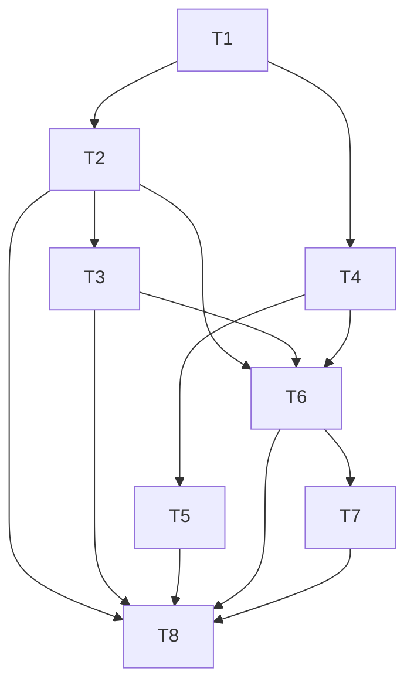

# 任务树 · 配色与界面形态

Status: APPROVED
PRD: `docs/PRDs/appearance-theme-shape.md`

## 任务列表

- [x] T1 · 建立形态目录与纯函数契约 · ≤25 min · 串行
  - 目标：定义六种形态、默认值、traits 和非法值回落规则。
  - 产出：`web/theme/themeShapes.ts`、`web/theme/themeShapes.test.ts`。
  - 验证：`npm run test:run -- web/theme/themeShapes.test.ts` → 六值、空值和非法值断言通过。
  - 依赖：无。
  - 信心：高。
  - TDD：RED 为缺少目录模块；GREEN/REFACTOR 后 `themeShapes.test.ts` 11/11 通过。

- [x] T2 · 扩展跨端设置契约 · ≤30 min · 串行
  - 目标：在 TypeScript/Rust `ThemeSettings` 中持久化 shape，并兼容旧配置和非法值。
  - 产出：`web/types/settings.ts`、`web/stores/useSettingsStore.ts`、`cc-panes-core/src/models/settings.rs` 及测试 fixture。
  - 验证：`cargo test -p cc-panes-core theme_shape -- --nocapture` 与 `npm run test:run -- web/stores/useSettingsStore.test.ts web/services/settingsService.test.ts` → 默认、往返和兼容断言通过。
  - 依赖：T1。
  - 信心：高。
  - TDD：RED 为前端 3 条兼容断言失败、Rust 缺字段编译失败；GREEN/REFACTOR 后 Rust 4/4、前端 23/23、TypeScript 与 rustfmt 通过，并补齐 `glass` 持久化往返测试。

- [x] T3 · 实现首帧与运行时应用 · ≤30 min · 串行
  - 目标：受控地设置 `html[data-shape]`，支持 localStorage 首帧兜底、设置加载覆盖和子窗口隔离。
  - 产出：`web/stores/useThemeStore.ts`、`web/main.tsx`、`web/hooks/useAppLifecycleLate.ts` 及运行时测试。
  - 验证：`npm run test:run -- web/stores/useThemeStore.test.ts` → 六值应用、非法值、重载和隔离断言通过。
  - 依赖：T1、T2。
  - 信心：中，风险是模块加载时序与 jsdom localStorage 状态。
  - TDD：RED 为新增 11 条运行时断言因 API 缺失失败；GREEN/REFACTOR 后形态 Store 与生命周期测试 20/20、TypeScript 通过。

- [x] T4 · 建立形态 CSS token 与语义类 · ≤30 min · 串行
  - 目标：让六种形态通过固定 token 控制半径、边界、玻璃和纹理，不依赖业务类名 sweep。
  - 产出：`web/assets/index.css`、`web/theme/themeShapeCss.test.ts`。
  - 验证：`npm run test:run -- web/theme/themeShapeCss.test.ts web/test/colorGuard.test.ts` → 六个 shape 块、语义类和色值护栏通过。
  - 依赖：T1。
  - 信心：中，风险是 Tailwind radius 变量与现有任意值圆角并存。
  - TDD：RED 为 9 条 CSS 契约缺失；GREEN/REFACTOR 后形态 CSS 10/10、色值护栏 3/3、生产构建通过。

- [x] T5 · 接入核心表面与通用原语 · ≤30 min · 串行
  - 目标：P0 chrome、Dialog、Button、Input 响应形态，同时排除内容画布和语义圆形。
  - 产出：AppShell、TitleBar、ActivityBar、Sidebar、StatusBar、TabBar、SettingsPanel 和 `web/components/ui/` 的语义 class 改动及覆盖测试。
  - 验证：`npm run test:run -- web/theme/themeShapeCoverage.test.ts web/components/TitleBar.test.tsx web/components/ActivityBar.test.tsx` → P0 标记和既有交互通过。
  - 依赖：T4。
  - 信心：中，风险是 portal 浮层和 inline 背景的 CSS 优先级。
  - TDD：RED 为 8 个 P0/原语覆盖点缺失；GREEN/REFACTOR 后覆盖与 CSS 契约 21/21、核心交互 58/58、TypeScript 通过。

- [x] T6 · 实现配色与形态选择器 · ≤30 min · 串行
  - 目标：按已确认文案展示两个区块、六张可访问预览卡并即时应用和自动保存。
  - 产出：`ThemeSection.tsx`、中英文 settings 文案、搜索条目和组件测试。
  - 验证：`npm run test:run -- web/components/settings/ThemeSection.test.tsx web/components/settings/settingsRegistry.test.ts` → 选择、独立组合、a11y 和搜索断言通过。
  - 依赖：T2、T3、T4。
  - 信心：高。
  - TDD：RED 为分区、六形态、独立组合、恢复和模糊降级断言失败；GREEN/REFACTOR 后设置页 14/14、CSS/色值护栏 13/13、TypeScript 通过，独立评审通过。

- [x] T7 · 增加功能发现与用户文档 · ≤25 min · 串行
  - 目标：加入形态功能提示、预览、更新记录和视觉验收清单。
  - 产出：tip registry/visual/i18n、`CHANGELOG.md`、`docs/shape-visual-checklist.md`。
  - 验证：`npm run test:run -- web/components/tips/featureTipRegistry.test.ts web/components/tips/FeatureTip.test.tsx` → 新 tip 可发现且动作打开主题设置。
  - 依赖：T6。
  - 信心：高。
  - TDD：RED 为 `interface-shapes` 注册、定向导航和六形态预览缺失；GREEN/REFACTOR 后 tip/状态栏回归 35/35、TypeScript 通过，无快捷键的提示不再显示重绑入口。

- [ ] T8 · 完整回归、视觉矩阵与独立评审 · ≤30 min · 串行
  - 目标：验证 36 组合中的代表矩阵、跨端契约、无回归和 PRD 一致性。
  - 产出：验证记录、修复、已完成任务状态和评审结论。
  - 验证：`npx tsc --noEmit`; `npm run test:run`; `npm run build`; `cargo fmt --all -- --check`; `cargo test -p cc-panes-core theme_shape`; `git diff --check` → 新失败为零并记录 Windows-host-required 项。
  - 依赖：T2、T3、T5、T6、T7。
  - 信心：中，风险是仓库已有未归属文件和完整测试耗时。
  - 状态：自动门禁已通过；Windows WebView2 全组合视觉矩阵待人工签署（当前会话无可连接的浏览器或桌面视觉工具）。详见 `docs/shape-verification-record.md` 和 `docs/shape-visual-checklist.md`。

## 依赖关系

## 容量估算

- 乐观：3.5 小时。
- 最可能：5.5 小时。
- 悲观：8 小时，主要来自 CSS 组合回归和 Windows WebView2 视觉差异。
- 并行度：共享设置、i18n 和 CSS 文件较多，代码实施保持单流；只读评审可在完成后独立进行。
- 关键路径：T1 → T2 → T3 → T6 → T7 → T8（170 分钟）。

## 强制自检

- 所有任务均不超过 30 分钟。
- 每项验证都包含可执行命令；视觉矩阵作为 T8 的补充证据，不替代自动化门禁。
- 两个中信心任务均写明具体风险。
- 本期总量未超出用户授权范围，不需要削减功能。
