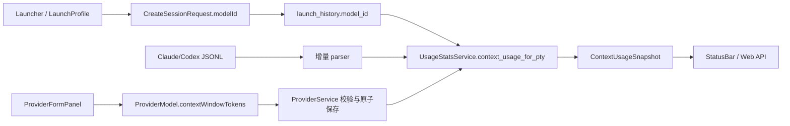

# Design - Provider 上下文窗口与用量显示

## Architecture diagram



## Key decisions

### 决策 1：Provider 模型维护值作为显式元数据

- 选择：在现有 `ProviderModel` 上增加可空 `contextWindowTokens`。
- 替代：写死模型表、调用供应商 `/models`、从 CLI 输出猜测。
- 理由：代理模型 id、上下文能力和供应商 API 不一致；本地维护可审计、离线可用且不暴露凭据。Codex 仍以运行时观测为准。

### 决策 2：保存启动时的 model id

- 选择：launch history 增加可空 `model_id` 与一次数据库迁移。
- 替代：每次查询只使用 Provider 默认模型或重新解析当前 Profile。
- 理由：Profile 可在会话运行期间修改，状态栏必须绑定实际启动选择；旧行通过 null 兼容。

### 决策 3：未知窗口不计算百分比

- 选择：保留 raw usage，窗口/百分比为 null，UI 显示 `-%` 和未知来源。
- 替代：继续使用 200k fallback。
- 理由：错误百分比比缺失百分比更容易误导；修复目标就是消除把所有 Provider 当成 200k 的假精确。

### 决策 4：运行时值优先、配置值兜底

- Codex 的 `model_context_window` 是 CLI 对当前模型的直接观测，应覆盖 Provider 手工值。
- Claude 日志若出现窗口字段则使用它；普通 Claude JSONL 没有该字段，使用已保存 model id 对应的 Provider 值。
- Provider 修改不更新旧 history 的 model id；解析结果带 source，便于解释配置变化。

## Data model changes

### Provider JSON

```json
{
  "id": "anthropic-proxy",
  "models": [
    {
      "id": "claude-sonnet-4-5",
      "label": "Sonnet 4.5",
      "contextWindowTokens": 1000000
    }
  ],
  "defaultModelId": "claude-sonnet-4-5"
}
```

字段缺失等价于 null；保存仍走现有 ProviderService 的 normalize/validate/atomic write。

### SQLite

- migration 新增 `launch_history.model_id TEXT`，默认 null。
- 查询列、mapper、Tauri/REST DTO 同步新增可选字段。
- 不删除或重写已有记录，不增加历史 usage 表字段。

## API surface changes

- `add_launch_history`、`/api/launch-history` 的请求增加可选 `modelId`。
- `LaunchRecord` 响应增加可选 `modelId`。
- Provider JSON/Tauri provider commands 自动透传 `contextWindowTokens`。
- `ContextUsageSnapshot` 继续复用现有契约，仅补充 `windowSource=unknown` 和 `diagnosticCode=WINDOW_UNKNOWN` 的明确语义，不改字段名。

## File / module impact

- 修改：`cc-panes-core/src/models/provider.rs`、`web/types/provider.ts`、`provider_service.rs`、Provider 表单/模型编辑器和中英文 settings i18n。
- 修改：`cc-panes-core/src/repository/db.rs`、`history_repo.rs`、`launch_history_service.rs`、Tauri history command、REST history adapter、Web history service、`useOpenTerminal`、orchestrator launch history 写入。
- 修改：`claude_session_service.rs`、`usage_stats_service.rs`、`ContextUsageIndicator.tsx`、context usage i18n 与相关测试。
- 新增：`docs/provider-context-window/README.md`。
- 不修改：CLI adapter 启动参数、SSH provider 安全策略、其他 CLI 的上下文解析。

## Rollout and rollback

1. 先发布字段和 migration，旧客户端请求不带 `modelId` 仍可启动。
2. 再启用实时窗口解析；Provider 未配置的模型会显示 unknown，不阻断启动。
3. 若发现解析回归，可回滚 UI/解析代码；新增 JSON 字段和 nullable SQLite 列不会破坏旧版本读取。
