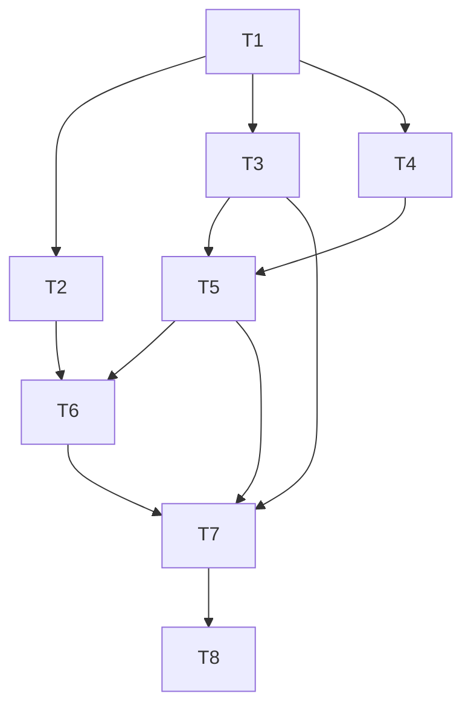

# 任务树 - Provider 上下文窗口与用量显示

## 任务列表

- [x] T1 - 扩展 ProviderModel 数据契约与 Rust 校验 - 20 min - 串行
  - 目标：新增可空 `contextWindowTokens`，完成 serde/TypeScript 类型、范围校验和旧数据兼容。
  - 产出：`provider.rs`、`web/types/provider.ts`、ProviderService 单测。
  - 验证：`cargo test -p cc-panes-core provider_service::tests:: -- --nocapture` -> 新旧字段、边界和非法值断言通过。
  - depends_on：无
  - 信心：高
  - Review：2026-08-05 独立规格复审与 staff-engineer 质量复审通过；边界、类型错误和持久化不变测试已核验。

- [x] T2 - Provider 表单维护上下文窗口 - 20 min - 串行
  - 目标：模型编辑器可输入/清空 token 窗口，表单保存保持 null 语义。
  - 产出：`ProviderModelsEditor.tsx`、`ProviderFormPanel.tsx`、中英文 settings i18n、组件测试。
  - 验证：`npm run test:run -- web/components/providers/ProviderFormPanel.test.tsx` -> 输入、保存和旧模型兼容通过。
  - depends_on：T1
  - 信心：高
  - Review：2026-08-05 独立规格与 staff-engineer 评审通过；响应式操作区错位已修复，边界测试 nit 转入 T7。

- [x] T3 - launch history 增加 modelId 迁移与跨层传输 - 30 min - 串行
  - 目标：保存一次启动最终使用的模型 id，覆盖 GUI、MCP、REST、Tauri 和 Web/API，旧请求可选为空。
  - 产出：数据库 migration、HistoryRepository/Service、commands、REST DTO、historyService、`useOpenTerminal`、orchestrator 调用与测试。
  - 验证：`cargo test -p cc-panes-core history_repo -- --nocapture` 与 `npm run test:run -- web/services/historyService.test.ts` -> round-trip 和 payload 通过。
  - depends_on：T1
  - 信心：中
  - Review：2026-08-05 规格合规与工程质量复审通过；补充 daemon 三态兼容、创建后 history fallback 与最终模型绑定。

- [x] T4 - Claude/Codex 窗口候选解析 - 25 min - 并行
  - 目标：Claude 识别显式窗口字段；Codex 保留现有运行时窗口；非法候选安全忽略。
  - 产出：两个 session parser 的字段和 fixture 测试。
  - 验证：`cargo test -p cc-panes-core claude_session_service -- --nocapture` 与 `cargo test -p cc-panes-core codex_session_service -- --nocapture` -> 解析、类型错误、partial line 通过。
  - depends_on：T1
  - 信心：中
  - 验证记录：2026-08-05 Claude 20/20、Codex 16/16 通过；T4 文件 rustfmt 与 `git diff --check` 通过。

- [x] T5 - UsageStatsService 窗口解析优先级与未知快照 - 30 min - 串行
  - 目标：注入 ProviderService，按 JSONL -> launch model -> Provider default -> unknown 解析；移除 Claude 200k 硬编码，保留 raw usage。
  - 产出：UsageStatsService、ContextUsageSnapshot tests、src-tauri/cc-panes-web wiring。
  - 验证：`cargo test -p cc-panes-core usage_stats_service -- --nocapture` -> Codex 实测优先、Claude Provider 值、unknown 百分比 null。
  - depends_on：T1, T3, T4
  - 信心：中
  - 验证记录：2026-08-05 UsageStatsService 20/20、workspace cargo check 通过；JSONL、Provider model/default、unknown、invalid-window 诊断与 u64 溢出语义已核验。

- [x] T6 - UI 显示窗口来源与 unknown 状态 - 20 min - 并行
  - 目标：状态栏在未知窗口时显示 `-%`，tooltip 解释来源和维护动作；不改变 waiting/stale/error 行为。
  - 产出：`ContextUsageIndicator.tsx`、context usage i18n、前端测试。
  - 验证：`npm run test:run -- web/utils/contextUsageModel.test.ts web/components/ContextUsageIndicator.test.tsx` -> raw/unknown/source 断言通过。
  - depends_on：T2, T5
  - 信心：高
  - 验证记录：2026-08-05 unknown 显示、维护提示、window source 与百分比归一化 focused Vitest 通过。

- [x] T7 - 跨层回归与安全扫描 - 25 min - 串行
  - 目标：确认新增字段不进入凭据/命令日志，所有构造器与旧 payload 兼容。
  - 产出：必要的回归测试和 diff 分类记录。
  - 评审跟进：补充前端 context window helper 的精确边界、NaN 和 Infinity 单测。
  - 验证：`rg -n "modelId|contextWindowTokens|API_KEY|Bearer" web cc-panes-core src-tauri cc-panes-web` -> 每个新传播点有归属说明，敏感值未进入新路径。
  - depends_on：T3, T5, T6
  - 信心：高
  - 验证记录：2026-08-05 NaN/Infinity/边界百分比测试、daemon 55/55、Web history 12/12、frontend focused 52/52、Launch Profile 6/6、lineRatchet 2/2、敏感词传播扫描和 npm audit（0 vulnerabilities）通过；新增快照不携带 Provider 凭据或完整 JSONL。

- [x] T8 - 运行项目门禁与完成验证 - 30 min - 串行
  - 目标：运行 TypeScript、Vitest、Rust fmt/check/test 与 diff 检查，记录环境边界。
  - 产出：验证结果、Windows-host-required 项目清单。
  - 验证：`npx tsc --noEmit`; `npm run test:run`; `cargo fmt --all -- --check`; `cargo check --workspace`; `cargo test -p cc-panes-core`; `git diff --check`。
  - depends_on：T5, T6, T7
  - 信心：中（当前工作区已有用户未提交改动）
  - 验证记录：`npx tsc --noEmit`、`cargo fmt --all -- --check`、`cargo check --workspace`、`cargo test -p cc-panes-core`（1009 passed）、`cargo test -p cc-panes-web`（102 passed）和 `git diff --check` 通过；完整 `npm run test:run` 已执行，剩余失败仅来自并行未归属改动：`useAppLifecycle.order.test.tsx`、`colorGuard.test.ts`、`WallpaperPreview.test.tsx`，Provider/context 相关测试全通过。唯一最终评审发现的 Launch Profile 窗口文本和非法 JSONL 诊断阻塞已修复，并由受影响测试与 Rust 全量回归覆盖；按用户要求未启动第二轮评审。Windows 桌面启动、WebView2、托盘、全局快捷键、截图、更新器和 Win32 PTY 仍需 Windows host 手工验证。

## 依赖关系

## 容量估算

- 乐观：2.5 小时
- 最可能：4 小时
- 悲观：6 小时（若历史入口或现有用户改动造成冲突）
- 最大并行度：2；T4 与 T2 可在 T1 后并行，其余按依赖串行。
- 关键路径：T1 -> T3 -> T4 -> T5 -> T6 -> T7 -> T8。
