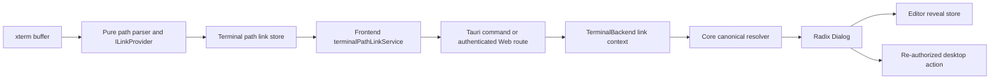

# Design · Terminal Path Link Dialog

## Architecture diagram

## Key decisions

- Decision 1: Use xterm `ILinkProvider` for plain paths and `linkHandler` for OSC 8. Alternative: rewrite output into DOM anchors. Reason: providers preserve terminal buffer, selection, copying, and renderer semantics.
- Decision 2: Perform no filesystem IO during hover. Alternative: existence probes in `provideLinks`. Reason: avoids IPC amplification, asynchronous callback races, and cache invalidation; click-time failure is explicit and safe.
- Decision 3: Add `TerminalBackend::terminal_link_context`. Alternative: pass `projectPath` from the renderer or fabricate provenance. Reason: the root must come from backend session state, while provenance has immutable daemon identity semantics that must not be forged.
- Decision 4: Put canonicalization in `cc-panes-core` and reuse it from Tauri and Web. Alternative: duplicate validation in adapters. Reason: one authorization implementation prevents cross-layer drift.
- Decision 5: Apply containment to absolute and relative paths. Alternative: allow absolute paths outside cwd as the reference project does. Reason: terminal output is untrusted and must not grant arbitrary filesystem access.
- Decision 6: Use Radix Dialog at `AppDialogs`. Alternative: hand-written overlay. Reason: existing focus, Escape, aria, portal, and style behavior should remain consistent.
- Decision 7: Use a non-persisted editor reveal store keyed by canonical path and request ID. Alternative: persist line/column on editor tabs. Reason: cursor navigation is one-shot UI intent, not tab identity.
- Decision 8: Reject SSH and unmapped WSL absolute POSIX paths. Alternative: guess mappings. Reason: host filesystem actions must not silently target the wrong machine.

## Data model changes

- Add a non-persisted frontend Dialog state union with request and action IDs.
- Add a non-persisted editor reveal request keyed by canonical file path.
- Add `TerminalLinkContext { project_path, runtime_kind }` to core.
- Add `project_path` and `runtime_kind` fields to in-memory `TerminalSession` so the in-process backend can expose trusted context.
- No SQLite schema or persisted frontend state changes.

## API surface changes

- Add `TerminalBackend::terminal_link_context(session_id)` with a fail-closed default.
- Add a core resolver returning canonical path, target kind, and runtime.
- Add Tauri commands `resolve_terminal_path_link` and `run_terminal_path_link_action`.
- Add authenticated Web route `POST /api/terminal/path-link/resolve`.
- Add frontend `terminalPathLinkService.resolve` and desktop action methods.
- Add a one-shot editor reveal store consumed by `EditorView`.

## File / module impact

- Add: `web/lib/terminalPathLink.ts`, parser tests, frontend service, Dialog store, Dialog component, editor reveal store, and their tests.
- Add: core terminal path link model/service and tests.
- Add: Tauri command adapter and Web route tests.
- Modify: `TerminalView.tsx` and its xterm mock tests.
- Modify: `EditorView.tsx`, `AppDialogs.tsx`, store/service exports, and panes i18n JSON.
- Modify: core terminal session/backend implementations and adapter registration.
- Delete: none.

