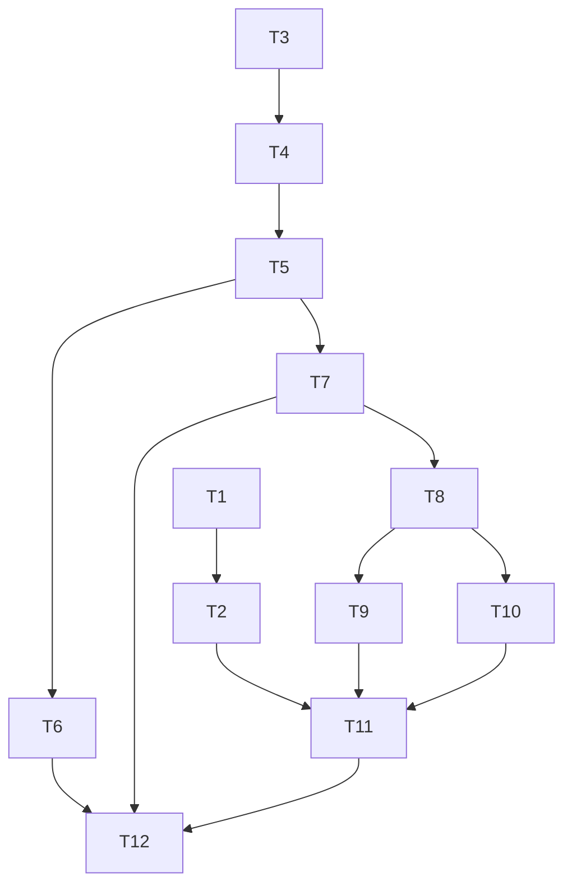

# Task Tree · Terminal Path Link Dialog

## Task list

- [x] T1 · Define and test terminal path parsing · <=30 min · serial
  - Goal: specify accepted/rejected syntax and xterm cell-range behavior with failing Vitest cases.
  - Output: `web/lib/terminalPathLink.test.ts`.
  - Verify: `npm run test:run -- web/lib/terminalPathLink.test.ts` -> failures identify unimplemented parser/provider behavior.
  - Depends on: none.
  - Confidence: high.

- [x] T2 · Implement pure parser and ILinkProvider · <=30 min · serial
  - Goal: pass bounded syntax, Unicode cell mapping, soft-wrap, and URI classification tests without IO.
  - Output: `web/lib/terminalPathLink.ts`.
  - Verify: `npm run test:run -- web/lib/terminalPathLink.test.ts` -> all tests pass.
  - Depends on: T1.
  - Confidence: medium; xterm wide/combining cell mapping requires exact 1-based ranges.

- [x] T3 · Define and test core resolver · <=30 min · serial
  - Goal: lock down canonical containment, target kinds, runtime rejection, and typed errors.
  - Output: core model/service tests for terminal path links.
  - Verify: `cargo test -p cc-panes-core terminal_path_link` -> expected failing resolver tests before implementation.
  - Depends on: none.
  - Confidence: high.

- [x] T4 · Implement core resolver and in-process context · <=30 min · serial
  - Goal: add trusted session context and canonical resolver for local/WSL sessions.
  - Output: core model/service, `TerminalSession` context fields, and `InProcessTerminalBackend` implementation.
  - Verify: `cargo test -p cc-panes-core terminal_path_link` -> all core cases pass.
  - Depends on: T3.
  - Confidence: medium; Windows canonical and WSL UNC paths need platform-safe handling.

- [x] T5 · Wire daemon terminal link context · <=20 min · serial
  - Goal: derive link context from daemon provenance and fail when provenance is absent.
  - Output: `DaemonTerminalBackend` implementation and backend tests.
  - Verify: `cargo test -p cc-panes-core terminal_backend` -> daemon/in-process backend tests pass.
  - Depends on: T4.
  - Confidence: high.

- [x] T6 · Add Tauri resolver and desktop actions · <=30 min · serial
  - Goal: expose typed commands and re-authorize before default/reveal actions.
  - Output: Tauri command module, registration, and focused tests.
  - Verify: `cargo test -p cc-panes terminal_path_link` -> command/action tests pass.
  - Depends on: T5.
  - Confidence: medium; opener behavior differs by target type and OS.

- [x] T7 · Add Web resolve route and frontend service · <=30 min · serial
  - Goal: reuse the core resolver through authenticated Web and `invokeOrApi` frontend contracts.
  - Output: Web route, frontend service, exports, and tests.
  - Verify: `cargo test -p cc-panes-web terminal_path_link; npm run test:run -- web/services/terminalPathLinkService.test.ts` -> all pass.
  - Depends on: T5.
  - Confidence: medium; route placement must match current router/auth conventions.

- [x] T8 · Implement Dialog state machine · <=25 min · serial
  - Goal: handle resolving/ready/acting/closed states, stale requests, close, and timeouts.
  - Output: `useTerminalPathLinkStore.ts` and tests.
  - Verify: `npm run test:run -- web/stores/useTerminalPathLinkStore.test.ts` -> race and error tests pass.
  - Depends on: T7.
  - Confidence: high.

- [x] T9 · Implement Radix Dialog and i18n · <=30 min · serial
  - Goal: render target-specific, runtime-specific, accessible actions at the global Dialog mount.
  - Output: Dialog component/tests, `AppDialogs.tsx`, and en/zh-CN panes translations.
  - Verify: `npm run test:run -- web/components/panes/TerminalPathLinkDialog.test.tsx` -> state, action, keyboard, and accessibility tests pass.
  - Depends on: T8.
  - Confidence: high.

- [x] T10 · Implement one-shot Monaco reveal · <=30 min · serial
  - Goal: focus requested line/column for new and existing editor tabs without persistence.
  - Output: editor reveal store/tests and `EditorView.tsx` integration.
  - Verify: `npm run test:run -- web/stores/useEditorRevealStore.test.ts web/components/editor/EditorView.test.tsx` -> reveal and clamp tests pass.
  - Depends on: T8.
  - Confidence: medium; editor load/mount ordering and Markdown preview require synchronization.

- [x] T11 · Integrate provider and OSC 8 into TerminalView · <=30 min · serial
  - Goal: register one provider, route activation through the store/service, and dispose it without terminal lifecycle regressions.
  - Output: `TerminalView.tsx` and updated xterm mock tests.
  - Verify: `npm run test:run -- web/components/panes/TerminalView.test.tsx web/lib/terminalPathLink.test.ts` -> registration, activation, and disposal tests pass.
  - Depends on: T2, T9, T10.
  - Confidence: medium; TerminalView has sensitive init/cleanup ordering.

- [x] T12 · Run cross-layer and regression gates · <=30 min · serial
  - Goal: prove frontend/core/Tauri/Web contracts agree and record environment-specific gaps.
  - Output: final fixes, completed task checkboxes, and verification evidence.
  - Verify: `npx tsc --noEmit; npm run test:run; npm run build; cargo fmt --all -- --check; cargo check --workspace; cargo test --workspace` -> all new failures resolved and pre-existing failures identified.
  - Depends on: T6, T7, T11.
  - Confidence: medium; workspace size and concurrent user changes may expose unrelated failures.

## Dependency graph

## Capacity estimate

- Optimistic: 4 hours.
- Most likely: 5.5 hours.
- Pessimistic: 8 hours if daemon/Web contracts or Windows path behavior need additional adapters.
- Parallelism: one implementation stream because shared terminal/backend contracts and workspace files overlap.
- Critical path: T3 -> T4 -> T5 -> T7 -> T8 -> T9 -> T11 -> T12 (235 minutes).

## Verification evidence (2026-08-05)

- Focused frontend: 8 files, 132 tests passed.
- TypeScript: `npx tsc --noEmit` passed.
- Frontend build: `npm run build` passed with existing CSS/chunk/circular-export warnings.
- Full frontend: all tests passed except the unrelated line ratchet for `ProviderFormPanel.tsx` (710 lines vs 701 baseline).
- Rust: `cargo fmt --all -- --check`, `cargo check --workspace`, `cargo clippy --workspace -- -D warnings`, and `cargo test --workspace` passed.
- Focused Rust: core resolver/Windows UNC containment, Tauri re-authorization/error mapping, daemon live-context, and Web typed-error tests passed.
- Dependency audit: `npm audit --omit=dev` is unavailable because npmmirror returns `NOT_IMPLEMENTED`; `cargo-audit` is not installed. No dependency was added by this change.
- Windows Tauri WebView/CDP: confirmed the real Tauri runtime, resolver errors, target-specific actions, Monaco one-shot reveal at line 2 column 1, and directory action filtering.
- Windows real-xterm activation: hovering `./README.md:2:1` set the xterm pointer decoration; native CDP mouse down/up opened the Radix Dialog with canonical `F:\C26\gitee.com\zhengjunkj\ccpanel\README.md:2:1` and no terminal selection.
