# CC-Panes Provider 全流程架构与实现手册

> 文档基线：2026-08-04 当前工作树  
> 读者：维护 Provider、运行配置、终端启动、MCP 编排和 CLI Adapter 的开发者  
> 范围：桌面端、Web、Daemon、REST、MCP、Local、WSL、SSH 以及会话恢复  
> 约定：中文界面称“运行配置”，Rust/TypeScript/API 中沿用 `LaunchProfile`

Provider 在 CC-Panes 中不是“某个 CLI 私有的一份账号配置”。它是全局凭证资源，经过 CLI 能力过滤后，可以被一个或多个兼容 CLI 使用。一次启动是否真正注入 Provider，取决于 `providerSelection`、显式请求、运行配置、Workspace 兼容字段和该 CLI 的默认映射，最终由后端共享解析器裁决。

本文记录当前实现，不把设计草案当成已落地行为。涉及模型历史持久化等尚未闭环的部分，会明确标为“当前限制”。

---

## 目录

1. [系统不变量与术语](#1-系统不变量与术语)
2. [全局组件架构](#2-全局组件架构)
3. [核心数据模型](#3-核心数据模型)
4. [Provider 类型与 CLI 兼容矩阵](#4-provider-类型与-cli-兼容矩阵)
5. [Provider CRUD 全流程](#5-provider-crud-全流程)
6. [持久化、默认值与配置迁移](#6-持久化默认值与配置迁移)
7. [Native 与 Managed 双模式](#7-native-与-managed-双模式)
8. [运行配置与项目绑定](#8-运行配置与项目绑定)
9. [Provider 解析优先级](#9-provider-解析优先级)
10. [模型与推理强度解析](#10-模型与推理强度解析)
11. [统一启动请求](#11-统一启动请求)
12. [桌面、Web 与 Daemon 入口](#12-桌面web-与-daemon-入口)
13. [MCP 与 REST 启动链路](#13-mcp-与-rest-启动链路)
14. [TerminalService 执行管线](#14-terminalservice-执行管线)
15. [Local、WSL、SSH 运行时](#15-localwslssh-运行时)
16. [CLI Adapter 注入矩阵](#16-cli-adapter-注入矩阵)
17. [OpenCode 专项说明](#17-opencode-专项说明)
18. [MCP、Skill、YOLO 与 Provider 的组合](#18-mcpskillyolo-与-provider-的组合)
19. [会话历史、事件与恢复](#19-会话历史事件与恢复)
20. [安全边界与敏感信息](#20-安全边界与敏感信息)
21. [错误码与故障排查](#21-错误码与故障排查)
22. [测试矩阵与扩展指南](#22-测试矩阵与扩展指南)
23. [关键文件索引](#23-关键文件索引)

---

## 1. 系统不变量与术语

### 1.1 五个核心对象

| 对象 | 作用 | Source of truth |
|---|---|---|
| Provider | 凭证、端点、模型目录和默认模型 | `providers.json` |
| ProviderModel | Provider 内可选模型及默认推理强度 | `Provider.models[]` |
| Launch Profile | Provider、模型、推理参数、MCP、Skill、运行时和 YOLO 的组合 | `launch-profiles.json` |
| Workspace / Project binding | 把运行配置绑定到工作空间或具体项目 | `workspaces/<name>/workspace.json` |
| ResolvedProviderPlan | 单次启动最终采用的 Native/Managed、Provider、模型和来源 | 运行时内存，不落凭证快照 |

核心定义位于：

- [`ProviderType`、`ProviderModel`、`Provider`](../cc-panes-core/src/models/provider.rs#L14)
- [`LaunchProfile`、`LaunchProviderSelection`](../cc-panes-core/src/models/launch_profile.rs#L6)
- [`WorkspaceProject.launch_profile_id`](../cc-panes-core/src/models/workspace.rs#L58)
- [`ProviderResolutionInput`、`ResolvedProviderPlan`](../cc-panes-core/src/services/provider_resolver.rs#L46)

### 1.2 三种常被混淆的状态

1. **兼容可见**：Provider 出现在某个 CLI 标签中，只说明 Adapter 声明可以消费该 Provider 类型。
2. **CLI 默认**：`default_provider_ids[cli]` 指向某个 Provider，`providerSelection=inherit` 时才可能采用。
3. **本次已解析**：共享解析器返回 `ProviderMode::Managed`，TerminalService 才会清理冲突环境并注入凭证。

例如 OpenCode 标签显示 Anthropic 和 OpenAI Provider，是“兼容可见”。如果两张卡都没有“默认”标记，且运行配置没有选择它们，本次 OpenCode 启动仍然是 Native。

### 1.3 不变量

- Provider 引用使用稳定 `id`；`name` 是可编辑显示名。
- 一个启动最多解析出一个 Provider 和一个模型。
- `providerSelection=none` 是显式 Native，不等于 `providerId=null`。
- `SYSTEM_PROVIDER_ID="__system__"` 是合成项，不写入 `providers[]`。
- 运行配置只保存 Provider id 和模型 id，不复制 API Key、Base URL。
- Managed Provider over SSH 当前被拒绝。
- Provider 兼容性由 Rust Adapter 能力声明裁决，前端 fallback 只是加载期间的镜像。
- Native 模式不主动清理用户现有 CLI 登录态、shell 环境或 CC Switch live config。

**本节检查**

- 在评审问题时先判断它属于“可见性”“默认映射”还是“有效启动计划”。
- 不以 UI 卡片是否出现推断凭证是否已注入。

---

## 2. 全局组件架构

### 2.1 分层图

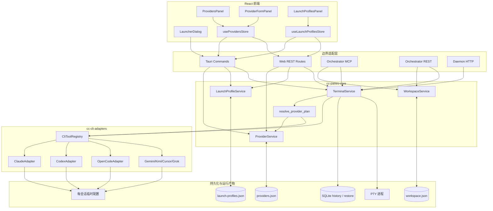

### 2.2 各层职责

| 层 | 应做 | 不应做 |
|---|---|---|
| React 组件 | 表单、筛选、预览、错误展示 | 自己拼 CLI 参数 |
| 前端 Service/Store | IPC/API 映射、缓存和刷新 | 判断后端最终 Provider 优先级 |
| Tauri/Web/MCP/Daemon | 校验边界、投影请求、鉴权 | 各自实现一套 Provider resolver |
| ProviderService | Provider 持久化、校验、默认映射、环境变量解析 | 决定某次启动最终选择哪个 Provider |
| LaunchProfileService | 运行配置 CRUD、匹配、MCP/Skill 解析、预览 | 直接注入凭证 |
| provider_resolver | Provider/模型来源优先级和兼容性 | 写磁盘或启动进程 |
| TerminalService | 汇聚请求、构建 Adapter 上下文、选择运行时、启动 PTY | 按 UI 猜测默认值 |
| CLI Adapter | 把统一上下文翻译为参数、环境和临时配置 | 读取 Workspace 或 Provider 存储 |

Adapter 契约定义在 [`CliToolAdapter`](../cc-cli-adapters/src/lib.rs#L372)，注册中心在 [`CliToolRegistry::with_builtin_adapters`](../cc-cli-adapters/src/lib.rs#L1142)。

**本节检查**

- 新入口必须落到 `CreateSessionRequest -> TerminalService`，不能绕过共享解析器。
- 新 CLI 的 Provider 规则应进入 Adapter capability，不应只写前端 if/else。

---

## 3. 核心数据模型

### 3.1 Provider

Rust 模型位于 [`cc-panes-core/src/models/provider.rs:14`](../cc-panes-core/src/models/provider.rs#L14)，前端镜像位于 [`web/types/provider.ts:3`](../web/types/provider.ts#L3)。

```text
Provider
├── id: String                    稳定引用键
├── name: String                  用户显示名
├── provider_type: ProviderType   凭证协议/目标服务类型
├── api_key: Option<String>       明文持久化凭证
├── base_url: Option<String>      HTTP(S) 端点
├── region/project_id/aws_profile Bedrock/Vertex 字段
├── config_dir                    Claude config 或 env JSON 路径
├── models: Vec<ProviderModel>    手工维护的模型目录
├── default_model_id              Provider 默认模型
└── is_default                    兼容旧结构的派生标记
```

`is_default` 不是按 CLI 区分的权威字段。当前权威字段是 `ProviderConfig.default_provider_ids`；`ProviderService::sync_legacy_default_flags` 只把“是否被任一 CLI 引用”投影回 `is_default`，供旧调用兼容。代码见 [`provider_service.rs:160`](../cc-panes-core/src/services/provider_service.rs#L160)。

### 3.2 ProviderModel

```text
ProviderModel
├── id: String
├── label: Option<String>
└── default_effort: Option<low|medium|high|xhigh|max>
```

模型目录不是远程 `/models` 自动发现结果。保存时会执行：

- 最多 100 个模型；
- model id trim 后唯一；
- id 不得为空、超长或含 ASCII 控制字符；
- label 可空，最长 128 字符；
- `defaultEffort` 只允许五档；
- 未指定 `defaultModelId` 时，第一个模型自动成为默认；
- 显式默认必须存在于 `models[]`。

实现见 [`ProviderService::normalize_provider_models`](../cc-panes-core/src/services/provider_service.rs#L590)。

### 3.3 LaunchProfile

[`LaunchProfile`](../cc-panes-core/src/models/launch_profile.rs#L6) 聚合以下配置：

| 字段 | 含义 |
|---|---|
| `providerId` | 运行配置指定 Provider |
| `modelId` | 该 Provider 中的模型 |
| `adapterOptions` | `effort`、`extraArgs`、`verbose`、`maxTurns` 等 |
| `targetTools` | 适用 CLI；空数组表示不限 |
| `targetRuntime` | `local` / `wsl` / `ssh`；空表示不限 |
| `yoloMode` | 是否绕过 CLI 权限确认 |
| `mcpPolicy` | default/custom/disabled 及 server 白名单/黑名单 |
| `skillPolicy` | core/custom/disabled 及 Skill 来源选择 |
| `isDefault` | 对重叠 CLI + runtime 范围生效的默认配置 |

### 3.4 CreateSessionRequest

所有终端创建路径最终投影为 [`CreateSessionRequest`](../cc-panes-core/src/models/terminal.rs#L53)：

```rust
pub struct CreateSessionRequest {
    pub project_path: String,
    pub workspace_name: Option<String>,
    pub provider_id: Option<String>,
    pub model_id: Option<String>,
    pub provider_selection: LaunchProviderSelection,
    pub launch_profile_id: Option<String>,
    pub cli_tool: CliTool,
    pub yolo_mode: Option<bool>,
    pub adapter_options: Option<HashMap<String, Value>>,
    pub ssh: Option<SshConnectionInfo>,
    pub wsl: Option<WslLaunchInfo>,
    // 省略尺寸、恢复、prompt、布局来源等字段
}
```

### 3.5 关系图

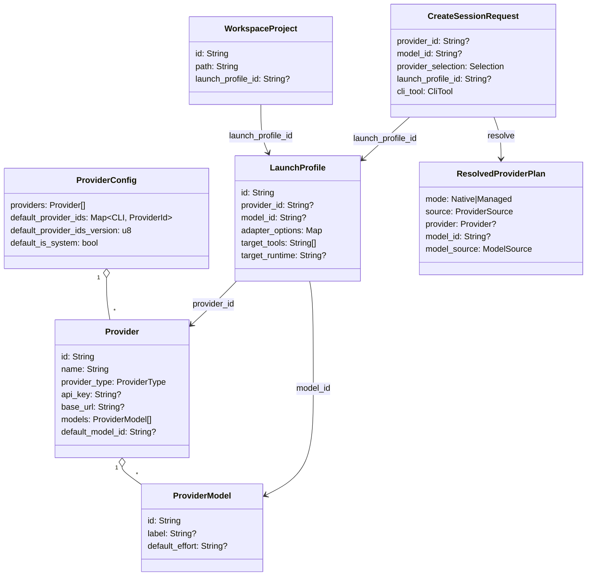

**本节检查**

- API 字段使用 camelCase；Rust 字段多为 snake_case，通过 serde 映射。
- 不把 `Provider.is_default` 当成 CLI 级默认来源。
- 模型 id 是不透明值，resolver 不猜别名或供应商前缀；OpenCode Adapter 是例外，它只补 CLI 所需的 provider key。

---

## 4. Provider 类型与 CLI 兼容矩阵

### 4.1 Adapter 是兼容性的权威来源

每个 Adapter 返回 [`CliToolCapabilities.compatible_provider_types`](../cc-cli-adapters/src/lib.rs#L489)。前端通过 `list_cli_tools` 异步获取能力；加载完成前使用 [`FALLBACK_CLI_TO_PROVIDER_TYPES`](../web/utils/providerCompatibility.ts#L12)，并要求两边保持一致。

| CLI | 兼容 ProviderType | 原生自动默认类型 | 主要注入通道 |
|---|---|---|---|
| Claude | `anthropic`, `bedrock`, `vertex`, `proxy`, `config_profile` | 同左，统一归属 `claude` | 环境变量 + CLI args |
| Codex | `open_ai` | `open_ai -> codex` | `-c model_provider` + 专用 env |
| Gemini | `gemini` | `gemini -> gemini` | 环境变量 + `--model` |
| Kimi | `kimi` | `kimi -> kimi` | 每会话 JSON + `--config-file` |
| OpenCode | `open_ai`, `opencode`, `anthropic` | 仅 `opencode -> opencode` | `OPENCODE_CONFIG` + `--model` |
| Cursor | `cursor` | `cursor -> cursor` | `CURSOR_API_KEY` + `--model` |
| Grok | `grok` | `grok -> grok` | XAI/Grok env + `--model` |
| Plain shell | 无 | 无 | 不支持 Managed Provider |

这里的“原生自动默认类型”只控制新增 Provider 时写入哪个 CLI 的默认映射。例如：

- 新增 Anthropic Provider：可出现在 Claude 和 OpenCode 标签，但只自动成为 Claude 默认。
- 新增 OpenAI Provider：可出现在 Codex 和 OpenCode 标签，但只自动成为 Codex 默认。
- 新增 OpenCode Provider：只自动成为 OpenCode 默认。
- 用户仍可在 OpenCode 标签中显式把 Anthropic/OpenAI Provider 设为 OpenCode 默认。

映射函数是 [`ProviderService::native_cli_for_provider_type`](../cc-panes-core/src/services/provider_service.rs#L143)。

### 4.2 UI 计数与过滤

[`ProvidersPanel`](../web/components/providers/ProvidersPanel.tsx#L79) 对每个 Provider 调用 `compatibleCliToolsForProviderType`：

```text
ProviderType -> Adapter compatibleProviderTypes -> 所有兼容 CLI 标签计数 +1
```

合成“系统环境变量”卡片总是置顶，但不在 `OpenCode 2` 这种真实 Provider 数量中。默认徽标按 `defaultProviderIds[activeTab] === provider.id` 计算，而不是读取 `provider.isDefault`。

### 4.3 为什么 OpenCode 会看到 Claude 和 Codex 凭证

OpenCode 原生支持多个 provider key。CC-Panes Adapter 把：

```text
ProviderType::Anthropic -> provider.anthropic.options
ProviderType::OpenAI    -> provider.openai.options
ProviderType::OpenCode  -> provider.opencode.options
```

因此兼容凭证可以复用。显示不意味着启动时同时加载两套凭证；`ResolvedProviderPlan` 最多包含一个 Provider。

**本节检查**

- 修改 Adapter capability 时同步更新前端 fallback 和 `providerCompatibility.test.ts`。
- UI 数量代表“兼容 Provider 数”，不是“该 CLI 独立创建的 Provider 数”。
- 处理误注入问题时查看默认徽标和实际解析日志，不要只看标签列表。

---

## 5. Provider CRUD 全流程

### 5.1 前端到后端

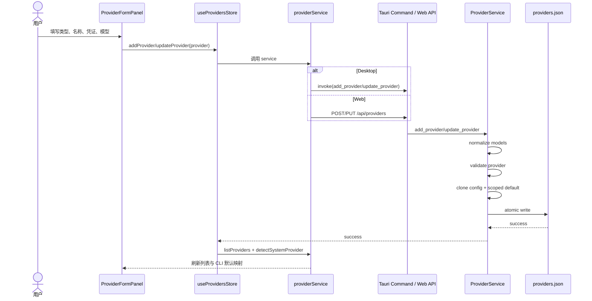

前端适配层在 [`web/services/providerService.ts:5`](../web/services/providerService.ts#L5)，状态层在 [`web/stores/useProvidersStore.ts:28`](../web/stores/useProvidersStore.ts#L28)，Tauri 命令在 [`src-tauri/src/commands/provider_commands.rs:11`](../src-tauri/src/commands/provider_commands.rs#L11)，Web 路由在 [`cc-panes-web/src/routes/resources.rs:507`](../cc-panes-web/src/routes/resources.rs#L507)。

### 5.2 新增

`ProviderService::add_provider` 的顺序是：

1. 规范化模型目录；
2. 校验 Provider id、名称、字段长度、URL scheme；
3. 拒绝保留 id `__system__` 和重复 id；
4. 克隆内存配置，避免失败时污染当前快照；
5. 将 Provider 放入 `providers[]`；
6. 若其原生 CLI 尚无默认，写入该 CLI 的默认映射；
7. 原子保存后才替换内存配置。

`add_provider_unique` 额外按 `name + type + base_url` 去重，用于一键导入。

### 5.3 更新

更新保持 Provider id 稳定。若旧调用通过 `is_default=true` 请求默认切换，只影响 Provider 的原生 CLI，不再扇出所有 CLI。模型默认被删除后，如果调用方同时清空 `defaultModelId`，首个剩余模型会被提升为默认。

### 5.4 删除

后端删除 Provider 后，会删除所有指向该 id 的 CLI 默认映射，让对应 CLI 回到 Native；不会静默选择另一个 Provider。前端还会扫描 Workspace 兼容字段 `workspace.providerId` 并清理悬空引用，见 [`useProvidersStore.ts:89`](../web/stores/useProvidersStore.ts#L89)。

运行配置中的悬空 `providerId` 不会被静默重写。预览或启动时共享 resolver 返回 `PROVIDER_NOT_FOUND`，便于用户修复配置。

### 5.5 设置默认

现代调用必须携带 `cliTool`：

```text
set_default_provider(id, cliTool)
    -> ProviderService::set_default_for_cli(cliTool, id)
    -> default_provider_ids[cliTool] = id
```

旧 `set_default(id)` 仍保留，但只设置 Provider 的原生 CLI。选择 `__system__` 时只设置 Claude 的 Native/系统来源。

**本节检查**

- CRUD 失败后，磁盘和内存都应保持旧值。
- 删除默认 Provider 后，确认默认映射被移除而不是指向列表第一项。
- 前端保存成功后必须重载 `providers` 与 `SystemProviderInfo`。

---

## 6. 持久化、默认值与配置迁移

### 6.1 文件位置

[`AppPaths`](../cc-panes-core/src/utils/app_paths.rs#L30) 决定配置目录：

| 环境 | 默认目录 | Provider 文件 | 运行配置文件 |
|---|---|---|---|
| Debug/dev | `~/.cc-panes-dev/` | `providers.json` | `launch-profiles.json` |
| Release | `~/.cc-panes/` | `providers.json` | `launch-profiles.json` |
| 自定义数据目录 | `settings.general.dataDir` | `<dataDir>/providers.json` | `<dataDir>/launch-profiles.json` |

`providers.json` 包含明文 API Key。保存使用临时文件、fsync、rename 的原子写路径，见 [`ProviderService::save_to_file`](../cc-panes-core/src/services/provider_service.rs#L81)。

### 6.2 脱敏示例

```json
{
  "providers": [
    {
      "id": "anthropic-main",
      "name": "Claude Main",
      "providerType": "anthropic",
      "apiKey": "<redacted>",
      "baseUrl": "https://api.example.com",
      "models": [
        {
          "id": "claude-sonnet-4-6",
          "label": "Sonnet 4.6",
          "defaultEffort": "high"
        }
      ],
      "defaultModelId": "claude-sonnet-4-6",
      "isDefault": true
    }
  ],
  "default_provider_ids": {
    "claude": "anthropic-main"
  },
  "default_provider_ids_version": 2,
  "default_is_system": false
}
```

注意：`Provider` 自身使用 camelCase，`ProviderConfig` 外层当前使用 snake_case；不要手工统一键名而破坏兼容读取。

### 6.3 默认映射状态迁移

旧版本会把第一个 Provider 写成八个 CLI 的默认。v2 迁移只保留 Provider 的原生 CLI 映射：

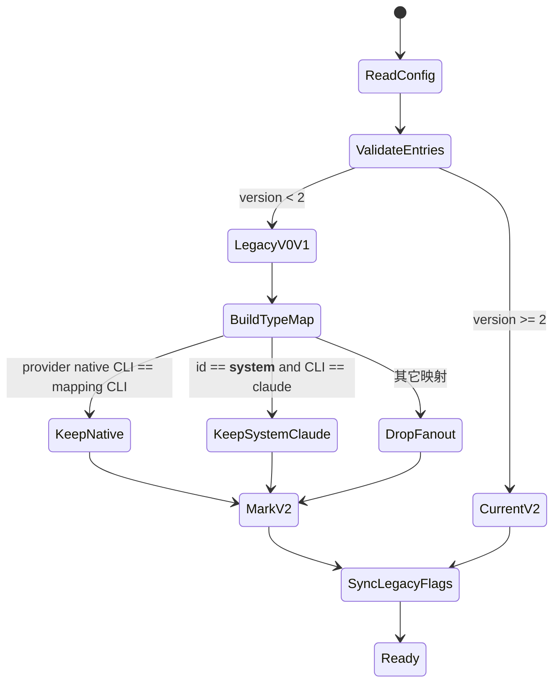

迁移实现位于 [`migrate_legacy_defaults`](../cc-panes-core/src/services/provider_service.rs#L106)。例如：

```text
迁移前：
claude -> anthropic-A
codex -> openai-B
gemini/kimi/opencode/cursor/grok -> anthropic-A

迁移后：
claude -> anthropic-A
codex -> openai-B
其它 CLI 无默认，走 Native
```

### 6.4 跨进程刷新

桌面进程和长期运行的 Daemon 各自持有 `ProviderService`。读取方法先调用 [`refresh_from_file`](../cc-panes-core/src/services/provider_service.rs#L187)，从原子文件重载快照，使下一次 Daemon 启动请求看到桌面刚保存的 Provider。

这不是文件监听器；一致性边界是“下一次读取/启动”。同一次解析使用已选中的 Provider clone，环境变量解析调用 `get_env_vars_for_provider`，避免选择后再次读盘产生 TOCTOU 差异。

**本节检查**

- 排查数据时先确认当前是 dev、release 还是自定义 dataDir。
- 日志和文档示例不得输出 `apiKey` 实值。
- 修改 schema 时提供 `#[serde(default)]` 和单向迁移，不要求用户手改配置。

---

## 7. Native 与 Managed 双模式

### 7.1 模式定义

[`ProviderMode`](../cc-panes-core/src/services/provider_resolver.rs#L10) 只有两个状态：

| 模式 | Provider | CC-Panes 行为 | CLI 行为 |
|---|---|---|---|
| Native | `None` | 不注入托管凭证，不清理用户 Provider 环境 | 读取自身登录态、配置文件、shell 环境、CC Switch live config |
| Managed | `Some(Provider)` | 清理冲突环境，注入精确 Provider 快照和可选模型 | 使用本次会话覆盖 |

`SYSTEM_PROVIDER_ID` 的语义也是 Native。它只让用户在 UI 中显式表达“跟随系统”，不会创建真实 Provider。

### 7.2 providerSelection

[`LaunchProviderSelection`](../cc-panes-core/src/models/launch_profile.rs#L66)：

| 值 | 行为 |
|---|---|
| `inherit` | 按请求、运行配置、Workspace、CLI 默认依次查找 |
| `explicit` | 必须有 `providerId`，否则 `PROVIDER_REQUIRED` |
| `none` | 立即返回 Native，跳过全部 fallback |

兼容逻辑：Kimi 旧请求若 `adapterOptions.kimiConfigMode="native"` 且 selection 仍是 inherit，会转换为 none，见 [`effective_selection`](../cc-panes-core/src/services/provider_resolver.rs#L316)。

### 7.3 环境变量处理

Managed 模式会按 CLI 生成冲突变量删除列表，见 [`managed_provider_conflict_env_keys`](../cc-panes-core/src/services/provider_resolver.rs#L87)。TerminalService 先准备代理和额外环境，再叠加 Provider 变量；启动 Adapter 时把冲突变量从继承环境移除，防止旧 shell 值覆盖本次选择。

Native 模式的 Provider map 为空，冲突删除列表也为空。因此 Native 是“保持原样”，不是“清空所有 Provider 环境”。

### 7.4 模式流程图

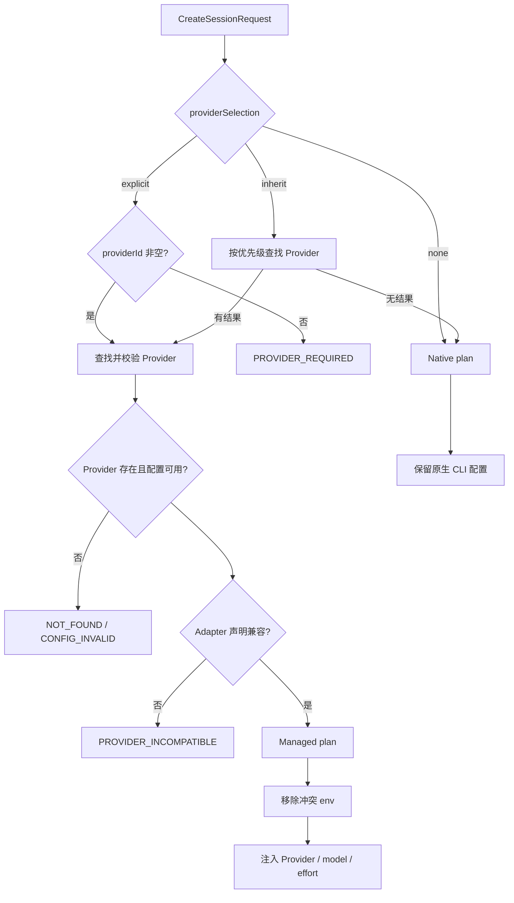

**本节检查**

- “不注入”必须用 `providerSelection=none`，不能只传 `providerId=null`。
- Managed 模式故障应 fail closed，不能悄悄换 Provider。
- Native 模式不得改写用户的 CC Switch 数据库或 CLI 全局配置。

---

## 8. 运行配置与项目绑定

### 8.1 运行配置选择优先级

[`LaunchProfileService::resolve_launch_profile_with_diagnostic`](../cc-panes-core/src/services/launch_profile_service.rs#L382) 先确定候选 id：

```text
显式 launchProfileId
  > 当前 WorkspaceProject.launchProfileId
  > Workspace.launchProfileId
  > 与 CLI/runtime 匹配的默认 LaunchProfile
  > 无运行配置
```

运行配置还必须匹配 `targetTools` 和 `targetRuntime`。显式选择存在但不兼容时，服务可回退到兼容默认配置，同时生成 diagnostic；TerminalService 会发出提示，避免 YOLO、Provider 等配置无声失效。

### 8.2 项目绑定是标量

[`WorkspaceProject.launch_profile_id`](../cc-panes-core/src/models/workspace.rs#L63) 是单值。绑定新运行配置会替换旧值，不存在同一项目同时继承多套 Profile 的合并规则。

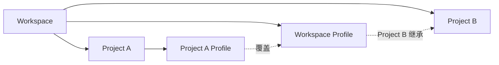

### 8.3 Profile 内的组合关系

Provider、模型和 `adapterOptions` 是标量/Map 覆盖；MCP 与 Skill 有各自 policy：

- `mcpPolicy.default`：继承共享 MCP，应用 disabled 列表；
- `mcpPolicy.custom`：只保留 enabled 列表；
- `mcpPolicy.disabled`：关闭本次 MCP 注入；
- `skillPolicy.core`：内置核心 Skill 加允许的外部/项目来源；
- `skillPolicy.custom`：按选中集合解析；
- `skillPolicy.disabled`：不注入 Profile Skill。

### 8.4 预览与真实启动共用 Provider resolver

运行配置预览先解析 Profile/MCP/Skill，再由 [`resolve_profile_with_provider`](../cc-panes-core/src/services/launch_profile_service.rs#L691) 调用 `resolve_provider_plan`。真实启动也调用同一函数，因此预览中的 Provider/模型来源不应与启动分叉。

### 8.5 绑定时序

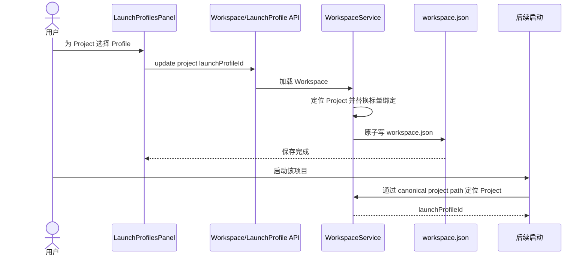

**本节检查**

- 项目绑定使用规范化项目身份，不用未经处理的路径字符串直接比较。
- Profile 删除前检查 Workspace 和 Project 绑定，避免悬空引用。
- 预览、桌面启动、MCP、REST 应使用同一 Profile 与 Provider 解析规则。

---

## 9. Provider 解析优先级

### 9.1 输入与输出

共享解析器入口是 [`resolve_provider_plan`](../cc-panes-core/src/services/provider_resolver.rs#L133)。它接收：

```text
ProviderResolutionInput
├── cli_tool
├── selection
├── requested_provider_id
├── requested_model_id
├── profile_provider_id
├── profile_model_id
├── workspace_provider_id
├── default_provider_id
└── adapter_options
```

输出 `ResolvedProviderPlan` 不只是 Provider 对象，还保留：

- `mode`: Native / Managed；
- `selection`: 最终 providerSelection；
- `source`: Request / LaunchProfile / LegacyWorkspace / DefaultProvider / Native；
- `model_id`、`model_label`、`model_default_effort`；
- `model_source`: Request / LaunchProfile / ProviderDefault / NativeDefault。

### 9.2 Inherit 的精确优先级

```text
request.providerId
  > resolved LaunchProfile.providerId
  > legacy Workspace.providerId
  > current CLI defaultProviderIds[cli]
  > Native
```

这里的 Workspace Provider 是兼容字段。新的确定性项目配置优先通过 `WorkspaceProject.launchProfileId` 选择运行配置；`Workspace.providerId` 仍保留为旧数据 fallback。

### 9.3 默认 Provider 不是无条件采用

`compatible_default_provider_id` 会再次验证：

1. CLI Adapter 存在；
2. Provider 存在；
3. Provider 具备可用 Managed 配置；
4. Adapter `supports_provider=true`；
5. Provider type 在 Adapter compatibility 中。

不兼容的默认映射被忽略并回到 Native，不会因旧数据导致 Codex 加载 Anthropic Provider。显式或 Profile 指向不兼容 Provider 时则返回错误，不静默回退。

### 9.4 来源决策图

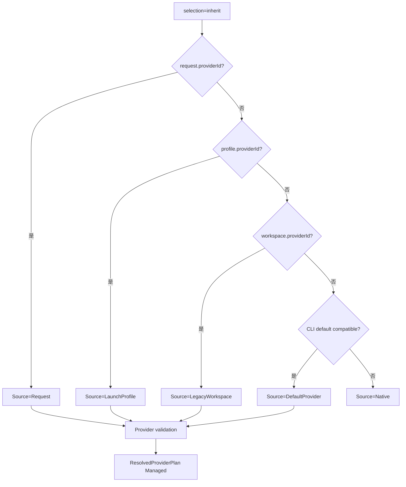

### 9.5 可用 Managed 配置判定

[`managed_configuration_is_usable`](../cc-panes-core/src/services/provider_service.rs#L481) 按类型判断：

| ProviderType | 可用条件 |
|---|---|
| Bedrock / Vertex | 类型本身可用，依赖外部 AWS/GCP 身份链 |
| ConfigProfile | 路径是目录，或文件能解析出非空合法 `env` |
| Cursor / Kimi | 必须有非空 API Key |
| 其它类型 | API Key 或 Base URL 至少一个非空 |

这一步早于 Adapter 构建，避免启动一个表面 Managed、实际没有任何凭证或端点的会话。

**本节检查**

- 新来源只能加入共享 `ProviderResolutionInput`，不能在入口层临时改优先级。
- 显式错误与默认 fallback 的处理不同：显式失败，默认不兼容回 Native。
- 日志应记录 `source` 和 Provider id，不记录 Provider secret。

---

## 10. 模型与推理强度解析

### 10.1 模型优先级

模型解析依赖已经选出的 Provider：

```text
request.modelId
  > profile.modelId（仅当 Provider 来源也是该 LaunchProfile）
  > selected Provider.defaultModelId
  > CLI native model default
```

“仅当 Provider 来源也是该 LaunchProfile”用于避免交叉组合。例如请求显式选择 Provider B 时，不能继续套用 Profile A 为 Provider A 配置的模型。

选中的模型必须存在于该 Provider 的 `models[]`，否则返回 `PROVIDER_MODEL_NOT_FOUND`。resolver 不把未知模型悄悄交给 CLI，因为这会让 UI 显示的模型与实际运行不一致。

### 10.2 推理强度优先级

TerminalService 先合并 Adapter options：

```text
profile.adapterOptions
  <- request.adapterOptions 覆盖同名键
  <- ProviderModel.defaultEffort 仅在 effort 缺失时补位
```

代码顺序位于 [`terminal_service.rs:1478-1518`](../cc-panes-core/src/services/terminal_service.rs#L1478)：

1. clone Profile options；
2. 遍历 request options 覆盖；
3. 调用 `provider_plan.apply_model_adapter_defaults`；
4. 把最终模型写入内部键 `__ccpanesModelId`；
5. Adapter 从内部键读取模型。

### 10.3 模型/强度流程图

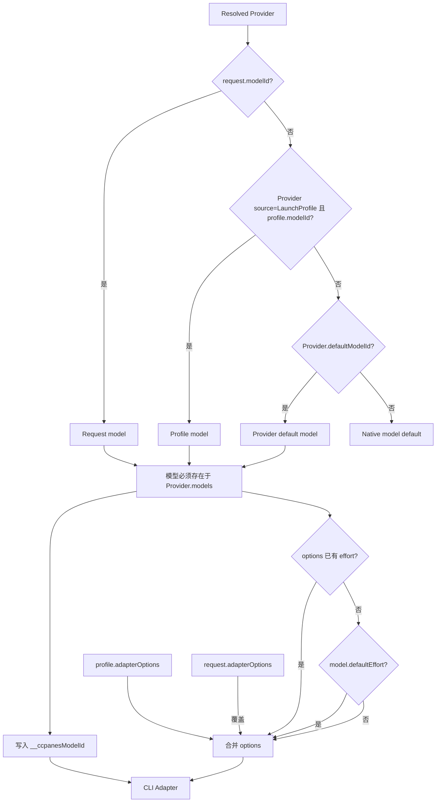

### 10.4 各 CLI 的 effort 映射

通用解析只接受 `low|medium|high|xhigh|max`，见 [`effort_from_options`](../cc-cli-adapters/src/lib.rs#L709)。

| CLI | 注入方式 | 映射 |
|---|---|---|
| Claude | `MAX_THINKING_TOKENS` | low=4096, medium=10000, high=16000, xhigh=31999, max=63999 |
| Codex | `-c model_reasoning_effort=<value>` | max 映射为 xhigh，其余原样 |
| 其它 Adapter | 当前不统一解释 effort | 仍可使用各 Adapter 支持的 options/extraArgs |

映射函数位于 [`claude_max_thinking_tokens`](../cc-cli-adapters/src/lib.rs#L755) 和 [`codex_reasoning_effort`](../cc-cli-adapters/src/lib.rs#L744)。Local 与 WSL 分支复用这些 helper，避免同一 Profile 在不同运行时产生不同强度。

### 10.5 MCP 启动是否继承模型和强度

答案是“继承”，条件是 MCP 请求没有用更高优先级覆盖：

1. MCP `launch_task` 根据项目路径取得项目绑定 `launchProfileId`；
2. `CreateSessionRequest.launch_profile_id` 被补齐；
3. TerminalService 解析 Profile；
4. Profile 的 `providerId`、`modelId`、`adapterOptions.effort` 进入共享 resolver 和 options merge；
5. 若 Profile 未显式 effort，Provider 默认模型的 `defaultEffort` 补位；
6. Adapter 把模型和强度翻译成目标 CLI 参数/环境变量。

因此项目绑定运行配置是 MCP 启动 Provider、模型和推理强度的共同来源，而不是只继承 Provider id。

**本节检查**

- 请求显式模型必须属于最终选中的 Provider。
- request effort 应覆盖 Profile effort，Profile effort应覆盖模型默认 effort。
- Local 与 WSL 使用相同 effort helper；修改映射时同时更新两条路径测试。

---

## 11. 统一启动请求

### 11.1 为什么需要统一请求

历史问题来自不同入口各自拼装 `providerId`。当前架构要求所有创建入口最终生成 Core `CreateSessionRequest`，由 TerminalService 完成 Profile、Provider、模型和运行时解析。

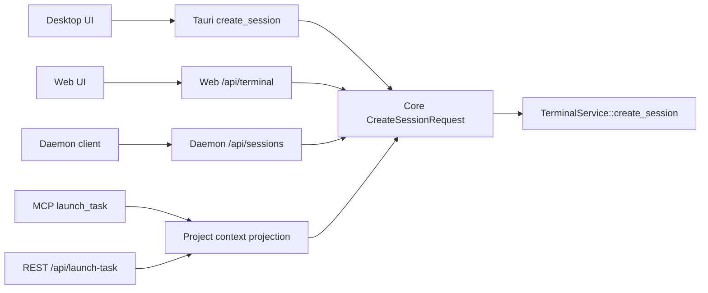

### 11.2 关键字段约定

| 字段 | `None` / 默认的语义 | 注意事项 |
|---|---|---|
| `providerId` | 没有请求级 Provider | 不代表 Native，仍可能继承 Profile/default |
| `modelId` | 没有请求级模型 | 可能继承 Profile/Provider default |
| `providerSelection` | serde 默认 `inherit` | Native 必须显式 `none` |
| `launchProfileId` | 由 Project/Workspace/default Profile 继续解析 | MCP/REST 会先补 Project binding |
| `adapterOptions` | 空 Map | request 键覆盖 Profile |
| `yoloMode` | 跟随 Profile | `Some(false)` 可显式关闭 Profile YOLO |
| `ssh` / `wsl` | Local | 两者不能同时存在 |
| `resumeId` | 新会话 | 恢复时复用会话 id，初始 prompt 规则不同 |

### 11.3 请求边界与运行边界

边界层负责语法、鉴权和路径注册检查；TerminalService 负责语义解析。比如 REST/MCP 检查 `prompt` 与 `resumeId` 必须二选一，但不会在入口层自己读取 Provider API Key。

**本节检查**

- 新字段必须同时投影 Tauri、Web、Daemon 和恢复结构。
- `providerSelection` 缺省和 `none` 不得混用。
- 入口层不要提前把 Profile Provider 填进 `request.providerId`，否则会错误提升为 Request 来源。

---

## 12. 桌面、Web 与 Daemon 入口

### 12.1 Desktop IPC

前端 [`terminalService.createSession`](../web/services/terminalService.ts#L478) 调用 Tauri `create_session`。命令层处理启动超时和后端恢复，但 Provider 请求仍作为完整 `CreateSessionRequest` 传给统一后端。

Tauri 注册位置在 [`src-tauri/src/lib.rs`](../src-tauri/src/lib.rs)，终端命令在 [`src-tauri/src/commands/terminal_commands.rs`](../src-tauri/src/commands/terminal_commands.rs)。

### 12.2 Web

[`cc-panes-web/src/routes/terminal.rs:92`](../cc-panes-web/src/routes/terminal.rs#L92) 定义 Partial request，并在 `create_session` 中补齐 Core request。Web 层不具备桌面宿主环境探测能力，因此“系统环境变量 Provider”探测返回 inactive；Provider CRUD 仍通过同一个 `ProviderService` 数据文件。

### 12.3 Daemon

Daemon 的 [`PartialCreateSessionRequest`](../cc-panes-daemon/src/server.rs#L407) 镜像 Core 字段。桌面在 Daemon 存活时把请求发给 Daemon；Daemon 归一化当前宿主运行时后调用 Terminal backend。

ProviderService 在桌面和 Daemon 中各有实例，所以 `refresh_from_file` 是 Provider 热切换生效的关键。

### 12.4 后端恢复

[`TerminalBackendState::create_session_with_recovery`](../src-tauri/src/services/terminal_backend_state.rs#L157) 是桌面创建入口的恢复封装：

- 初始 backend 成功则返回；
- Daemon 失效时尝试恢复/切换 backend；
- 使用原 `CreateSessionRequest` 重试；
- Provider/Profile 字段不会在恢复层重新解释。

**本节检查**

- Web/Daemon request 结构必须跟随 Core 新字段。
- 后端恢复重试应复用同一请求，不在失败后改变 Provider 来源。
- System Provider 探测是桌面宿主能力，Web fallback 不应伪造凭证存在。

---

## 13. MCP 与 REST 启动链路

### 13.1 共享项目上下文

MCP 和 REST 共用 [`ProjectLaunchContext`](../src-tauri/src/services/orchestrator_service.rs#L7990)：

```text
projectPath + optional workspaceName
    -> canonical project identity
    -> Workspace + WorkspaceProject
    -> workspaceName / workspacePath / launchProfileId
```

Profile 优先级是：

```text
MCP 显式 profileId > Project.launchProfileId
```

若两者都没有，TerminalService 随后仍可从完整 Workspace 解析 `Workspace.launchProfileId` 或默认 Profile。REST `LaunchTaskRequest` 当前没有显式 `profileId` 字段，因此直接使用项目绑定。

### 13.2 项目身份规范化

项目查找使用 `project_identity_key`，而不是简单字符串相等。它覆盖 Windows 路径大小写/分隔符、`/mnt/...` 和 WSL UNC 表达，使 MCP 传入路径能够命中 UI 中绑定的同一项目。

共享实现见 [`resolve_project_launch_context`](../src-tauri/src/services/orchestrator_service.rs#L7996) 和 [`apply_project_launch_context_to_request`](../src-tauri/src/services/orchestrator_service.rs#L8020)。

### 13.3 MCP 时序

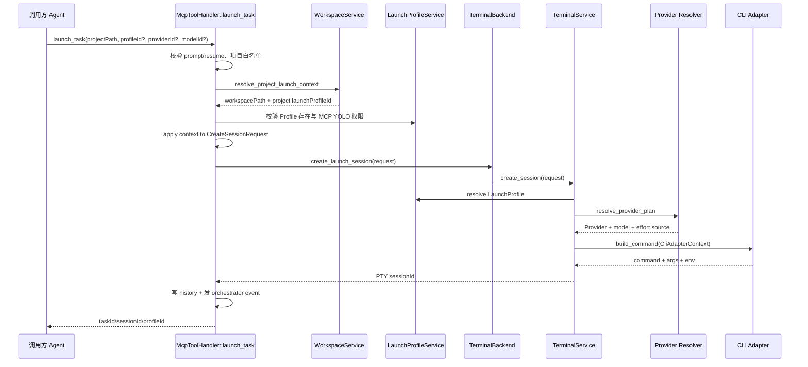

### 13.4 Profile 与 YOLO Gate

MCP/REST 派生出的 Profile 会进入 [`validate_orchestrator_launch_profile`](../src-tauri/src/services/orchestrator_service.rs#L3912)：

- Profile id 不存在：请求失败；
- Profile `yoloMode=false`：允许；
- Profile `yoloMode=true`：只有设置 `orchestrator.allowMcpYoloProfiles` 开启才允许。

这个 Gate 同时适用于 MCP 显式 Profile 和项目绑定派生 Profile，避免绕过权限设置。

### 13.5 REST 差异

REST [`handle_launch_task`](../src-tauri/src/services/orchestrator_service.rs#L8439) 还执行 Bearer token、速率限制和 HTTP 状态码映射。它构造同一个 Core request，并调用相同 `apply_project_launch_context_to_request`。

REST 启动后由 [`rest_launch_history.rs`](../src-tauri/src/services/rest_launch_history.rs) 同步回写 history；失败会返回降级 notice，因为未落历史的会话无法可靠 resume。

**本节检查**

- MCP 和 REST 修改项目上下文时必须共用 helper。
- 显式 MCP `profileId` 优先于项目绑定；REST 使用项目绑定。
- 派生 Profile 也必须走存在性与 YOLO 权限校验。
- Provider、模型、effort 的最终解析仍在 TerminalService，不在 MCP handler 复制实现。

---

## 14. TerminalService 执行管线

### 14.1 主流程

TerminalService 是 Provider 全链路的执行汇聚点。核心段落位于 [`terminal_service.rs:1390-2045`](../cc-panes-core/src/services/terminal_service.rs#L1390)。

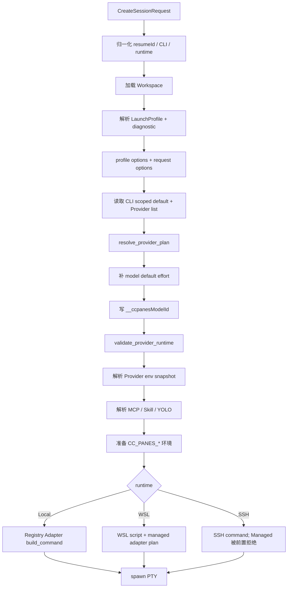

### 14.2 Profile 解析与 option 合并

TerminalService 将 `launch_profile_id`、Workspace、CLI 和 runtime 交给 `LaunchProfileService`。Profile 不兼容时保留 diagnostic，用事件通知前端“所选配置未生效”。

Profile options 打底，请求 options 覆盖。`yoloMode` 的规则相同：request `Some` 优先，否则跟随 Profile，最终缺省 false。

### 14.3 Provider 快照

解析器从一次 `list_providers()` 快照中 clone 最终 Provider。后续环境变量使用 [`get_env_vars_for_provider`](../cc-panes-core/src/services/provider_service.rs#L475) 解析这份 clone，不再按 id 二次读文件。

### 14.4 环境合并顺序

概念顺序如下：

```text
proxy env
  + validated request.extraEnv
  + Provider env
  + CC_PANES_* context env
  + Adapter envInject
  - Managed Provider conflict env
  - Adapter envRemove
```

Managed Provider 是本次启动的权威来源。冲突变量先标记为移除，再注入本次值；Native 不产生 Provider remove 列表。

### 14.5 Adapter 上下文

[`CliAdapterContext`](../cc-cli-adapters/src/lib.rs#L532) 是 Core 到 Adapter 的轻量边界，包含：

- 项目/Workspace 路径；
- 已选 Provider 的轻量副本；
- Adapter options 和内部 model id；
- resume/issued session id；
- MCP token、port、launch id、共享 MCP URL；
- prompt、YOLO、skipMcp；
- 每会话 dataDir 和 MCP 隔离策略。

Adapter 不接触 WorkspaceService、ProviderService 或 SQLite。

**本节检查**

- Provider 选择与注入之间使用同一 Provider 快照。
- request options 必须晚于 Profile options 合并。
- Adapter 只能翻译上下文，不能自行选择另一个 Provider。

---

## 15. Local、WSL、SSH 运行时

### 15.1 Local

Local 直接调用 Registry 中目标 Adapter：

1. 同步项目 hooks；
2. 生成 Profile Skill prompt；
3. 构造 `CliAdapterContext`；
4. Adapter 返回 `command/args/envInject/envRemove`；
5. TerminalService 合并环境并 spawn PTY。

Adapter 临时文件位于 `<dataDir>/cli-adapters/<cli>/...`，通常按 session 隔离。

### 15.2 WSL

WSL 不是把 Windows 环境整包透传给 Linux。`wsl_codex.rs` 会：

- 移除 Windows 代理变量并按需要重建可达地址；
- 只导出允许的 Provider 和 `CC_PANES_*` 环境；
- 把 Windows dataDir 临时路径翻译为 `/mnt/...`；
- 对 Kimi、OpenCode 调用 Adapter 生成托管配置，再把路径传给 WSL CLI；
- Claude/Codex 的 model 和 effort 使用与 Local 相同 helper；
- 为 OpenCode 模型补 `openai/`、`anthropic/` 或 `opencode/` 前缀一次。

关键函数包括：

- [`build_wsl_managed_adapter_plan`](../cc-panes-core/src/services/terminal_service/wsl_codex.rs#L722)
- [`wsl_model_id`](../cc-panes-core/src/services/terminal_service/wsl_codex.rs#L767)
- Claude effort 注入 [`wsl_codex.rs:1199`](../cc-panes-core/src/services/terminal_service/wsl_codex.rs#L1199)
- Codex effort 注入 [`wsl_codex.rs:1609`](../cc-panes-core/src/services/terminal_service/wsl_codex.rs#L1609)

### 15.3 SSH

共享 resolver 在命令构建前调用 [`validate_provider_runtime`](../cc-panes-core/src/services/provider_resolver.rs#L331)。只要 plan 是 Managed 且 runtime=SSH，就返回 `PROVIDER_SSH_MANAGED_UNSAFE`。

原因不是 CLI 不支持 Provider，而是当前 SSH transport 需要把凭证编码进本地进程参数/远程 shell 命令，可能出现在进程列表或日志。Native SSH 仍可使用远端 CLI 自己的登录态和配置。

### 15.4 运行时分支图

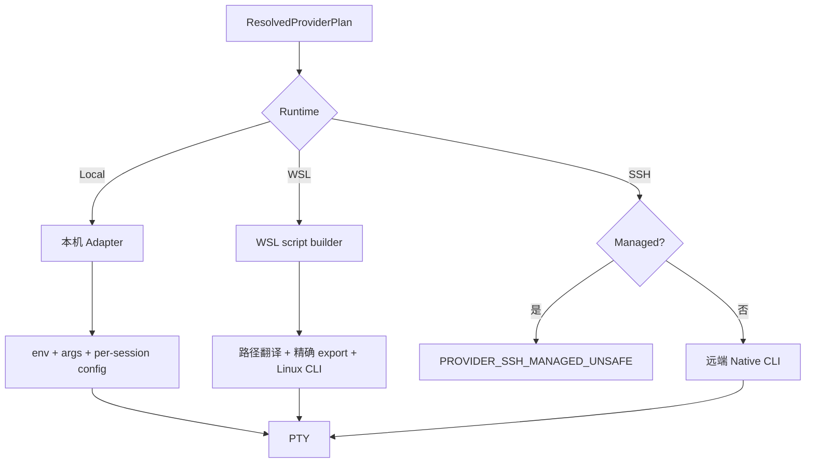

**本节检查**

- 不从非 Windows 环境声称 WSL/WinPTY 行为已验证。
- WSL 临时配置路径必须翻译后再注入 Linux CLI。
- SSH Managed Gate 不得在入口层被绕过。

---

## 16. CLI Adapter 注入矩阵

### 16.1 通用命令模型

[`CliCommandResult`](../cc-cli-adapters/src/lib.rs) 返回四部分：

```text
command: 可执行文件
args: 独立 argv 元素
env_inject: 本次新增/覆盖环境
env_remove: 本次从继承环境删除的键
```

模型通用 helper [`push_model_arg`](../cc-cli-adapters/src/lib.rs#L647) 追加两个独立 argv：`--model`, `<id>`，避免 shell 字符串插值。OpenCode 使用自定义 qualification 逻辑。

### 16.2 Adapter 详细矩阵

| CLI | Provider 凭证 | 模型 | effort | MCP | Resume |
|---|---|---|---|---|---|
| Claude | ProviderService 生成 Anthropic/AWS/Vertex/config env | `--model id` | `MAX_THINKING_TOKENS` | `--mcp-config file` | `--resume id` |
| Codex | `-c model_provider=...`、base_url、env_key + `CCPANES_CODEX_API_KEY` | `--model id` | `-c model_reasoning_effort` | per-launch `-c mcp...` | `resume id` |
| Gemini | Gemini env | `--model id` | 无统一映射 | Adapter 原生能力 | Adapter 参数 |
| Kimi | `<dataDir>/cli-adapters/kimi/configs/<session>.json` | `--model id` | 无统一映射 | Adapter 原生能力 | Adapter 参数 |
| OpenCode | 每会话 `opencode.json` 的 provider options | `--model provider/id` | 无统一映射 | 同一 JSON 中 remote MCP | `--session id` |
| Cursor | `CURSOR_API_KEY` | `--model id` | 无统一映射 | capability 定义 | Adapter 参数 |
| Grok | XAI/Grok endpoint env | `--model id` | 无统一映射 | 会话配置/Adapter 逻辑 | resume/issued id |

### 16.3 Claude

[`ClaudeAdapter::build_command`](../cc-cli-adapters/src/claude.rs#L958) 的参数顺序是：

```text
--model
--resume / --session-id
--add-dir
--mcp-config
--append-system-prompt
--dangerously-skip-permissions
verbose/maxTurns/extraArgs
-- <initial prompt>
```

`effort` 不进入 args，而进入 `env_inject[MAX_THINKING_TOKENS]`。Adapter 还移除嵌套启动冲突变量 `CLAUDECODE`。

### 16.4 Codex

[`CodexAdapter::build_command`](../cc-cli-adapters/src/codex.rs#L1355) 不隔离整个 `CODEX_HOME`，而用 per-launch `-c`：

- 选择临时 `model_provider`；
- 指定 Provider Base URL；
- 用专用环境变量承载 API Key；
- 覆盖 MCP enable/disable；
- 注入 developer instructions；
- 在 `resume` 子命令之前放 model、effort 和全局 options。

这种设计保留真实 `~/.codex/sessions`，让 resume 和 CC Switch live config 不因复制 Home 丢失。

### 16.5 Kimi

Kimi 的 API Key 写入每会话 JSON，通过 `--config-file` 传入，并为受控会话设置 `KIMI_SHARE_DIR`。实现见 [`kimi.rs:44`](../cc-cli-adapters/src/kimi.rs#L44)。

**本节检查**

- 参数必须作为独立 argv，不拼成 shell 字符串。
- API Key 优先走环境或权限受控临时文件，不进入日志。
- 新 Adapter 必须声明准确 capability，并实现 Native 无注入负例。

---

## 17. OpenCode 专项说明

### 17.1 为什么 OpenCode 标签包含 Anthropic 和 OpenAI

[`OpenCodeAdapter::new`](../cc-cli-adapters/src/opencode.rs#L30) 声明：

```rust
compatible_provider_types: vec![
    "open_ai".into(),
    "opencode".into(),
    "anthropic".into(),
]
```

因此 Provider 管理页会列出这三类真实 Provider。标签计数是兼容 Provider 数，不是 OpenCode 专属配置数。

一次 OpenCode 启动仍只使用一个 Provider：

```text
UI 可见三类 Provider
    != 同时加载三类 Provider

ResolvedProviderPlan.provider
    = None 或一个 Provider
```

### 17.2 每会话配置

[`write_session_config`](../cc-cli-adapters/src/opencode.rs#L90) 生成：

```text
<dataDir>/cli-adapters/opencode/<sessionId>/opencode.json
```

文件可能包含：

- `$schema`；
- `mcp.ccpanes` remote URL、Bearer header 和 `launchId`；
- 共享 MCP URL；
- `instructions` 文件路径；
- 当前 Provider 的 `options.apiKey/baseURL`；
- 从用户 TUI 配置派生的会话主题。

Adapter 通过 `OPENCODE_CONFIG=<path>` 让该配置只影响当前会话，不覆盖用户全局 OpenCode 配置。

### 17.3 Provider key 映射

```json
{
  "provider": {
    "anthropic": {
      "options": {
        "apiKey": "<redacted>",
        "baseURL": "https://example.invalid"
      }
    }
  }
}
```

映射规则：

| ProviderType | OpenCode provider key |
|---|---|
| `anthropic` | `anthropic` |
| `open_ai` | `openai` |
| `opencode` | `opencode` |

### 17.4 模型 qualification

OpenCode 模型通常需要 `<provider-key>/<model-id>`：

```text
open_ai + gpt-5.4                -> openai/gpt-5.4
anthropic + claude-sonnet-4-6   -> anthropic/claude-sonnet-4-6
opencode + qwen3-coder          -> opencode/qwen3-coder
custom/foo                      -> custom/foo（已有斜杠，不重复加前缀）
```

Local 实现在 [`qualified_model_id`](../cc-cli-adapters/src/opencode.rs#L60)，WSL 镜像实现在 [`wsl_model_id`](../cc-panes-core/src/services/terminal_service/wsl_codex.rs#L767)。

### 17.5 超时与降级

OpenCode 会话配置写入由有界 worker 执行。超过 deadline 或 worker 停止时，Adapter 记录警告并以 Native config 启动，避免配置 I/O 永久卡住终端创建。该降级主要针对配置生成故障，不会把一个已校验的 Provider 静默换成另一个 Provider。

### 17.6 OpenCode 时序图

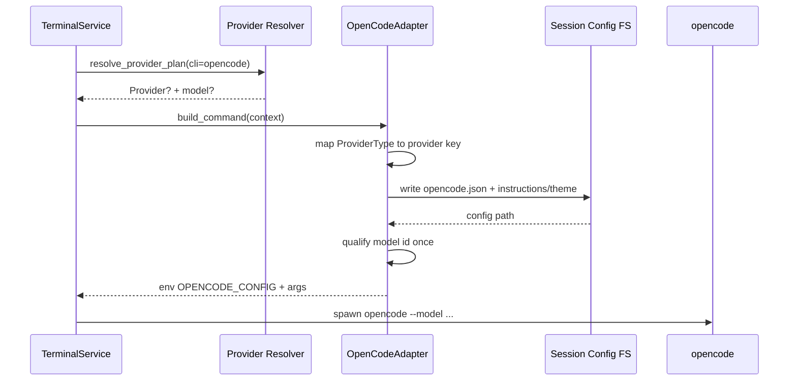

**本节检查**

- 卡片无“默认”徽标时，不应声称 OpenCode 会自动注入该 Provider。
- `OpenCode N` 的 N 不包含合成系统卡片。
- 排查实际注入时检查 resolved provider 日志和 session config，不能只看 UI 列表。

---

## 18. MCP、Skill、YOLO 与 Provider 的组合

### 18.1 一个 Profile，多条独立解析轴

运行配置把 Provider、模型、Adapter options、MCP、Skill、runtime、YOLO 放在一起，但内部不是一个巨型 merge：

```text
LaunchProfile
├── Provider/model -> provider_resolver
├── adapterOptions -> TerminalService merge + Adapter
├── MCP policy -> LaunchProfileService + Adapter MCP channel
├── Skill policy -> LaunchProfileService prompt/hook resolution
├── target runtime/tool -> Profile matcher
└── yoloMode -> TerminalService + Orchestrator permission Gate
```

这些轴共享同一个 resolved Profile id，避免 Provider 来自 Profile A、MCP 来自 Profile B。

### 18.2 MCP policy

`LaunchProfileMcpPolicy` 定义在 [`launch_profile.rs:84`](../cc-panes-core/src/models/launch_profile.rs#L84)。TerminalService 计算：

- `effective_skip_mcp`；
- 当前 Profile 允许的共享 MCP URL；
- `allowed_mcp_server_ids`；
- 是否禁用用户全局配置中未列出的 MCP。

Claude 使用生成的 `--mcp-config`；Codex 使用 per-launch `-c`；OpenCode 写入会话 `opencode.json`。

### 18.3 ccpanes MCP caller identity

Adapter 注入的 orchestrator URL携带：

```text
http://127.0.0.1:<port>/mcp?token=<token>&launchId=<launch-id>
Authorization: Bearer <token>
```

`launchId` 让子 Agent 再次调用 `launch_task` 时，Orchestrator 能识别父会话并建立级联关系。token 在日志脱敏，不能写入 history metadata。

### 18.4 Skill policy

Profile Skill 解析结果被组合为 session prompt，并通过 Adapter 的 system/developer instructions 通道注入。`includeProjectSkills`、外部 Claude/Codex/plugin 来源开关和 enabled/disabled id 在 `LaunchProfileService` 中解析。

Provider 只负责凭证与模型，不决定 Skill 权限。两者唯一共享的是同一次 Profile 选择。

### 18.5 YOLO

TerminalService 的优先级：

```text
request.yoloMode Some(value) > resolved Profile.yoloMode > false
```

桌面直接启动可以使用用户选择；由 MCP/REST 管理或派生的 YOLO Profile 还必须通过 `allowMcpYoloProfiles` Gate。Adapter 再把布尔值翻译成各 CLI 的危险权限参数。

**本节检查**

- 不要因 `mcpPolicy.disabled` 清空 Provider；它们是独立解析轴。
- caller token/launchId 只进入临时 MCP 配置，不进入公开日志。
- MCP 派生的 YOLO Profile 必须经过设置 Gate。

---

## 19. 会话历史、事件与恢复

### 19.1 三类元数据

| 类别 | 目的 | 当前字段 |
|---|---|---|
| 启动请求 | 重建同一语义 | providerId、providerSelection、launchProfileId、modelId、adapterOptions 等 |
| History/restore DB | 列表、resume、重启恢复 | providerId、providerSelection、launchProfileId；当前 schema 未持久化 modelId |
| Orchestrator event/response | 前端落位和外部调用反馈 | request provider/model、effective profileId、runtime、sessionId |

### 19.2 History

[`history_repo.rs`](../cc-panes-core/src/repository/history_repo.rs) 的 `launch_history` 当前保存：

- CLI 和 runtime；
- Workspace、launch cwd；
- `provider_id`；
- `provider_selection`；
- `launch_profile_id`；
- session/workspace snapshot id。

REST/MCP 启动不依赖 WebView 异步回写，后端会同步写 History。失败不会终止已经启动的 PTY，但会返回/记录降级说明。

### 19.3 Session restore

[`SavedTerminalSession::from_creation`](../cc-panes-core/src/models/session_restore.rs#L111) 从原始创建请求保存 Provider selection 和 Profile id。恢复时重新进入 TerminalService，因此：

- `explicit` 保持显式 Provider 语义；
- `none` 保持 Native；
- `inherit` 会按恢复时仍有效的配置重新解析；
- Profile/Provider 被删除时可能返回明确错误，而不是使用旧 secret 快照。

### 19.4 当前模型元数据限制

当前 Core request、前端 Tab 类型和 Orchestrator event 已有 `modelId`，但 `launch_history` 与 `terminal_sessions` 持久化结构尚未完整保存 `modelId/modelLabel`。因此：

- 正常新启动能把模型传到 Adapter；
- 仅依赖旧 History 的恢复，不能保证重放当时的请求级模型；
- 项目绑定 Profile 或 Provider default 仍可在恢复时重新解析模型；
- 不应在 UI 中把 History 展示的空模型解释为“当时使用 CLI 默认”。

这是当前实现边界，不应通过把 Provider secret 或整个 Provider JSON塞入 History 来修补。

### 19.5 会话生命周期

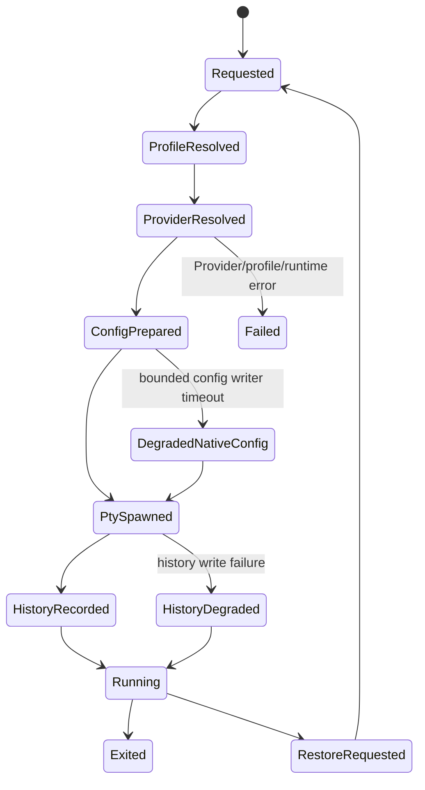

**本节检查**

- History 只保存非敏感标识，不保存 API Key/Base URL。
- 区分“请求字段”“最终解析字段”和“历史字段”，不要假设三者完全相同。
- 修改模型恢复语义时需要数据库迁移、Core model、Web/Daemon contract 和前端 Tab 同步更新。

---

## 20. 安全边界与敏感信息

### 20.1 凭证生命周期

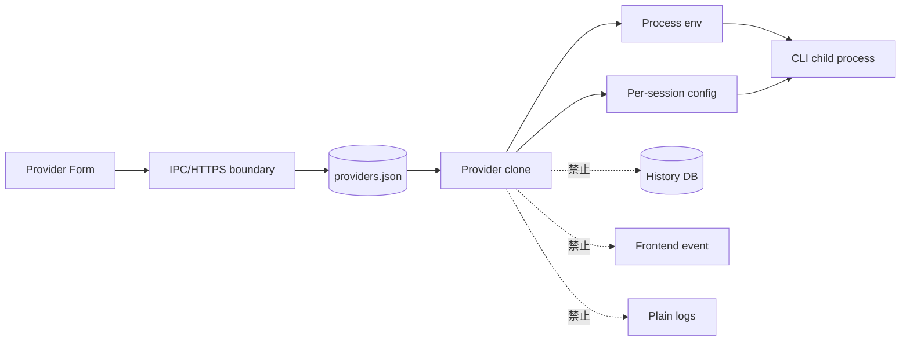

### 20.2 存储现实

`providers.json` 当前明文保存 API Key。这意味着安全边界依赖用户目录权限和主机账户安全，尚未接入系统 Keychain。文档、测试 fixture、日志和错误参数不得复制真实凭证。

### 20.3 输入校验

[`ProviderService::validate_provider`](../cc-panes-core/src/services/provider_service.rs#L687) 限制：

- Provider id 字符集和长度；
- Provider 数、模型数和配置文件大小；
- secret/URL/名称字段长度；
- Base URL 只允许 HTTP/HTTPS；
- model id 禁止控制字符；
- ConfigProfile env key 必须符合大写环境变量格式；
- ConfigProfile env 条目数和 value 长度有限制。

模型作为独立 argv 传递，不插值进 shell command。WSL shell script 的值使用 POSIX escape helper。

### 20.4 日志脱敏

[`redact_args_for_log`](../cc-cli-adapters/src/lib.rs#L961) 和 `redact_cli_text_for_log` 处理：

- token query；
- Authorization/Bearer；
- api_key 等 secret；
- developer instructions；
- 过长 prompt。

新增 Adapter 时，任何把 config override 放入 args 的逻辑都必须经过相同脱敏函数再记录。

### 20.5 SSH Gate

Managed SSH 在 resolver 后、命令构建前失败。这是安全 fail closed：不能因为远端启动方便，就把本地 Provider API Key嵌入可见的 `ssh ... export KEY=...` 参数。

### 20.6 CC Switch 边界

CC-Panes 只探测 `~/.cc-switch/cc-switch.db` 是否存在以及宿主 Anthropic 环境变量名，不读取或改写 CC Switch source of truth。选择 Native/System 时沿用 CLI live config；选择 Managed 时只覆盖本次子进程。

**本节检查**

- `providers.json` 不得进入版本控制、诊断包或截图。
- 错误参数只放 Provider/model id，不放 secret、Base URL 快照。
- 临时配置按 session 隔离并在会话清理路径中删除。
- SSH Managed 保持拒绝，直到 transport 能安全传递 secret。

---

## 21. 错误码与故障排查

### 21.1 Provider 错误码

| 错误码 | 触发条件 | 处理建议 |
|---|---|---|
| `PROVIDER_REQUIRED` | selection=explicit 但 providerId 为空 | 在启动器选择 Provider，或改为 inherit/none |
| `PROVIDER_NOT_FOUND` | 显式/Profile/Workspace 指向不存在 id | 修复 Profile/Workspace 引用 |
| `PROVIDER_CONFIG_INVALID` | Provider 无可用 key/url/config | 编辑 Provider 补齐配置 |
| `PROVIDER_INCOMPATIBLE` | Provider type 不在 Adapter capability | 选择兼容 Provider 或修正 Adapter capability |
| `PROVIDER_UNSUPPORTED` | Plain shell 或 CLI 无 Provider Adapter | 使用 Native 或实现 Adapter |
| `PROVIDER_SSH_MANAGED_UNSAFE` | SSH + Managed | 使用远端 Native 配置，或改为 Local/WSL |
| `PROVIDER_MODEL_DUPLICATE` | 模型 id trim 后重复 | 去重模型目录 |
| `PROVIDER_MODEL_INVALID` | 模型字段、默认值或限制不合法 | 修正 Provider model catalog |
| `PROVIDER_MODEL_NOT_FOUND` | 选中模型不在 Provider.models | 修复 Profile/request 模型 id |

前端本地化映射见 [`web/i18n/locales/zh-CN/errors.json:84`](../web/i18n/locales/zh-CN/errors.json#L84)。

### 21.2 Runbook：Provider 出现在错误 CLI 标签

1. 查看 Provider `providerType`。
2. 查看 Adapter `compatible_provider_types`。
3. 查看前端 `providerCompatibility.ts` fallback 是否一致。
4. 如果 capability 允许，则属于兼容展示，不是错误归类。
5. 如果 capability 不允许但仍显示，检查 `list_cli_tools` 是否加载失败及 fallback。

### 21.3 Runbook：未设置却自动注入

1. 查看该卡片是否有当前 CLI 的“默认”徽标。
2. 检查 `providers.json.default_provider_ids[cli]`，输出时只显示 id，不显示 secret。
3. 检查项目和 Workspace 的 `launchProfileId`。
4. 检查 Profile 的 `providerId`。
5. 检查请求 `providerSelection`；`inherit` 会继续 fallback，`none` 才强制 Native。
6. 查看 `resolved launch provider` 日志中的 mode/source/provider_id。

### 21.4 Runbook：模型或 effort 没生效

1. 确认最终 Provider 来源；请求 Provider 覆盖 Profile Provider 时，Profile model 会被忽略。
2. 确认模型存在于最终 Provider 的 `models[]`。
3. 检查 request `adapterOptions.effort` 是否覆盖 Profile。
4. 检查 Profile `adapterOptions.effort` 是否覆盖模型默认 effort。
5. Claude 查看 `MAX_THINKING_TOKENS`；Codex 查看 `-c model_reasoning_effort`。
6. OpenCode 确认模型已变为 `provider-key/model-id`。
7. WSL 需要检查远端脚本，而不是只看 Windows 侧 env。

### 21.5 Runbook：MCP 启动未继承项目 Profile

1. `projectPath` 是否已注册。
2. 路径是否能通过 canonical identity 匹配 WorkspaceProject。
3. `WorkspaceProject.launchProfileId` 是否存在。
4. Profile 是否与 MCP 请求的 CLI/runtime 匹配。
5. Profile 是否已删除或 id 拼写错误。
6. YOLO Profile 是否被 `allowMcpYoloProfiles` 拒绝。
7. 查看 MCP debug 中 resolved workspace/path/profile。
8. 确认 request 投影后 `CreateSessionRequest.launch_profile_id` 非空。

### 21.6 Runbook：OpenCode 仍读用户全局配置

1. 确认本次是 Native 还是 Managed。
2. Managed 时确认 `<dataDir>/cli-adapters/opencode/<session>/opencode.json` 存在。
3. 确认子进程 `OPENCODE_CONFIG` 指向该文件。
4. 查看 bounded config writer 是否超时并降级 Native。
5. 检查 Provider key 是否是 `openai/anthropic/opencode` 中之一。
6. 检查 WSL 路径是否已翻译为 Linux 可见路径。

**本节检查**

- 先复现并确认 `ResolvedProviderPlan`，再修改 Adapter。
- 不把“UI 显示兼容 Provider”当作“运行时注入多个 Provider”。
- 排障输出必须脱敏。

---

## 22. 测试矩阵与扩展指南

### 22.1 分层测试矩阵

| 层 | 重点 | 代表命令 |
|---|---|---|
| Provider model/service | schema、默认迁移、原子保存、ConfigProfile | `cargo test -p cc-panes-core provider -- --nocapture` |
| Shared resolver | selection、来源、兼容性、模型、SSH Gate | `cargo test -p cc-panes-core provider_resolver -- --nocapture` |
| LaunchProfile | CLI/runtime、项目绑定、预览、MCP/Skill | `cargo test -p cc-panes-core launch_profile -- --nocapture` |
| Adapter | argv、env、模型、effort、Native 负例、脱敏 | `cargo test -p cc-cli-adapters -- --nocapture` |
| Orchestrator | MCP/REST 项目 Profile 继承、路径身份 | `cargo test -p cc-panes orchestrator_project_profile -- --nocapture` |
| Web contract | Partial request 到 Core request | `cargo test -p cc-panes-web -- --nocapture` |
| Frontend | 兼容筛选、默认徽标、表单、启动请求 | `npx vitest run web/utils/providerCompatibility.test.ts web/components/providers/ProvidersPanel.test.tsx` |
| Static gates | 类型、格式、编译、lint | `npx tsc --noEmit`; `cargo fmt --all -- --check`; `cargo check --workspace`; `cargo clippy --workspace -- -D warnings` |

### 22.2 必须覆盖的行为

- Native：不注入 Provider/model，不清理用户环境。
- Explicit：缺 id 失败，正确 id 优先于 Profile/Workspace/default。
- Inherit：按共享优先级解析。
- 不兼容显式 Provider 失败；不兼容 CLI 默认回 Native。
- Provider model default 和 effort 补位。
- request model/effort 覆盖 Profile/default。
- OpenCode Anthropic/OpenAI qualification 只执行一次。
- Local 与 WSL 模型/effort 一致。
- SSH Managed 被拒绝。
- MCP 显式 Profile 优先于项目绑定。
- MCP/REST 项目绑定行为一致。
- 旧默认映射迁移后不再生成 `opencode -> anthropic` 等隐式跨 CLI 默认。
- 日志不包含 token、API Key、prompt/developer instructions 明文。

### 22.3 Windows-host-required

以下行为不能只靠 Linux/WSL 测试声称完成：

- Tauri/WebView2 启动；
- Windows PTY 环境变量与 npm shim；
- Local CLI 实际版本对 `--model`、effort 和 config override 的支持；
- Windows 路径到 WSL 路径翻译；
- Daemon 重启后的 Provider 热更新；
- OpenCode `OPENCODE_CONFIG` 实际读取。

### 22.4 新增 ProviderType

按顺序修改：

1. `cc-panes-core/src/models/provider.rs`：enum、字段和 env 映射；
2. `ProviderService`：可用配置判定、校验、原生 CLI 默认映射；
3. `web/types/provider.ts`：TS union、字段、表单 label/description；
4. Provider presets 和 i18n；
5. 目标 Adapter `compatible_provider_types`；
6. `web/utils/providerCompatibility.ts` fallback；
7. resolver/Adapter/UI 测试；
8. 本手册兼容矩阵。

### 22.5 新增 CLI Adapter

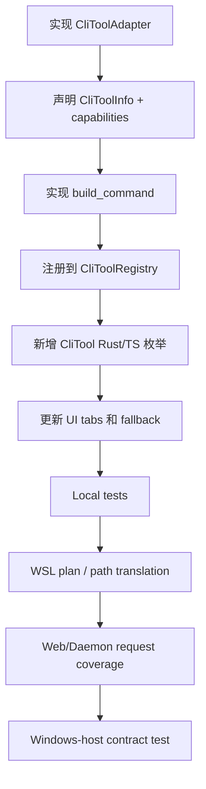

Adapter 实现至少回答：

- 哪些 ProviderType 真正兼容；
- secret 走 env、临时文件还是 CLI config override；
- 模型 flag 的准确语法和位置；
- effort 是否支持以及取值映射；
- Native 时如何确保零注入；
- resume/prompt/YOLO/MCP 参数顺序；
- Local 与 WSL 如何保持相同语义；
- 日志如何脱敏；
- 会话结束如何清理临时配置。

### 22.6 修改优先级规则

Provider/model 优先级属于跨入口契约。修改时必须同步：

1. `provider_resolver.rs`；
2. `LaunchProfileService::resolve_profile_with_provider` 预览；
3. TerminalService 真实启动；
4. MCP/REST request projection；
5. History/restore 语义；
6. 前端说明和错误映射；
7. 本文第 9、10、13、19 节。

**本节检查**

- 测试覆盖按风险分层，不以一个端到端测试代替 resolver 单测。
- 新增 CLI 前先确认安装版本的真实参数契约。
- Windows 专属行为必须记录 Windows-host 证据。

---

## 23. 关键文件索引

### 23.1 Core

| 文件 | 职责 |
|---|---|
| [`cc-panes-core/src/models/provider.rs`](../cc-panes-core/src/models/provider.rs) | Provider、模型、配置和环境变量映射 |
| [`cc-panes-core/src/services/provider_service.rs`](../cc-panes-core/src/services/provider_service.rs) | CRUD、校验、默认值、迁移、ConfigProfile |
| [`cc-panes-core/src/services/provider_resolver.rs`](../cc-panes-core/src/services/provider_resolver.rs) | Native/Managed、Provider/model/effort 来源 |
| [`cc-panes-core/src/models/launch_profile.rs`](../cc-panes-core/src/models/launch_profile.rs) | 运行配置模型和预览结果 |
| [`cc-panes-core/src/services/launch_profile_service.rs`](../cc-panes-core/src/services/launch_profile_service.rs) | Profile CRUD、匹配、MCP/Skill、预览 |
| [`cc-panes-core/src/models/terminal.rs`](../cc-panes-core/src/models/terminal.rs) | 统一 CreateSessionRequest |
| [`cc-panes-core/src/services/terminal_service.rs`](../cc-panes-core/src/services/terminal_service.rs) | 启动执行总管线 |
| [`cc-panes-core/src/services/terminal_service/wsl_codex.rs`](../cc-panes-core/src/services/terminal_service/wsl_codex.rs) | WSL Provider/model/effort/MCP 注入 |

### 23.2 Boundary

| 文件 | 职责 |
|---|---|
| [`src-tauri/src/commands/provider_commands.rs`](../src-tauri/src/commands/provider_commands.rs) | Provider Tauri IPC |
| [`src-tauri/src/commands/launch_profile_commands.rs`](../src-tauri/src/commands/launch_profile_commands.rs) | Profile Tauri IPC 与预览 |
| [`src-tauri/src/commands/terminal_commands.rs`](../src-tauri/src/commands/terminal_commands.rs) | Desktop terminal create boundary |
| [`src-tauri/src/services/orchestrator_service.rs`](../src-tauri/src/services/orchestrator_service.rs) | MCP/REST launch_task、项目绑定投影 |
| [`src-tauri/src/services/rest_launch_history.rs`](../src-tauri/src/services/rest_launch_history.rs) | REST history 同步回写 |
| [`cc-panes-web/src/routes/resources.rs`](../cc-panes-web/src/routes/resources.rs) | Web Provider CRUD |
| [`cc-panes-web/src/routes/terminal.rs`](../cc-panes-web/src/routes/terminal.rs) | Web session request 投影 |
| [`cc-panes-daemon/src/server.rs`](../cc-panes-daemon/src/server.rs) | Daemon session request 投影 |

### 23.3 Frontend

| 文件 | 职责 |
|---|---|
| [`web/types/provider.ts`](../web/types/provider.ts) | Provider TypeScript contract |
| [`web/services/providerService.ts`](../web/services/providerService.ts) | IPC/API 双通道 Provider service |
| [`web/stores/useProvidersStore.ts`](../web/stores/useProvidersStore.ts) | Provider 列表、系统探测、CLI 默认映射 |
| [`web/components/providers/ProvidersPanel.tsx`](../web/components/providers/ProvidersPanel.tsx) | 凭证面板、标签计数、默认操作 |
| [`web/components/providers/ProviderFormPanel.tsx`](../web/components/providers/ProviderFormPanel.tsx) | Provider 表单 |
| [`web/components/providers/ProviderModelsEditor.tsx`](../web/components/providers/ProviderModelsEditor.tsx) | 模型目录编辑 |
| [`web/utils/providerCompatibility.ts`](../web/utils/providerCompatibility.ts) | capability 驱动的 UI 兼容筛选 |
| [`web/components/providers/LaunchProfilesPanel.tsx`](../web/components/providers/LaunchProfilesPanel.tsx) | 运行配置、模型、effort、MCP、Skill、绑定 UI |
| [`web/services/terminalService.ts`](../web/services/terminalService.ts) | 前端创建会话边界 |

### 23.4 Adapters

| 文件 | CLI |
|---|---|
| [`cc-cli-adapters/src/lib.rs`](../cc-cli-adapters/src/lib.rs) | Trait、Context、Registry、通用 model/effort/脱敏 helper |
| [`cc-cli-adapters/src/claude.rs`](../cc-cli-adapters/src/claude.rs) | Claude Code |
| [`cc-cli-adapters/src/codex.rs`](../cc-cli-adapters/src/codex.rs) | Codex |
| [`cc-cli-adapters/src/gemini.rs`](../cc-cli-adapters/src/gemini.rs) | Gemini CLI |
| [`cc-cli-adapters/src/kimi.rs`](../cc-cli-adapters/src/kimi.rs) | Kimi CLI |
| [`cc-cli-adapters/src/opencode.rs`](../cc-cli-adapters/src/opencode.rs) | OpenCode |
| [`cc-cli-adapters/src/cursor.rs`](../cc-cli-adapters/src/cursor.rs) | Cursor Agent |
| [`cc-cli-adapters/src/grok.rs`](../cc-cli-adapters/src/grok.rs) | Grok CLI |

**本节检查**

- 从入口问题沿索引按 Boundary -> Core resolver -> TerminalService -> Adapter 排查。
- 从 UI 显示问题沿 Frontend capability -> Adapter capability 排查。
- 从恢复问题沿 History/restore schema -> CreateSessionRequest -> resolver 排查。

---

## 总结：一次启动的最短心智模型

```text
1. Provider 是全局凭证资源；CLI 标签只是兼容视图。
2. Project/Workspace/显式请求决定使用哪套 Launch Profile。
3. providerSelection 决定是否允许继承，none 直接 Native。
4. 共享 resolver 只选一个 Provider，并验证配置与 CLI 兼容性。
5. 模型按 request > matching profile > Provider default 解析。
6. effort 按 request > profile > model default 解析。
7. TerminalService 把最终计划交给 Local/WSL/SSH 分支。
8. Adapter 只负责把计划翻译成 argv、env 和每会话临时配置。
9. MCP/REST 与桌面最终走同一个 TerminalService。
10. History 记录非敏感标识；当前模型历史持久化仍有限制。
```

当 UI 显示、默认配置和实际启动发生分歧时，`ResolvedProviderPlan` 是最接近事实的检查点；当 Local 与 WSL 行为分歧时，比较的是 Adapter context 到最终命令的翻译，而不是重新讨论 Provider 优先级。
