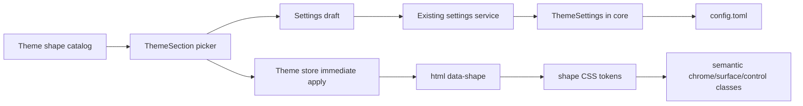

# PRD - 配色与界面形态

Version: 1.0  
Status: APPROVED  
Date: 2026-08-06  
Human confirmation: 2026-08-06, user approved the copy and requested PRD generation plus implementation.  
Source copy: `docs/82-appearance-theme-shape-copy.md`

## 1. Executive Summary

CC-Panes 已有六套配色和壁纸能力，但所有主题共用一套圆角、边界和表面材质，用户换颜色时无法改变工作台的结构观感。本功能把“配色”和“形态”拆成可自由组合的两个维度：保留现有配色，新增 Soft、Slab、Sharp、Glass、Panel、Carbon 六种全局形态，并让选择即时生效、自动保存、旧配置默认回落 Soft。预期产出是 36 组稳定组合，同时不改变终端、编辑器、窗格布局和状态语义。Ask 已获批准：按本 PRD 实施并通过前端、Rust、视觉与兼容性门禁。

## 2. Mission & Core Principles

本功能服从根目录 `STRATEGY.md`：终端与编辑器是主内容，应用 chrome 必须退后；设置本地保存、可恢复、跨版本兼容；桌面与 Web 共用同一设置模型；中英文同步交付。功能特定原则如下：

1. 配色只管颜色，形态只管边角、边界、阴影和材质，两者不互相改写。
2. Soft 等于当前视觉，升级后不改变老用户界面。
3. 形态通过语义 token 和语义表面生效，不用针对业务组件堆散点选择器。
4. xterm、Monaco、Mermaid、状态圆点、头像和色板保持自身语义。
5. 切换必须立即可见，持久化失败不得阻止本次预览，非法持久值统一回落 Soft。

## 3. Target Users & Personas

主要用户是同时管理多个 CLI-agent 会话的开发者。他们长时间停留在终端、侧栏、标签栏和设置页，希望工作台符合自己的信息密度偏好，但不愿因换外观丢失已习惯的配色。次要用户一是通过 Web 访问同一工作区的远程用户，二是为演示或录屏调整界面的内容创作者。反画像是需要任意 CSS 注入、主题市场或逐工作区品牌皮肤的用户；MVP 不服务这些需求。

## 4. MVP Scope

### In scope

- 在现有“主题”页面分开展示“配色主题”和“界面形态”。
- 提供六种形态、视觉预览、中文加英文名称、描述、默认与壁纸标记。
- 将 `theme.shape` 纳入 TypeScript、Rust、Tauri 和 Web 共用设置契约。
- 支持首帧预应用、即时切换、500 ms 既有自动保存、重启恢复和非法值归一化。
- 让核心 chrome、通用按钮/输入/弹窗和设置卡片响应形态。
- 增加中英文文案、搜索关键词、功能提示、更新记录、测试和视觉清单。

### Out of scope

- 不增加自定义 CSS、第三方形态包、在线市场或网络下载。
- 不提供逐工作区形态，不把形态绑定到布局快照。
- 不改变 UI 密度、字体、字号、窗格尺寸、终端主题或状态颜色。
- 不重构 TerminalView、xterm 生命周期、PTY、Monaco 或 Mermaid。
- 不为 Carbon 引入图片资源，不让 Glass 透出操作系统桌面。

### Deferred

- 自定义形态仅在连续两个稳定版本后仍有至少三条独立用户请求时重新评估。
- 逐工作区形态仅在全局形态造成明确工作区识别冲突时评估。
- 自动化全量截图矩阵在仓库具备稳定的桌面视觉基线工具后引入；本期保留有界手工矩阵。

## 5. User Stories

1. 作为现有用户，我希望升级后仍看到当前界面，以便功能上线不打断工作。验收例：旧配置没有 `shape` 时，加载结果和 DOM 均为 Soft。
2. 作为外观定制用户，我希望午夜蓝与 Glass、Sharp 等形态自由组合，以便保留颜色偏好。验收例：切形态后 `theme.mode` 不变，切配色后 `theme.shape` 不变。
3. 作为长时间看终端的用户，我希望装饰不进入终端和输入内容区，以便文字对比度不下降。验收例：Glass 下 xterm 与 input 保持实底，Carbon 纹理不覆盖终端画布。
4. 作为键盘和屏幕阅读器用户，我希望六张卡片可聚焦并播报选中状态。验收例：每张卡片是 button，具备 `aria-pressed`，焦点环可见。
5. 作为 Web 用户，我希望形态选择与桌面端使用同一设置。验收例：`GET/PUT /api/settings` 往返 `theme.shape`，无需新增端点。

## 6. Core Architecture & Patterns



关键模式：形态目录是名称、描述键和 traits 的单一真源；`useThemeStore` 负责 DOM 副作用与 localStorage 首帧兜底；Rust `ThemeSettings` 负责持久化默认和非法值归一化；CSS 自定义属性驱动标准 radius token；只有核心表面使用 `shape-chrome`、`shape-surface`、`shape-panel`、`shape-control`、`shape-input` 语义类。应用设置仍沿现有 `Component -> draft -> settingsService -> Tauri/Web -> SettingsService -> config.toml` 链路。

## 7. Tools/Features Specification

### 7.1 Shape catalog

输入是 `soft|slab|sharp|glass|panel|carbon`，输出包含稳定 code、显示名、i18n 描述键和 `translucent/decorative/flat` traits。空值、未知值、大小写变体和注入字符串统一解析为 `soft`。

### 7.2 Settings picker

“主题”页面顶部保留配色，下面增加三列响应式形态卡片。卡片显示可辨认的结构预览、名称、描述和可选 badge；点击后同一帧更新 `data-shape`，并进入既有自动保存。选中态使用 accent 边框、勾选图标和 `aria-pressed`，不只靠颜色。

### 7.3 Persistence and startup

`theme.shape` 是全局字段，默认 `soft`。Rust 反序列化旧配置时补默认，保存前归一化非法值；前端 localStorage 仅承担 React 挂载前的无闪烁预应用，后端设置加载后覆盖它。ccchan、popup 和 WebGL 诊断子窗口使用 Soft，避免主窗口形态污染专用窗口。

### 7.4 Visual semantics

Soft 保持当前半径；Slab 收紧半径并加轻微上下沿明暗；Sharp 令标准圆角和语义表面归零；Glass 使用主题表面色的半透明混合与有界 blur；Panel 使用直角和更清晰的边界；Carbon 在半透明语义表面增加低对比 CSS 几何纹理。所有颜色来自当前主题 token。

### 7.5 Surface coverage

P0 表面包括 AppShell、TitleBar、ActivityBar、Sidebar、StatusBar、TabBar、SettingsPanel、Dialog、Button 和 Input。内容画布、状态圆点、头像、色板、单选标记和关闭按钮的危险色语义不变。静态覆盖测试禁止新的核心表面绕过语义类，但允许记录具名历史例外。

### 7.6 Discoverability

设置搜索加入“形态、圆角、直角、玻璃、磨砂、Soft、Sharp、Carbon”等关键词。功能提示提供“打开主题设置”动作和形态预览；`CHANGELOG.md` 增加 Unreleased Added 条目。提示被关闭后遵守现有 tips 记忆，不新增弹窗。

## 8. Technology Stack

继续使用 React 19、TypeScript、Zustand、现有 settings draft、Rust serde/TOML、Tailwind CSS 4 自定义属性、Vitest 和 Rust test。理由是所有所需能力已存在，不需要依赖或后端端点。拒绝移植参考项目的全局 class-name sweep，因为它依赖 DOM 偶然类名且维护成本随组件增长；拒绝 CSS-in-JS，因为会绕开现有 token 与首帧路径；拒绝只存 localStorage，因为桌面与 Web 设置会分叉。若未来改为数据库或逐工作区保存，需要设置迁移、跨客户端同步和布局归属改造，成本显著高于本期全局字段。

## 9. Security & Configuration

威胁面仅新增一个本地枚举设置，不涉及鉴权、网络、密钥、文件选择或特权操作。STRIDE 结论：S/R/I/E 无新增暴露；T 的风险是手改配置注入任意 dataset/CSS 值，使用六值白名单归一化；D 的风险是异常 blur/纹理导致渲染负载，使用固定上限且不接受用户数值。适用 OWASP 子集是 A03/A05：不得把持久字符串拼入 `<style>`，不得开放自定义 CSS。配置只有 `theme.shape` 和本地首帧缓存 `theme-shape`；无新密钥、日志或依赖。

## 10. API Specification

不新增 API。现有 Tauri `get_settings/update_settings` 与 Web `GET/PUT /api/settings` 扩展同一 payload：

```json
{
  "theme": {
    "mode": "deep-ink",
    "shape": "glass"
  }
}
```

读取旧数据缺少 `shape` 时响应 `soft`；写入非法值时服务归一化为 `soft`，不让整个设置文件加载失败。沿用现有设置服务错误：读取失败保持当前内存/默认状态，写入失败由 SettingsPanel 显示保存失败 toast；即时视觉预览仍保留，下一次加载以已落盘值为准。

## 11. Success Criteria

- **Leading:** 六张形态卡片点击后在下一动画帧前更新 `html[data-shape]`，组件测试六值全覆盖。
- **Outcome:** 六种配色与六种形态共 36 组在亮暗主题视觉矩阵中无文字遮挡、无不可读输入、无终端内容纹理；桌面手工矩阵记录代表组合证据。
- **Moat:** 六种形态均通过旧配置、非法配置、即时切换、自动保存和重启恢复契约，覆盖率为 100%。
- **Guardrails:** 不修改 TerminalView/PTY/Monaco/Mermaid 生命周期；无新 npm/Cargo 依赖；TypeScript、前端测试、构建、Rust focused tests、格式和 diff 检查通过。
- **Discoverability:** 设置搜索能以中英文形态关键词命中主题页，功能提示动作能打开该页。

## 12. Implementation Phases

- **Phase 0 - Contracts (45 min):** 增加目录、TypeScript/Rust 字段、默认、归一化和旧配置测试。
- **Phase 1 - Runtime (45 min):** 增加首帧缓存、`data-shape` 应用、设置加载同步和子窗口隔离测试。
- **Phase 2 - Picker (60 min):** 重构 ThemeSection 层级、加入六张预览卡、i18n、搜索和无障碍测试。
- **Phase 3 - Surfaces (90 min):** 增加 shape token、语义类、核心 chrome 与通用原语接入、静态护栏。
- **Phase 4 - Discovery and docs (30 min):** 增加功能提示视觉、更新记录和视觉检查清单。
- **Phase 5 - Verification (60 min):** 跑类型、测试、构建、Rust、视觉矩阵、设计/QA/独立代码评审。

## 13. Future Considerations / Risks & Mitigations

未来只在 MVP 稳定后评估自定义形态、逐工作区设置和自动截图基线。主要风险如下：

| 风险 | 概率 | 影响 | 缓解 |
|---|---|---|---|
| 旧配置缺字段或非法值导致设置加载失败 | 中 | 高 | Rust serde 默认、归一化和 legacy fixture |
| 首帧先 Soft 后切换造成闪烁 | 高 | 中 | 模块加载时读取受控 localStorage，React 前设置 dataset |
| Glass/Carbon 降低文字对比或增加 GPU 负载 | 中 | 高 | 输入与内容区实底、固定 blur、reduced motion、桌面矩阵 |
| Sharp/Panel 被任意值圆角漏接 | 高 | 中 | 标准 radius token + P0 语义表面 + 静态覆盖测试 |
| CSS 形态规则与既有壁纸/主题互相覆盖 | 中 | 高 | 仅消费现有颜色 token，禁止写死颜色，代表组合截图验证 |
| 子窗口继承主窗口形态后布局失真 | 低 | 中 | main.tsx 路由隔离，专用窗口显式 Soft |

## Appendix A - Required Reviews

### CEO Review

值不值得：有条件地值得做。它不会直接创造收入，但能把现有主题和壁纸资产扩展为 36 组可见组合，并回应明确用户请求。优先级：低于会话恢复和数据可靠性，高于纯装饰性新增；本期不得触碰终端主线。为什么现在：需求已由用户确认，参考实现提供了失败经验，当前仓库也已有语义 token 和主题设置入口。成本与风险：最可能 5.5 小时，悲观 8 小时；失败时可回落 Soft 并删除单一字段。Ask：批准一轮有界实现和 Windows 视觉验收。结论：**有条件地做，条件是范围保持在外观层并通过回归门禁。**

### Designer Review

用户路径：清晰，现有“主题”入口内完成选择。认知负荷：中，六个颜色加六个形态需要明确分区和预览。错误/恢复：Soft 默认与“恢复本组”提供可逆路径，模糊不支持时使用中性降级提示。反馈：点击即生效，选中态包含边框、勾选和文字。一致性：符合“工具退后”和设置页单标题规则。Top 3 改动：1. 配色与形态分成两个有说明的区块；2. 卡片必须用结构预览而不是仅显示名称；3. 语义圆形和内容画布不随形态变化。

### Engineer Review

可行性：有信心，现有 `ThemeSection`、`useThemeStore`、SettingsService 和 CSS radius token 可复用。复杂度集中在设置契约、首帧时序和核心表面覆盖；更简单的 localStorage-only 方案被拒，因为会让桌面/Web设置分叉。最担心的失败模式是非法旧配置阻断加载、Glass 覆盖输入实底、子窗口继承主窗口 dataset。测试缺口需用 Rust legacy fixture、运行时 DOM 测试、组件 a11y 测试和视觉矩阵补齐。维护性要求目录单源、语义类和覆盖护栏。必修：归一化、pre-paint、P0 语义覆盖、禁止触碰终端生命周期。结论：**通过。**

### Security Review

范围是 `theme.shape` 枚举、DOM dataset 和固定 CSS 规则。S/R/I/E 无新增暴露；T 通过双端白名单防止持久值变成 CSS 注入；D 通过固定 blur/纹理强度和无自定义数值控制。A03/A05 的上线前必修是不得动态拼接 style 文本、不得增加自定义 CSS 入口、依赖审计保持无新增漏洞。结论：**低风险，按枚举边界实施。**
