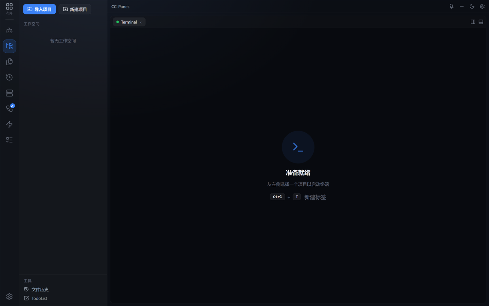

# 2. 安装与第一次启动

CC-Panes 有两种用法：**直接下载安装包**（推荐普通用户），或**从源码运行**（适合想跟最新代码、参与开发的人）。

## 方式一：下载安装包

预编译安装包在 [最新版 Release](https://github.com/wuxiran/cc-pane/releases/latest) 页面发布，按你的平台选对应文件：

| 平台 | 安装包 |
| --- | --- |
| Windows | `*_x64-setup.exe`（Intel/AMD）或 `*_arm64-setup.exe`（ARM） |
| macOS | `*_aarch64.dmg`（Apple Silicon）或 `*_x64.dmg`（Intel） |
| Linux | `*_amd64.deb` 或 `*_amd64.AppImage` |

> CC-Panes 只是**启动并管理** Claude Code / Codex / Gemini 等 CLI，并不内置它们。请确保你想用的 CLI 已经在系统里装好、能在终端里跑起来。

## 方式二：从源码运行

### 环境要求

- Node.js 22+
- Rust 1.83+
- 平台对应的 [Tauri 2 环境依赖](https://tauri.app/start/prerequisites/)
- 你希望由 CC-Panes 启动的 Claude Code、Codex、Gemini 等 CLI

### 安装并启动

```bash
git clone https://github.com/wuxiran/cc-pane.git
cd cc-pane
npm install
npm run tauri:dev
```

第一次启动会编译 Rust 后端，需要等几分钟，之后会快很多。

## 开发版与发布版互不干扰

这是 CC-Panes 一个贴心的设计：用 `npm run tauri:dev` 跑的**开发版**和安装包的**发布版**数据完全隔离，可以同时开着、互不污染。

| | 开发版（`tauri:dev`） | 发布版（安装包） |
| --- | --- | --- |
| 数据目录 | `~/.cc-panes-dev/` | `~/.cc-panes/` |
| 窗口标题 | `CC-Panes [DEV]` | `CC-Panes` |
| 截图快捷键 | `Ctrl+Alt+Shift+S` | `Ctrl+Shift+S` |

所以你日常用发布版、同时拿开发版试新功能，两边的工作空间和配置不会串。

## 第一次启动看到什么

打开 CC-Panes，界面分成几块：

- **最左侧竖排图标栏（ActivityBar）**：全局功能入口，从上到下依次是 **自我对话、工作空间、文件、最近启动、SSH 机器、编排、供应商、TodoList**，最底部是**设置**。鼠标悬停在图标上会显示名称。
- **左侧边栏**：显示当前选中视图的内容。第一次打开时**工作空间是空的**。
- **中央工作区**：还没有终端，会提示「从左侧选择一个项目以启动终端」。

<p align="center">
  
</p>

第一次使用，界面会引导你：**先创建一个工作空间，再往里导入项目**。

> 看到空空的界面不用慌——这就是正常的初始状态。接下来照着[上手五步](04-getting-started-5-steps.md)走一遍，就能跑起第一个 Claude。

## 下一步

- 先搞懂工作空间 / 项目 / 任务和 Provider 是什么 → [3. 核心概念](03-core-concepts.md)
- 直接动手 → [4. 上手五步](04-getting-started-5-steps.md)
