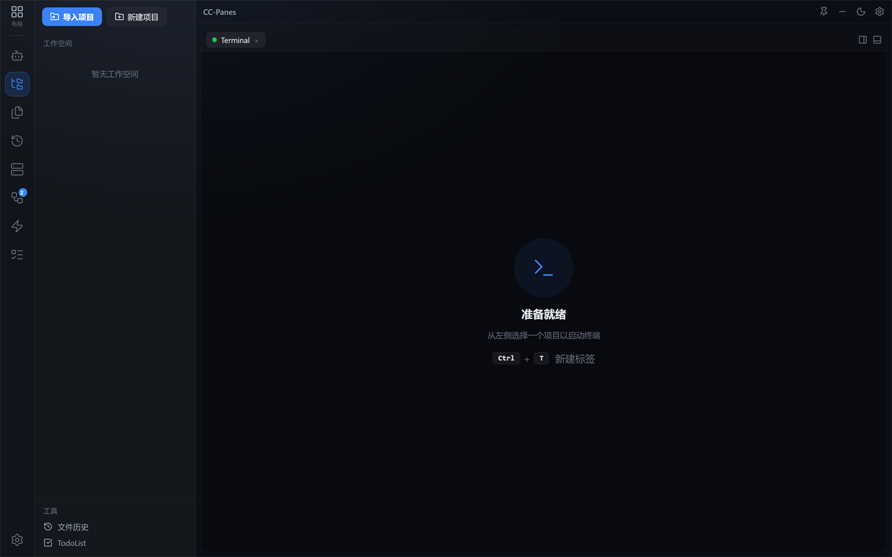

# 2. 安装与第一次启动

CC-Panes 有两种用法：**直接下载安装包**（推荐普通用户），或**从源码运行**（适合想跟最新代码、参与开发的人）。

## 方式一：下载安装包

预编译安装包在 [最新版 Release](https://github.com/wuxiran/cc-pane/releases/latest) 页面发布，按你的平台选对应文件：

| 平台 | 安装包 |
| --- | --- |
| Windows | `*_x64-setup.exe`（Intel/AMD）或 `*_arm64-setup.exe`（ARM） |
| macOS | `*_aarch64.dmg`（Apple Silicon）或 `*_x64.dmg`（Intel） |
| Linux | `*_amd64.deb` 或 `*_amd64.AppImage` |

> CC-Panes 只是**启动并管理** Claude Code / Codex / Gemini 等 CLI，并不内置它们。请确保你想用的 CLI 已经在系统里装好、能在终端里跑起来。

### macOS：首次打开被 Gatekeeper 拦截怎么办

当前版本未经 Apple 签名，首次打开时 macOS 可能提示**"文件已损坏"或"无法验证开发者"**。任选一种方式放行：

**方式一：系统设置（全版本可用）**
先双击打开一次（会被拦截），然后进入「系统设置 → 隐私与安全性」，在页面底部找到被阻止的 CC-Panes，点击「仍要打开」。

**方式二：终端命令**

```bash
xattr -cr /Applications/CC-Panes.app
```

> 旧教程常见的"右键 → 打开"绕过方式在 macOS 15 Sequoia 已被系统移除，不必再试。放行只需做一次，之后正常双击即可。

## 方式二：从源码运行

### 环境要求

- Node.js 22+
- Rust 1.83+
- 平台对应的 [Tauri 2 环境依赖](https://tauri.app/start/prerequisites/)
- 你希望由 CC-Panes 启动的 Claude Code、Codex、Gemini 等 CLI

### 安装并启动

```bash
git clone https://github.com/wuxiran/cc-pane.git
cd cc-pane
npm install
npm run tauri:dev
```

第一次启动会编译 Rust 后端，需要等几分钟，之后会快很多。

## 开发版与发布版互不干扰

这是 CC-Panes 一个贴心的设计：用 `npm run tauri:dev` 跑的**开发版**和安装包的**发布版**数据完全隔离，可以同时开着、互不污染。

| | 开发版（`tauri:dev`） | 发布版（安装包） |
| --- | --- | --- |
| 数据目录 | `~/.cc-panes-dev/` | `~/.cc-panes/` |
| 窗口标题 | `CC-Panes [DEV]` | `CC-Panes` |
| 截图快捷键 | `Ctrl+Alt+Shift+S` | `Ctrl+Shift+S` |

所以你日常用发布版、同时拿开发版试新功能，两边的工作空间和配置不会串。

## 第一次启动看到什么

打开 CC-Panes，界面分成几块：

- **最左侧竖排图标栏（ActivityBar）**：全局功能入口，从上到下依次是 **自我对话、工作空间、文件、最近启动、SSH 机器、编排、供应商、TodoList**，最底部是**设置**。鼠标悬停在图标上会显示名称。
- **左侧边栏**：显示当前选中视图的内容。第一次打开时里面有一个自动创建的 **`default` 工作空间**——它自带一个 CC-Panes 管理的目录，不用配置就能直接用。
- **中央工作区**：还没有终端，会提示「从左侧选择一个项目以启动终端」。

<p align="center">
  
</p>

## 第一件事：让 AI 接管外骨骼

先别急着建工作空间、导项目——花两分钟体验 CC-Panes 和普通终端的本质区别。

CC-Panes 是 **AI 的外骨骼**：它把自己的几乎所有能力（开终端、建工作空间、读别的会话的输出、派任务、发通知……）都做成了 MCP 工具，从它里面启动的 AI **天生就能指挥它**。试一下：

1. 在侧边栏的 **`default` 工作空间上右键 → 「打开 Claude Code」**（或「打开 Codex CLI」，看你装了哪个）。
2. 终端起来后，直接对 AI 说，比如：
   - 「列出 CC-Panes 里的工作空间和项目」
   - 「帮我再开一个终端」
   - 「把 D:\\xxx 目录扫描一下，把里面的 Git 仓库导入成项目」
3. 看它自己调工具把事办了——你没有点任何按钮。

这就是后面所有高级玩法（并行跑任务、Leader/Worker 编排、Plan 交接）的地基：**你指挥 AI，AI 指挥 CC-Panes**。详见 [用 MCP 让 AI 自己操控 CC-Panes](mcp-orchestration.md)。

## 正式干活前：先搭一个干净的工作空间

体验完就可以收拾出正式的工作环境了。这一步是**一切的开始，值得做对**：

为每条业务线建一个**容器目录**（本身不是 Git 仓库），把各代码仓库作为子目录放进去，再建工作空间、用「扫描目录导入」注册项目。**工作空间目录和 Git 仓库要分开**——跨项目的文档、AI 产出、临时脚本放容器目录里，不污染任何仓库的 `git status`。

而且这一步**同样可以让 AI 代办**——建工作空间、扫描导入都是 MCP 工具。还是在刚才那个 Claude 里，一句话：

> 「在 D:\work 下建一个 erp-workspace 容器目录，创建同名工作空间并把根目录设为它，然后把 D:\repos 下的 erp 相关仓库移进去、扫描导入成项目」

为什么这样最干净、具体怎么做，见 [3. 核心概念 · 干净的工作空间](03-core-concepts.md#干净的工作空间把工作空间目录和-git-仓库分开)；想自己动手点一遍 UI，见[上手五步](04-getting-started-5-steps.md)。

## 下一步

- 先搞懂工作空间 / 项目 / 任务和 Provider 是什么 → [3. 核心概念](03-core-concepts.md)
- 直接动手 → [4. 上手五步](04-getting-started-5-steps.md)
