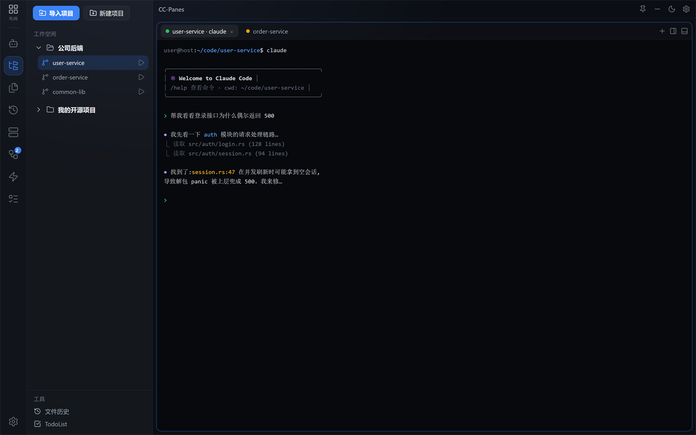

# 4. 上手五步：从空界面到跑起第一个 Claude

跟着这五步走一遍，你就能在 CC-Panes 里跑起第一个 Claude Code 会话。每步末尾都有一个 ✅ **检查点**，确认无误再进入下一步。

> 前提：你想用的 CLI（如 Claude Code）已经装好、能在普通终端里运行。

---

## 第 1 步：新建工作空间

1. 点左侧 ActivityBar 的 **工作空间**（文件夹树图标）切到 Explorer 视图。
2. 在侧边栏点 **「新建工作空间」**。
3. 给它起个名字（比如「我的项目」），可选地指定一个根目录，确认创建。

✅ **检查点**：侧边栏出现了一个空的工作空间节点。

---

## 第 2 步：导入项目

1. 在刚建的工作空间上点 **「导入项目」**。
2. 选一种导入方式：
   - **从目录导入**：选一个已有的本地项目目录。
   - **扫描目录导入**：选一个根目录，CC-Panes 自动找出下面所有 Git 仓库，批量导入。
   - **从 Git 克隆**：填仓库地址，克隆到本地并自动登记。
3. 完成后，项目会出现在工作空间下面。

✅ **检查点**：展开工作空间，能看到你的项目（一个 Git 仓库）。

---

## 第 3 步：选好 Provider（第一次可以跳过细节）

启动 CLI 时会用到 Provider（连哪条模型通道）。第一次上手，**直接用默认即可**：

- 在启动选项里把 Provider 选成 **「不指定（继承系统）」**，让 CLI 用它自己已经配好的本地设置。

等你以后有了多个 API 来源，再去 [3. 核心概念](03-core-concepts.md) 学怎么配多通道切换。

✅ **检查点**：你知道启动时 Provider 这一项选「不指定（继承系统）」就行，不必纠结。

---

## 第 4 步：启动第一个 Claude

1. 在项目上点启动（播放图标）或右键，选 **「打开 Claude Code」**（想用 Codex 就选「打开 Codex CLI」）。
2. 在启动选项里确认：
   - **运行环境**：本机 / WSL / SSH——本地开发选 **本机**。
   - **Provider**：按第 3 步选「不指定（继承系统）」。
3. 确认启动。中央工作区会开出一个**终端标签页**，自动拉起 Claude Code。

  

✅ **检查点**：中央出现终端标签，Claude Code 已经跑起来、能接收你的输入。

---

## 第 5 步：终端分屏

想一边跑 Claude、一边开个终端敲命令？把当前标签分屏：

- **右键该终端标签 → 「终端 · 右切」**（向右分屏），或按快捷键 **`Ctrl+\`**。
- 想上下分，用 **「终端 · 下切」** 或 **`Ctrl+-`**。
- 拖动中间的分隔线可以调整两边大小。

  

✅ **检查点**：工作区里并排（或上下）出现两个终端，互不影响。

---

## 你已经上手了 🎉

到这里，你已经走通了 CC-Panes 最核心的链路：**建工作空间 → 导项目 → 选 Provider → 启动 Claude → 分屏**。

## 下一步

- 把终端和分屏玩熟（标签、布局、弹窗、快捷键）→ [5. 终端与分屏](05-terminal-and-panes.md)
- 回顾概念 → [3. 核心概念](03-core-concepts.md)
