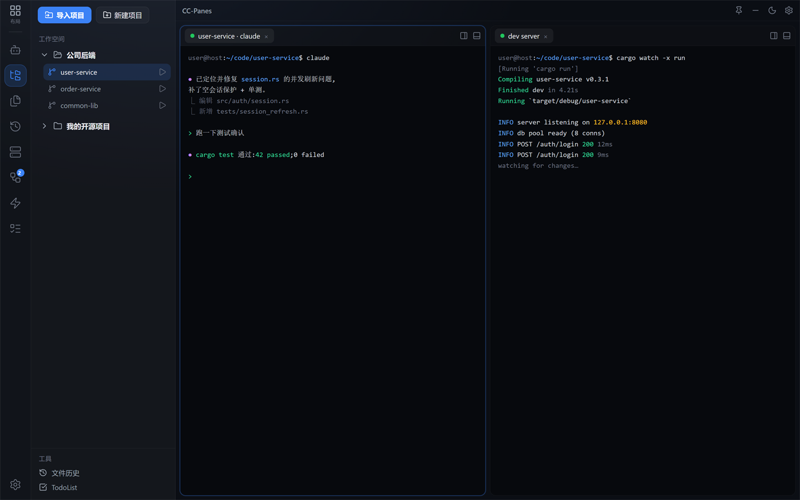

# 5. 终端与分屏

CC-Panes 的中央工作区由**标签页**和**分屏面板**组成，外面再套一层**布局**。把这套玩熟，多任务并行就很顺手。

## 标签页

每个面板顶部是一条标签栏，每个标签是一个终端（或文件、Diff、预览）。

- **新建标签**：点标签栏的 **`+`**，或按 **`Ctrl+T`**。
- **切换标签**：点标签；或用 **`Ctrl+Tab`**（下一个）/ **`Ctrl+Shift+Tab`**（上一个）；或 **`Ctrl+1` ~ `Ctrl+9`** 直接跳到第 N 个。
- **关闭标签**：**`Ctrl+W`**，或标签右键 →「关闭标签」。

### 标签右键菜单

在标签上右键，常用动作：

| 菜单项 | 作用 |
| --- | --- |
| 重命名 | 给标签改个好认的名字 |
| 固定标签 / 取消固定 | 固定后不会被"关闭其他"误关 |
| 最小化 | 收起标签 |
| 终端 · 右切 / 终端 · 下切 | 把当前终端向右 / 向下分屏 |
| 关闭左侧 / 右侧 / 其他标签 | 批量清理 |
| 恢复已关闭标签 | 误关了找回来 |
| 在文件树中显示 | 定位该标签对应的目录 |
| 弹出为独立窗口 | 把标签拆成独立窗口（多屏幕好用），关掉后自动回收 |

## 分屏

让多个终端并排，一边看 AI 跑、一边自己敲命令：

- **向右分屏**：标签右键「终端 · 右切」，或 **`Ctrl+\`**。
- **向下分屏**：标签右键「终端 · 下切」，或 **`Ctrl+-`**。
- **调整大小**：拖动面板之间的分隔线。
- **面板间切换焦点**：**`Alt+方向键`**（左 / 右 / 上 / 下）。

  

> 还有「面板 · 拆分到右侧 / 下方」「面板 · 移至右侧 / 下方」等更细的面板操作，按需在右键菜单里取用。

## 布局（LayoutBar）

ActivityBar **最顶部**是布局切换条。一个**布局**就是一整套分屏 + 标签的排布，你可以为不同场景存多套，一键切换：

- **新建布局** / **重命名布局** / **删除布局**（均在布局条上操作）。
- 删除布局时，该布局里仍在运行的终端会话和弹出窗口会一并关闭，所以会让你确认。
- 至少保留一个布局，**最后一个布局不可删除**。

## 终端状态怎么看

终端启动 / 恢复时，标签和工作区会给出状态提示，常见的有：

- **准备就绪** — 可以用了
- **正在启动终端** — 正在拉起会话，稍等
- **正在恢复会话** — 应用重启后在续上次的标签
- **恢复失败** — 看终端输出排查原因

## 常用快捷键速查

以下是默认值（都可在 **设置 → 快捷键** 里自定义）：

| 快捷键 | 动作 |
| --- | --- |
| `Ctrl+T` | 新建标签 |
| `Ctrl+W` | 关闭标签 |
| `Ctrl+\` | 向右分屏 |
| `Ctrl+-` | 向下分屏 |
| `Alt+←/→/↑/↓` | 切换到左 / 右 / 上 / 下面板 |
| `Ctrl+Tab` / `Ctrl+Shift+Tab` | 下一个 / 上一个标签 |
| `Ctrl+1` ~ `Ctrl+9` | 切换到第 1~9 个标签 |
| `Ctrl+B` | 折叠 / 展开侧边栏 |
| `F11` | 切换全屏 |
| `Ctrl+M` | 切换迷你模式 |
| `Ctrl+,` | 打开设置 |
| `Ctrl+Alt+M` | 语音输入 |

### 为什么我在终端里按 `Ctrl+W` 没关标签？

这是**有意为之**。当焦点在终端里时，少数与 CLI / 终端本身冲突的快捷键（如 `Ctrl+B`、`Ctrl+T`、`Ctrl+W`、`Ctrl+M`、`Ctrl+\`、`Ctrl+-`）会**放行给终端**，让 Claude Code 等程序自己处理。想用这些 App 级动作时，先把焦点点到终端外，或改用标签右键菜单。

## 下一步

- 手册其余章节（文件编辑、Git、Local History、Todo/Memory、设置详解，以及多实例并行、编排、Plan→Codex、Resume、WSL/SSH 等高级玩法）正在分批补全 → 回到 [手册首页](README.md) 查看进度。
