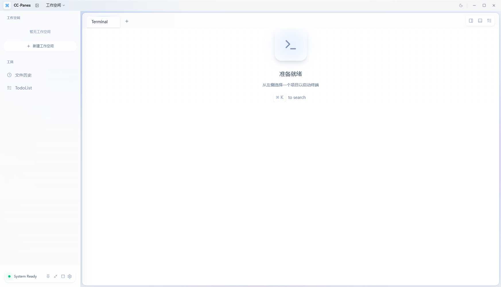
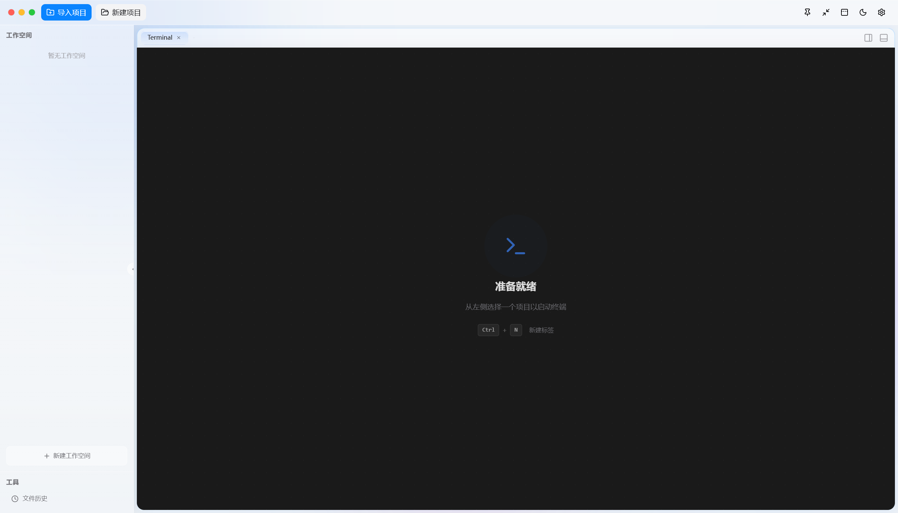
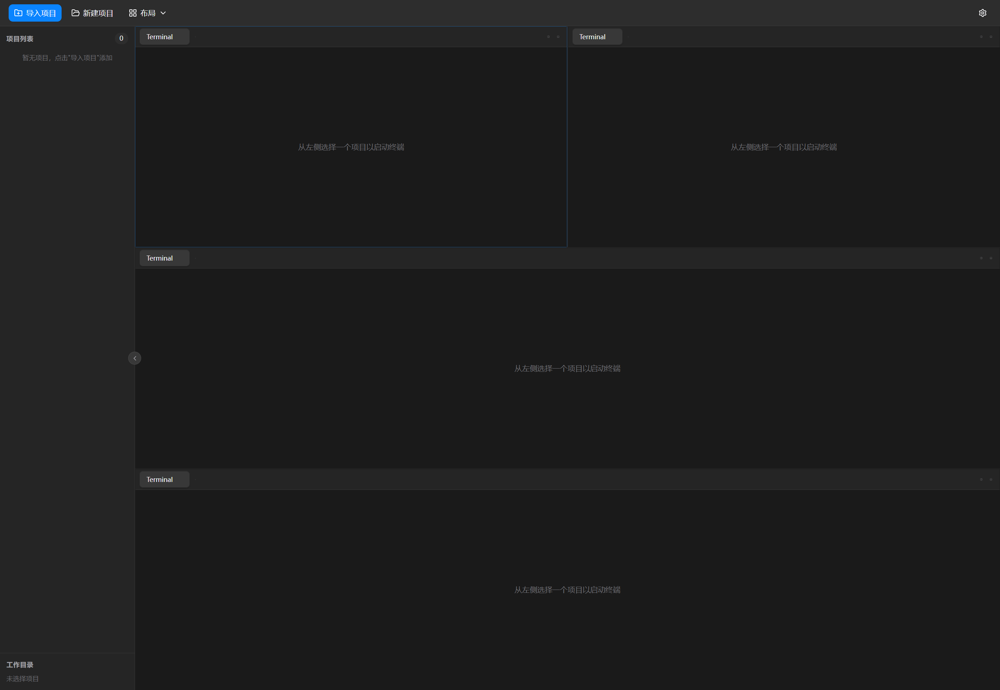
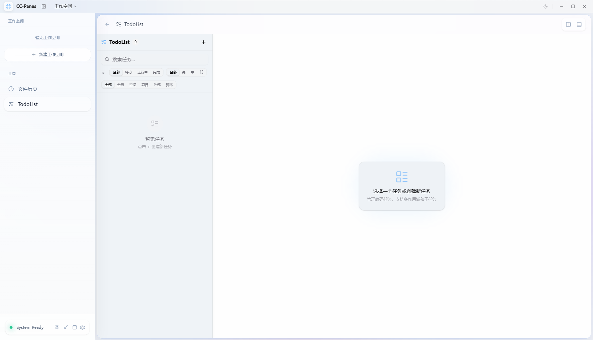

## CC-Panes：给 Claude Code 做了个多实例分屏管理器（开源/Tauri 2）

> 开源 | Tauri 2 + React + Rust | v0.94 预发布
> GitHub: https://github.com/wuxiran/ccpane

先说好，项目处于非常初级的版本，我自己都还没测试完。但核心功能已经跑起来了，先开源放出来。



---

### 背景

我自己做个人工作室，高度依赖 Claude Code，从前期需求调研，到设计、开发、测试、运维全是一个人包了。每天要做的事情非常多、非常杂，经常 IDEA、PyCharm、RustRover 多开，同时跑好几个 CC 实例。

后来我发现一个事情：**用了 CC 之后，90% 看文件的需求都可以抛掉了**。我的工作模式变成了同时跟多个 CC 客户端对话，多线程推进不同的任务。

但问题也来了——终端窗口越开越多，Alt+Tab 切来切去根本分不清哪个是哪个，resume ID 记不住，会话历史乱成一团。

所以就做了这个东西。

---

### 解决了什么问题

#### 1. 工作空间——跨磁盘、跨项目统一管理

我的项目很多，比如 Java 前后端分离的项目，前端和后端分别在不同磁盘不同目录下。我需要一个工作空间把它们关联起来，同时开发。

工作空间自己还可以存放 CLAUDE.md 等配置，尽量保证项目目录本身干净。通过引用关系连接到不同的项目进行操作。

#### 2. 分屏多开 + 自动记录 Resume ID

水平/垂直任意分屏，每个分屏都是独立的 PTY 终端。CC 的 resume ID 自动记录，重启之后可以直接恢复之前的对话，不用再去翻历史。

#### 3. TodoList + 自我对话

为了管好项目加了一个 TodoList，支持优先级、子任务、计划归档。

但写着写着发现手动维护 TodoList 太麻烦了，于是在 CCPane 里加了**自我对话模式**——让 CC 针对工作空间、项目上下文，自动帮你整理和记录 TodoList。跟 CC 的 TodoWrite 工具配合使用。

#### 4. 多 Provider 支持

支持一个项目引入多个 Provider（Anthropic、Bedrock、Vertex、各种代理站都行）。功能已经写了，但说实话暂时还没空全部测完，我的项目真的太多了……

同时为了解决官转和三方的切换问题，引入了**会话修复**，避免三方转官转后思考模式不能用的情况。

#### 5. 置顶

为了方便一边刷帖子一边写代码，支持窗口置顶最前端。嗯，很实用的小功能。

---

### 其他功能

除了上面几个核心痛点，还顺手做了一些：

- **Git 集成**：分支状态、pull/push/fetch/stash、Worktree 管理、Git Clone，不用离开界面
- **Local History**：自动追踪文件变更，Diff 查看、标签、分支感知快照、一键还原。AI 改了啥一目了然
- **Memory & Skills 管理**：直接在界面里管理 CC 的 memory 和 skills
- **MCP 服务器配置**
- **Hooks/工作流自动化**
- **目录批量导入项目**
- **桌面通知**：会话退出、等待输入提醒
- **亮色/暗色主题** + 毛玻璃效果
- **无边框模式 / 迷你模式 / F11 全屏**
- **系统托盘**
- **自定义快捷键**
- **中英文界面**

---

### 截图

| 亮色主题 | 暗色主题 |
|:-:|:-:|
|  |  |

| 分屏布局 | TodoList |
|:-:|:-:|
|  |  |

---

### 技术栈

| 层次 | 技术 |
|------|------|
| 桌面框架 | Tauri 2（Rust 后端 + 系统 WebView） |
| 前端 | React 19 + TypeScript + Zustand |
| UI | shadcn/ui + Tailwind CSS 4 |
| 终端 | xterm.js + portable-pty |
| 数据库 | SQLite (rusqlite) |
| 构建 | Vite 6 |

打包大小约 10MB（Tauri 的优势），内存占用比 Electron 方案小很多。

---

### 安装

目前没有预编译安装包，需要从源码构建：

```bash
git clone https://github.com/wuxiran/ccpane.git
cd ccpane
npm install
npm run tauri build
```

需要：Node.js 22+、Rust 1.83+、Tauri 2 平台依赖。

---

### 项目状态

坦白说，当前 v0.94 还非常初级：

- 很多功能写了但没充分测试
- 目前只在 Windows 上跑过（理论上 macOS/Linux 也能构建）
- 没有自动更新
- 没有预编译包
- Bug 肯定不少

但核心的分屏多开、工作空间管理、resume 恢复这些每天在用，基本稳定。

先开源出来，欢迎感兴趣的佬试试看。Issue 和 PR 都欢迎，有问题也可以直接在帖子里说。

**GitHub**: https://github.com/wuxiran/ccpane
**协议**: GPL-3.0

---

### 后续计划

- 提供预编译安装包（Windows / macOS / Linux）
- 把没测完的功能补上
- 完善跨平台兼容性
- 自动更新
