<h1 align="center">
  <a href="https://github.com/wuxiran/cc-pane">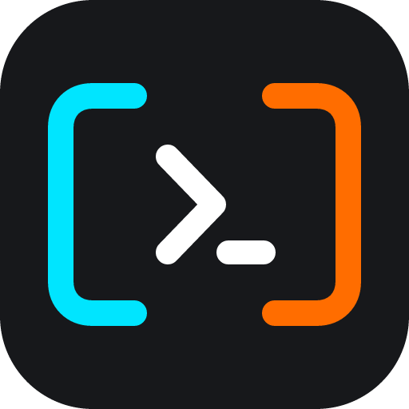</a> CC-Panes
</h1>

<p align="center">
  <a href="https://github.com/wuxiran/cc-pane/releases/latest"></a>
  <a href="https://github.com/wuxiran/cc-pane/releases"></a>
  
  
</p>

<p align="center">
  <sub><a href="../../README.md">English</a> · <a href="README.zh-CN.md">中文</a> · <a href="README.ja.md">日本語</a> · <a href="README.ko.md">한국어</a> · <a href="README.es.md">Español</a> · <a href="README.fr.md">Français</a> · <strong>Português</strong></sub>
</p>

<p align="center">
  <strong>O centro de comando de desktop para coding AI em paralelo.</strong><br />
  Execute agentes CLI lado a lado, organize workspaces e sessões e coordene o trabalho com MCP, planos, skills, Git e histórico local.
</p>

<h3 align="center"><a href="https://github.com/wuxiran/cc-pane/releases/latest"><ins>Baixar CC-Panes</ins></a></h3>

<p align="center">
  <picture>
    <source srcset="../assets/readme-recordings/readme-hero.gif" type="image/gif" />
    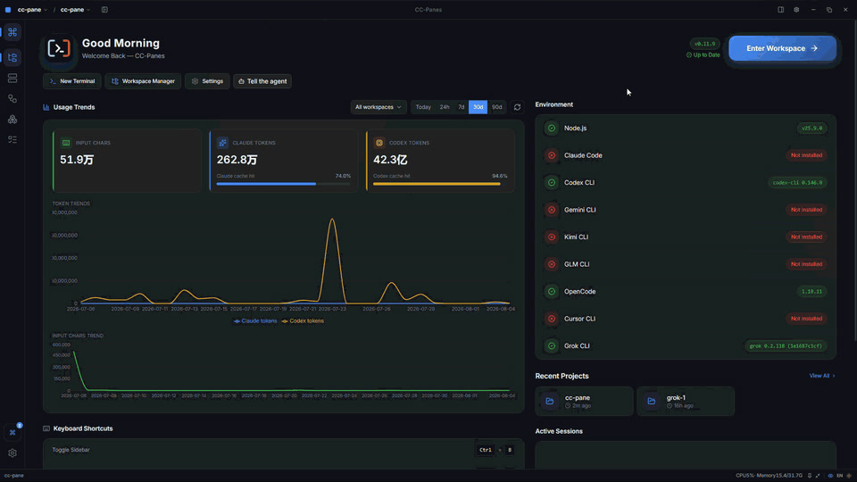
  </picture>
</p>

<p align="center"><sub>As capturas abaixo foram gravadas de interações reais do CC-Panes no desktop.</sub></p>

## Recursos

<table>
<tr>
<td width="50%" valign="middle">
<h3>Centro de comando do workspace</h3>
<p>Veja sessões ativas, projetos recentes, CLIs disponíveis, tendências de uso e o contexto do workspace em uma única vista de desktop local. Alterne entre workspace, projeto, tarefa e terminal sem perder o fio do trabalho.</p>
<p><a href="../guide/03-core-concepts.md">Guia →</a></p>
</td>
<td width="50%">
<a href="../guide/03-core-concepts.md"><picture><source srcset="../assets/readme-recordings/readme-hero.gif" type="image/gif" /></picture></a>
</td>
</tr>
<tr>
<td width="50%" valign="middle">
<h3>Providers e perfis de lançamento</h3>
<p>Escolha CLI, provider, conjunto MCP, skills, runtime e política de permissões como um perfil de lançamento reutilizável. Mantenha fluxos locais, WSL e SSH no mesmo modelo de workspace.</p>
<p><a href="../guide/10-settings.md">Guia de configurações →</a></p>
</td>
<td width="50%">
<a href="../guide/10-settings.md"><picture><source srcset="../assets/readme-recordings/provider-profiles.gif" type="image/gif" />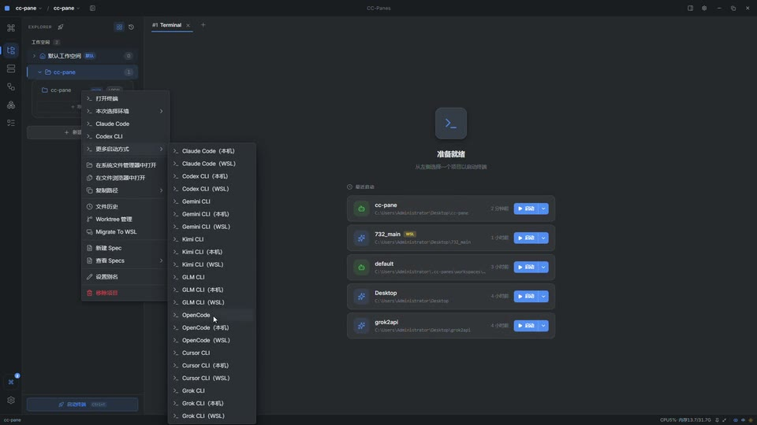</picture></a>
</td>
</tr>
<tr>
<td width="50%" valign="middle">
<h3>Orquestração de agentes</h3>
<p>Transforme uma tarefa delimitada em uma execução coordenada. O MCP embutido <code>ccpanes</code> permite que um leader despache workers, observe o progresso, colete resultados e mantenha planos e Todos perto das sessões que fazem o trabalho.</p>
<p><a href="../guide/mcp-orchestration.md">Guia de orquestração MCP →</a></p>
</td>
<td width="50%">
<a href="../guide/mcp-orchestration.md"><picture><source srcset="../assets/readme-recordings/agent-orchestration.gif" type="image/gif" />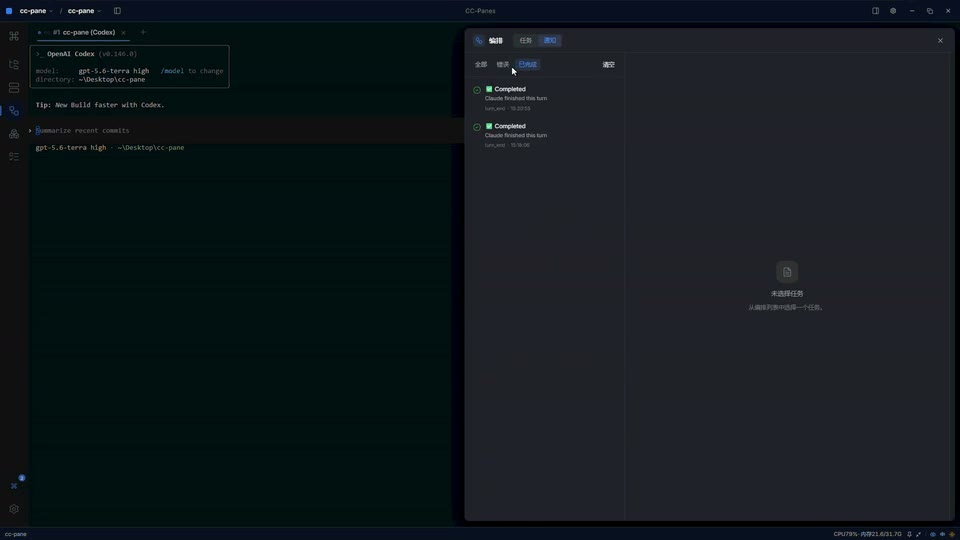</picture></a>
</td>
</tr>
<tr>
<td width="50%" valign="middle">
<h3>Skills e ferramentas compartilhadas</h3>
<p>Navegue por fluxos reutilizáveis, gerencie skills globais e anexe serviços MCP compartilhados aos perfis que precisam deles. O CC-Panes também exibe skills de CLI instalados sem forçá-los em cada sessão.</p>
<p><a href="../guide/18-skills.md">Guia de skills →</a></p>
</td>
<td width="50%">
<a href="../guide/18-skills.md"><picture><source srcset="../assets/readme-recordings/skills-and-mcp.gif" type="image/gif" />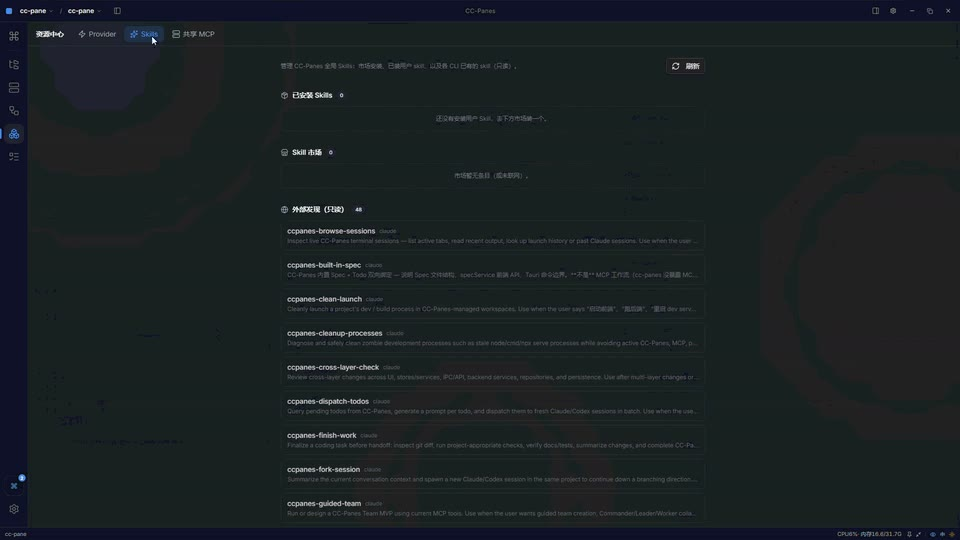</picture></a>
</td>
</tr>
<tr>
<td width="50%" valign="middle">
<h3>Divisões e abas de terminal</h3>
<p>Sessões PTY reais com layouts horizontais e verticais flexíveis, scrollback e layouts de painéis salvos em uma única janela.</p>
<p><a href="../guide/05-terminal-and-panes.md">Guia →</a></p>
</td>
<td width="50%">
<a href="../guide/05-terminal-and-panes.md"><picture><source srcset="../assets/readme-recordings/terminal-splits.gif" type="image/gif" />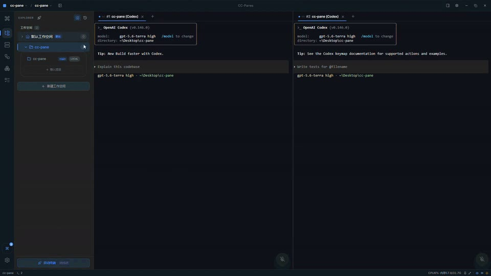</picture></a>
</td>
</tr>
<tr>
<td width="50%" valign="middle">
<h3>Retomada e acesso remoto</h3>
<p>Reabra trabalhos anteriores e conecte-se a partir do desktop, web ou Android. Mantenha o mesmo modelo de workspace entre clientes.</p>
<p><a href="../guide/14-resume.md">Guia →</a></p>
</td>
<td width="50%">
<a href="../guide/14-resume.md"><picture><source srcset="../assets/readme-recordings/resume-remote.gif" type="image/gif" />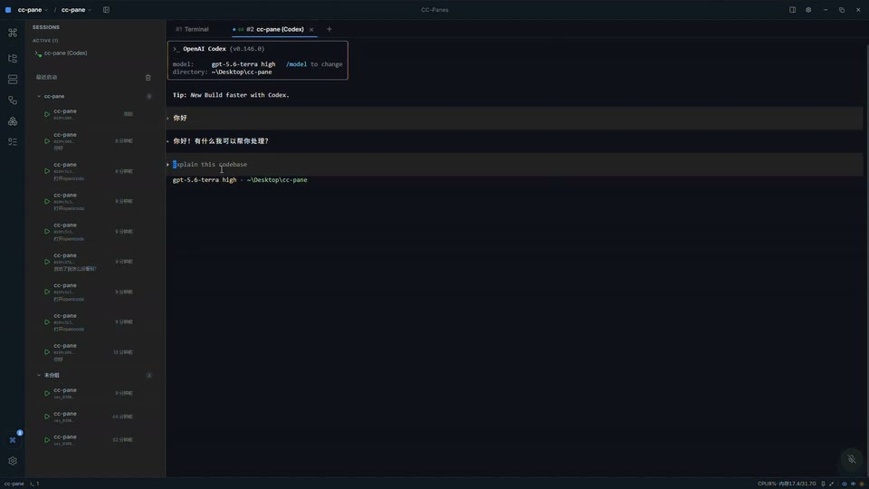</picture></a>
</td>
</tr>
<tr>
<td width="50%" valign="middle">
<h3>Git e histórico local</h3>
<p>Inspecione branches e worktrees e use snapshots rotulados, diffs e pontos de restauração sem sair do workspace.</p>
<p><a href="../guide/07-git-worktree.md">Guia →</a></p>
</td>
<td width="50%">
<a href="../guide/07-git-worktree.md"><picture><source srcset="../assets/readme-recordings/git-history.gif" type="image/gif" />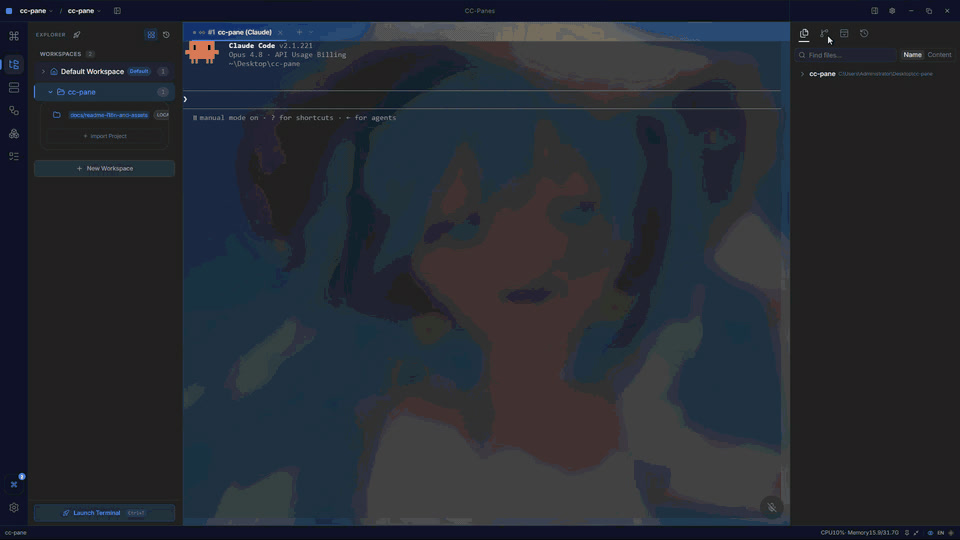</picture></a>
</td>
</tr>
<tr>
<td width="50%" valign="middle">
<h3>Superfícies de planejamento</h3>
<p>Todos, diários, planos, specs, resumos de sessão e memória persistente ficam ao lado dos agentes que fazem o trabalho.</p>
<p><a href="../guide/09-todo-journal-memory.md">Guia →</a></p>
</td>
<td width="50%">
<a href="../guide/09-todo-journal-memory.md"><picture><source srcset="../assets/readme-recordings/planning-surfaces.gif" type="image/gif" />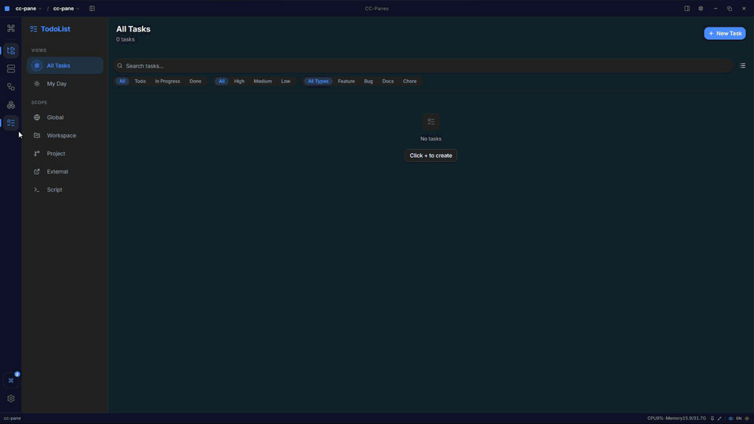</picture></a>
</td>
</tr>
<tr>
<td width="50%" valign="middle">
<h3>Desenvolvimento orientado a workspace</h3>
<p>Navegador de arquivos, editor Monaco, previews de Markdown e imagem, hooks de projeto e adaptadores CLI no mesmo shell.</p>
<p><a href="../guide/06-files-and-editor.md">Guia →</a></p>
</td>
<td width="50%">
<a href="../guide/06-files-and-editor.md"><picture><source srcset="../assets/readme-recordings/files-editor.gif" type="image/gif" />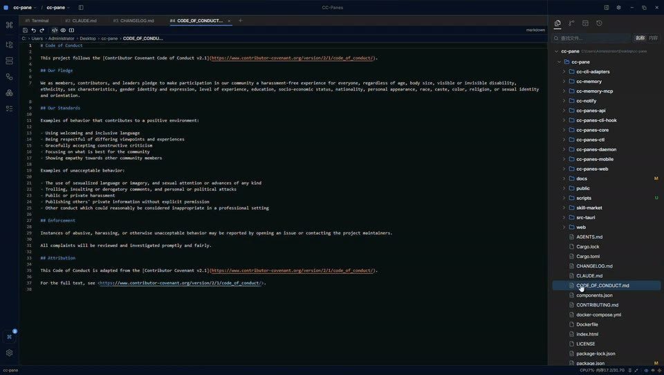</picture></a>
</td>
</tr>
<tr>
<td width="50%" valign="middle">
<h3>Acesso Web</h3>
<p>Conecte-se a um workspace por qualquer navegador. Mantenha as sessões sincronizadas entre desktop, web e Android com o mesmo modelo de workspace.</p>
<p><a href="../guide/16-web-and-mobile.md">Guia →</a></p>
</td>
<td width="50%">
<a href="../guide/16-web-and-mobile.md"><picture><source srcset="../assets/readme-recordings/web-access.gif" type="image/gif" />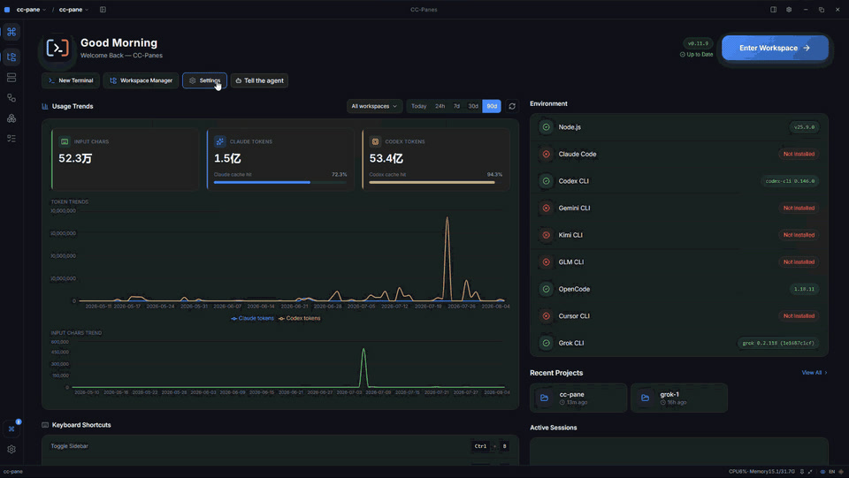</picture></a>
</td>
</tr>
<tr>
<td width="50%" valign="middle">
<h3>Configuração de Fundo</h3>
<p>Personalize o shell com temas, papel de parede, opacidade e efeitos de janela. Salve visuais como presets reutilizáveis entre workspaces.</p>
<p><a href="../guide/10-settings.md">Guia →</a></p>
</td>
<td width="50%">
<a href="../guide/10-settings.md"><picture><source srcset="../assets/readme-recordings/background-settings.gif" type="image/gif" />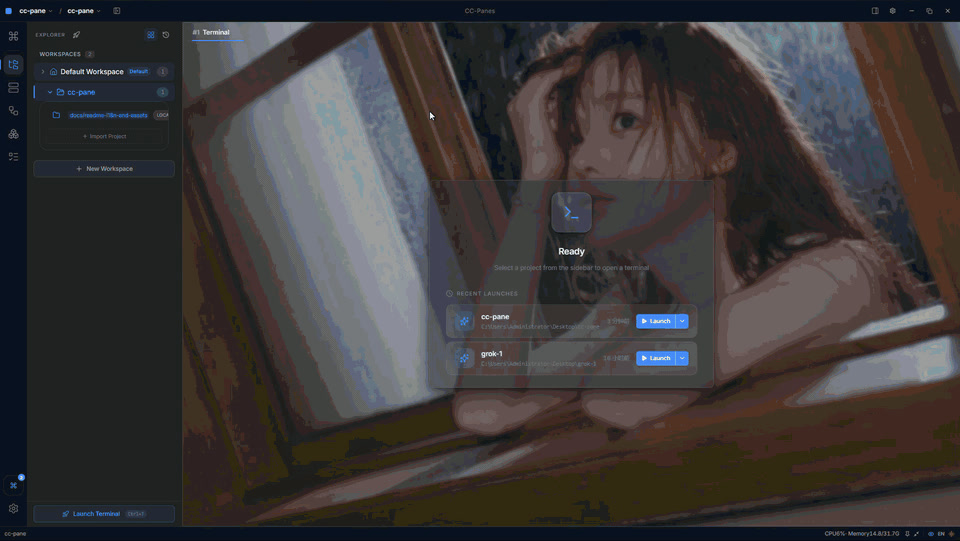</picture></a>
</td>
</tr>
</table>

**Também inclui:**

- Hooks de projeto e adaptadores CLI para injeção de provider, configuração MCP, resume e eventos de ciclo de vida.
- Extras de fluxo no desktop: capturas de tela, bandeja, modo mini, paleta de comandos, temas e monitoramento de recursos.

---

## Agentes CLI suportados

O CC-Panes funciona com qualquer agente CLI que rode em um terminal. Adaptadores de primeira classe adicionam injeção de provider, MCP, resume, flags de workspace, system prompts e hooks de projeto onde cada CLI suportar.

<p>
  <kbd>Claude Code</kbd> &nbsp;
  <kbd>Codex</kbd> &nbsp;
  <kbd>Gemini CLI</kbd> &nbsp;
  <kbd>Kimi</kbd> &nbsp;
  <kbd>GLM</kbd> &nbsp;
  <kbd>Grok</kbd> &nbsp;
  <kbd>OpenCode</kbd> &nbsp;
  <kbd>Cursor</kbd> &nbsp;
  <kbd>+ any terminal CLI</kbd>
</p>

---

## Instalação

### Desktop — Windows, macOS, Linux

- **[Baixe a versão mais recente](https://github.com/wuxiran/cc-pane/releases/latest)**
- Veja a [página de releases](https://github.com/wuxiran/cc-pane/releases) para instaladores e formatos atuais.

As versões estáveis incluem o atualizador in-app. Pré-releases estão disponíveis para instalação manual na página de releases.

### Primeira execução

1. Instale pelo menos um CLI suportado e garanta que ele esteja no seu `PATH`.
2. Abra o CC-Panes, crie ou importe um workspace, adicione um projeto e inicie uma sessão.
3. Divida o terminal quando a tarefa se beneficiar de trabalho paralelo, ou use a vista de orquestração para despachar subtarefas delimitadas.

Para o passo a passo completo, veja o [guia do usuário](../guide/README.md). Para web e Android, veja o [guia web e mobile](../guide/16-web-and-mobile.md).

---

## Comunidade e suporte

- **Issues:** [github.com/wuxiran/cc-pane/issues](https://github.com/wuxiran/cc-pane/issues)
- **Discussions:** [github.com/wuxiran/cc-pane/discussions](https://github.com/wuxiran/cc-pane/discussions)
- **WeChat:** adicione `yemaofeng66` e mencione `CC-Panes chat` ou `CC-Panes bug feedback`.

<p>
  
</p>

---

## Desenvolvimento

Veja [CONTRIBUTING.md](https://github.com/wuxiran/cc-pane/blob/main/CONTRIBUTING.md) para orientação de contribuição.

```bash
git clone https://github.com/wuxiran/cc-pane.git
cd cc-pane
npm install
npm run tauri:dev
```

Verificações úteis:

```bash
npx tsc --noEmit
npm run build
npm run test:run
cargo fmt --all -- --check
cargo check --workspace
cargo test --workspace
```

`npm run tauri:dev` usa `com.ccpanes.dev` e `~/.cc-panes-dev/`. Builds de release usam `com.ccpanes.app` e `~/.cc-panes/`.

## Licença

O CC-Panes é software livre e de código aberto sob a [licença GPL-3.0](https://github.com/wuxiran/cc-pane/blob/main/LICENSE).

## Agradecimentos

[Claude Code](https://docs.anthropic.com/en/docs/claude-code) | [Tauri](https://tauri.app/) | [xterm.js](https://xtermjs.org/) | [portable-pty](https://github.com/wez/wezterm/tree/main/pty) | [Allotment](https://github.com/johnwalley/allotment) | [shadcn/ui](https://ui.shadcn.com/)
